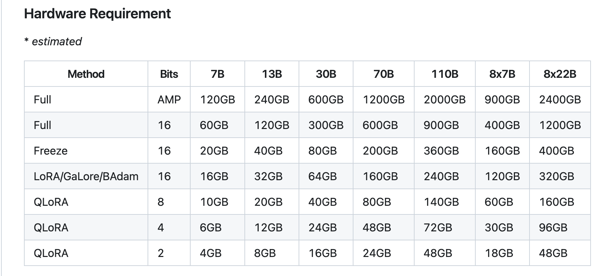
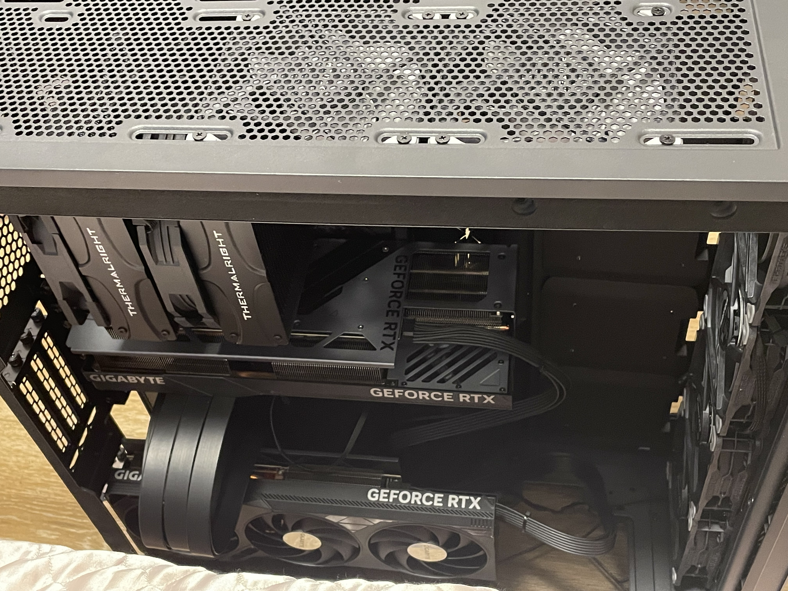
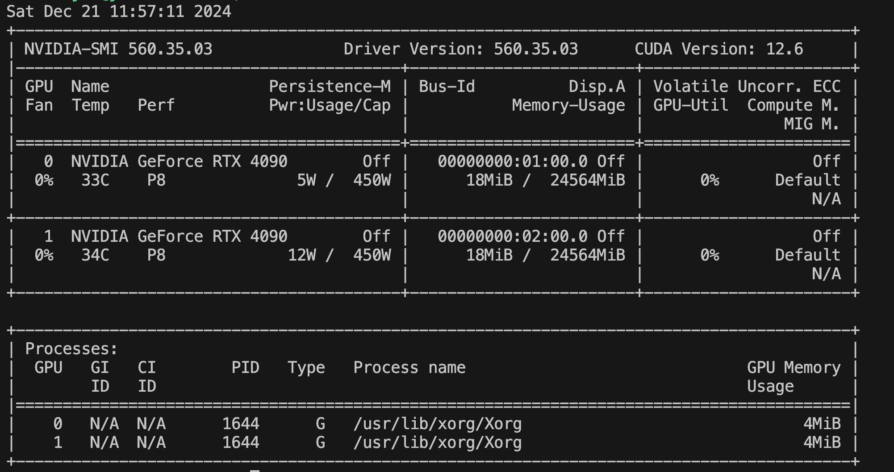
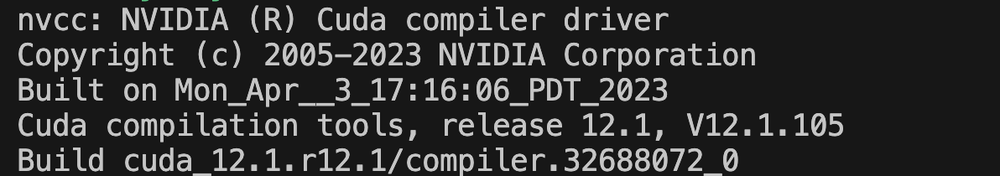

## Rent a GPU or Buy Your Own?

Before setting up a deep learning environment, consider **usage duration**, **budget**, **data privacy**, and **maintenance overhead**. If you have long-term needs (e.g., over a year) and require strict data security, building your own GPU server often provides lower overall costs and a more controllable environment. On the other hand, for short-term projects or when data privacy is not critical, renting cloud GPUs (e.g., Azure, AWS, GCP) or using free platforms (Colab, Kaggle) offers greater flexibility.

- **Advantages of Renting GPUs**:  
  - No high upfront hardware costs  
  - Elastic scalability according to project needs  
  - Cloud vendors typically provide data compliance and security assurances, reducing hardware maintenance concerns  

- **Advantages of Buying GPUs**:  
  - Lower total cost if used extensively over the long term  
  - Higher privacy and control for in-house data and models  
  - Hardware can be upgraded or adjusted at any time, offering more flexible deployment  

> **Personal Suggestions**  
> 1. If you have a limited budget or are just starting out, use Colab, Kaggle, or cloud-based GPU solutions first.  
> 2. Once computing needs and privacy requirements increase, consider building your own multi-GPU server or renting a multi-node, multi-GPU cluster.

---

## Background

In September 2023, to continue my exploration and research on Large Language Models (LLMs) outside of work, I assembled a **dual RTX 4090** personal AI server. It has been running for nearly a year, and here are some observations:

- **Noise**: Placed under my desk, the fans can get quite loud under full load. However, noise levels are acceptable during inference or moderate loads.  
- **Inference Performance**: With a total of 48GB of VRAM, and by using 4-bit quantization, it can handle 70B-level models (e.g., Llama 70B, Qwen 72B).  
- **Training Performance**: By using [DeepSpeed](https://github.com/microsoft/DeepSpeed) with distributed and offload techniques (ZeRO-3 + CPU offload), I can finetune around 34B parameter models (e.g., CodeLlama 34B).  
- **Cost-Effectiveness**: For personal or small-team experiments and small-to-medium scale model training, this configuration is quite practical. However, full-scale training of very large models (hundreds of billions of parameters) still requires more professional GPUs (e.g., multi-GPU A100 or H100 clusters).

Below is an illustration of VRAM requirements for various model sizes and training approaches (referenced from [LLaMA-Factory](https://github.com/hiyouga/LLaMA-Factory#hardware-requirement)):



---

## Assembly Strategy & Configuration Details

The total budget is around **40,000 RMB (~6,000 USD)**. The final build list is as follows (for reference only):

| Component            | Model                                        | Price (RMB)  |
| :------------------: | :------------------------------------------- | :----------: |
| **GPU**              | RTX 4090 \* 2                                | 25098        |
| **Motherboard + CPU**| AMD R9 7900X + MSI MPG X670E CARBON          | 5157.55      |
| **Memory**           | Corsair 48GB \* 2 (DDR5 5600)                | 2399         |
| **SSD**              | SOLIDIGM 944 PRO 2TB \*2 + Samsung 990PRO 4TB| 4587         |
| **PSU**              | Corsair AX1600i                              | 2699         |
| **Fans**             | Phanteks T30 120mm P \* 6                     | 1066.76      |
| **CPU Cooler**       | Thermalright FC140 BLACK                     | 419          |
| **Chassis**          | Phanteks 620PC Full Tower                    | 897.99       |
| **GPU Riser Cable**  | Phanteks FL60 PCI-E4.0 \*16                  | 399          |

**Total**: ~ 42,723.3 RMB

### GPU Selection

For large-scale model research, **floating-point performance (TFLOPS)** and **VRAM capacity** are the most critical metrics. Professional GPUs (A100, H100, etc.) boast higher VRAM and NVLink support but can easily cost hundreds of thousands of RMB, which is prohibitive for most individual users. According to [Tim Dettmers](https://timdettmers.com/2023/01/30/which-gpu-for-deep-learning/), the RTX 4090 offers excellent performance-per-dollar and supports features like BF16 and Flash Attention, making it a high-value option.

#### Cooling Options: Blower vs. Air-Cooling vs. Liquid-Cooling

| **Cooling Method** | **Advantages**                                      | **Disadvantages**                       | **Best For**                                 |
| :----------------: | :------------------------------------------------- | :--------------------------------------: | :------------------------------------------: |
| **Blower Fan**     | Compact form factor; good for multi-GPU setups     | Loud noise, generally weaker cooling     | Server racks, dense multi-GPU deployments    |
| **Air-Cooling**    | Good balance of performance and noise; easy upkeep | Cards are often large, require space     | Home or personal research (with enough space)|
| **Liquid-Cooling** | Excellent cooling, quieter under full load         | Risk of leaks, higher cost              | Extreme quiet needs or heavy overclocking     |

> **Home Setup Recommendation**: **Air-cooled GPUs** are typically the best balance of cooling efficiency, noise, and maintenance. They are generally more user-friendly compared to blower or liquid-cooled alternatives.

### CPU & Motherboard

In deep learning scenarios, the CPU handles data preprocessing, pipeline scheduling, and multi-process/thread management, ensuring high-throughput, low-latency data delivery to the GPUs. Thus, the CPU’s main requirements include **sufficient PCIe lanes** and **robust multi-threaded performance**.

- **Intel**: 13th/14th Generation i9 (e.g., 13900K) offers 20 primary PCIe lanes, enough for dual GPUs at x8 + x8.  
- **AMD**: The Ryzen 7000/9000 series (e.g., 7950X) provides 28 (24 usable) PCIe lanes and also supports dual GPUs at x8 + x8, with enough bandwidth for multiple M.2 SSDs.

#### MSI MPG X670E CARBON Motherboard

- **Expandability**: Supports PCIe 5.0 and DDR5 memory, offering ample future-proofing.  
- **Stability**: High-quality power delivery, ensuring stable operation for both CPU and multiple GPUs.  
- **Rich I/O**: Supports multiple M.2 SSDs and USB4 for various usage scenarios.

#### AMD Ryzen 9 7900X Highlights

- **Cores & Threads**: 12 cores, 24 threads, excellent for data preprocessing and multitasking in deep learning workloads.  
- **PCIe Bandwidth**: Provides 28 (24 usable) PCIe 5.0 lanes to support dual GPUs at x8 + x8 while also powering high-speed M.2 SSDs.  
- **Power Efficiency**: Built on the Zen 4 architecture, delivering outstanding performance-to-power ratio for high-performance computing tasks.

#### Key Motherboard Considerations

1. **Physical Layout**  
   - RTX 4090 cards are huge, often occupying multiple slots. Confirm the board can hold two such cards simultaneously. If space or thermal conflicts arise, use a riser cable for vertical placement of the second GPU.  
2. **PCIe Lane Splitting**  
   - Ensure the motherboard can run two PCIe 4.0 x8 + x8 slots. Avoid a setup ending up as x16 + x2, which severely limits the second GPU’s bandwidth and can lead to a significant performance bottleneck, especially critical in large model training.  
3. **Expandability**  
   - With two GPUs installed, you still need enough M.2 slots and external ports for additional storage or peripherals.

After evaluating expandability, performance, and cost-effectiveness, I chose the **AMD Ryzen 9 7900X paired with the MSI MPG X670E CARBON**. A GPU riser cable resolved the slot conflicts caused by the thickness of dual RTX 4090s.

#### BIOS Setup Recommendations

1. **Memory Optimization**  
   - Enable **XMP/EXPO** (Intel/AMD) to boost memory clock speeds and bandwidth.  
2. **Overclocking**  
   - If additional performance is needed, enable **PBO (Precision Boost Overdrive)** or Intel Performance Tuning and monitor system stability.  
3. **Thermals & Stability**  
   - Avoid extreme overclocking and keep temperatures under control to maintain system stability.

### Memory

During deep learning training, large amounts of system memory are used for data loading and optimizer states (especially in multi-GPU scenarios with Zero-stage parallelism). **Aim for at least 2× the total GPU VRAM capacity**. This build uses 48GB \* 2 (96GB in total), sufficient for everyday multitasking and distributed training without frequent swapping.

### Storage

- **Prefer M.2 NVMe SSDs**: They offer superior read/write performance, critical for loading large model weights, caching intermediate files, and storing training logs.  
- **Capacity ≥ 2TB**: Model files continue to grow in size. 2TB can fill up quickly; consider 4TB or more depending on your needs.  
- **SSD Brands**: Samsung, SK Hynix, and Western Digital have reliable high-end product lines.

### Power Supply

Dual RTX 4090s can draw **900W–1000W** under full load, and you also need overhead for the CPU, motherboard, and storage. Generally, **1,500W+** Platinum or Titanium PSUs are recommended to ensure stable power delivery and mitigate voltage fluctuations.  
I opted for a Corsair AX1600i (digital PSU), which provides real-time power monitoring and sufficient headroom.

### Cooling & Fans

I chose an **air-cooling** setup:

- **CPU Cooler**: Thermalright FC140, a dual-tower air cooler offering solid thermal performance with relatively low noise.  
- **Case Fans**: Phanteks T30 120mm \* 6, maintaining slightly positive internal pressure to ensure proper airflow across the GPUs and power delivery modules.

For prolonged high-load training (such as distributed training of large models), chassis airflow management and adequate fans are crucial. Monitor CPU, GPU, and VRM temperatures regularly and adjust fan curves as needed.

> **Advanced Cooling**  
> - For even quieter operation, consider a *Hybrid* or partial liquid-cooling solution, along with finely tuned fan curves.  
> - Regularly cleaning dust filters, using dust guards, and refreshing thermal compound can also help improve thermals and stability.

### Chassis

Because the RTX 4090 is massive, and two of them stacked requires ample internal space and airflow, a full-tower chassis is recommended for better cable routing and thermal design. I went with the Phanteks 620PC, which offers ample space and built-in cable management.

Below is a sample photo of the completed build:  


---

## System & Software Environment

**Operating System**: Linux (e.g., **Ubuntu 22.04 LTS**) is highly recommended due to better compatibility and support for CUDA, NVIDIA drivers, and popular deep learning frameworks. The general setup flow:

1. **OS Installation**: Ubuntu or another Linux distribution.  
2. **NVIDIA Driver Installation**: Make sure `nvidia-smi` detects both 4090 GPUs correctly:  
     
3. **CUDA Toolkit**: Verify via `nvcc -V`:  
     
4. **cuDNN**: Ensure your deep learning frameworks can leverage GPU-accelerated kernels for convolution, RNN, etc.  
5. **Framework Testing**: Use [PyTorch](https://pytorch.org/), [TensorFlow](https://www.tensorflow.org/), or [JAX](https://github.com/google/jax) to confirm basic inference and training functionality.  
6. **Docker Containerization**:  
   - With [nvidia-container-toolkit](https://github.com/NVIDIA/nvidia-container-toolkit), containers can directly access GPU resources, eliminating host-environment conflicts.  
   - For multi-node, multi-GPU setups, consider **Kubernetes**, **Ray**, or **Slurm** for cluster scheduling and resource management.

---

## Recommended Tools & Frameworks

1. **Training Frameworks**  
   - [**LLaMA-Factory**](https://github.com/hiyouga/LLaMA-Factory): Offers user-friendly packaging for large language model training and inference. Great for beginners.  
   - [**DeepSpeed**](https://github.com/microsoft/DeepSpeed): Provides distributed training for large models, with multiple parallelization strategies and optimizations.  
   - [**Megatron-LM**](https://github.com/NVIDIA/Megatron-LM): NVIDIA’s official large-scale language model training framework, ideal for multi-node, multi-GPU scenarios.

2. **Monitoring & Visualization**  
   - [**Weights & Biases**](https://wandb.ai/) or [**TensorBoard**](https://www.tensorflow.org/tensorboard): Real-time monitoring of loss, learning rate, etc., with remote-friendly UI.

3. **Inference Tools**  
   - [**ollama**](https://github.com/jmorganca/ollama): Based on [llama.cpp](https://github.com/ggerganov/llama.cpp), easy local inference setup.  
   - [**vLLM**](https://github.com/vllm-project/vllm): Optimized for high-concurrency, multi-user scenarios, delivering superior throughput.

   | **Framework**  | **ollama**                                   | **vLLM**                                   |
   | :------------: | :------------------------------------------: | :----------------------------------------: |
   | **Function**   | Simple local LLM deployment                  | High-concurrency / high-throughput LLM     |
   | **Concurrent** | Performance drops as concurrency increases   | Handles higher concurrency with better TPS |
   | **16 Threads** | ~17s/req                                     | ~9s/req                                    |
   | **Throughput** | Slower token generation speeds              | ~2× faster token generation                |
   | **Max Concur.**| Performance deteriorates over 32 threads    | Remains stable under large concurrency     |
   | **Use Cases**  | Personal or low-traffic apps                 | Enterprise or multi-user high concurrency  |

4. **WebUI**  
   - [**Open-WebUI**](https://github.com/open-webui/open-webui): A user-friendly, web-based solution that integrates multiple AI backends (ollama, OpenAI API, etc.), handy for rapid prototyping and visualization.

---

## Advanced Suggestions

1. **Development & Debugging Efficiency**  
   - Use SSH for remote development, and create custom Docker images to reduce setup overhead.  

2. **Quantization & Pruning**  
   - Techniques like 4-bit or 8-bit quantization and pruning can reduce model size and VRAM usage, thereby improving inference performance.

3. **Mixed-Precision Training**  
   - Switch to BF16 or FP16 training to accelerate training speed, combined with gradient scaling (GradScaler) to maintain numerical stability.

4. **CPU Coordination**  
   - Enhance data loading using multi-threading, multi-processing, or RAM disks for streaming large pretraining datasets.

5. **Multi-Node Cluster Deployment**  
   - Connect nodes via InfiniBand or high-speed Ethernet and use Kubernetes for efficient resource scheduling.

---

## Summary

With the above configuration and methodology, I successfully built a **dual RTX 4090** deep learning workstation. It excels at **inference** and **small to medium scale fine-tuning** scenarios—ideal for individuals or small teams focusing on LLM research or application development. This setup strikes a balance between **cost-effectiveness** and **flexibility**. However, if you plan to train massive models (hundreds of billions of parameters) in a full-parameter regime, you will still need more GPUs (e.g., multi-GPU A100 or H100 clusters).

From personal experience, dual 4090 GPUs provide sufficient performance within a reasonable budget, meeting the majority of small-to-medium-scale R&D needs—a solid option for qualified individuals or teams to consider.

---

## References

1. [Tim Dettmers: Which GPU for Deep Learning? (2023)](https://timdettmers.com/2023/01/30/which-gpu-for-deep-learning/)  
2. [Intel 14900K PCIe lane specs](https://www.intel.com/content/www/us/en/products/sku/236773/intel-core-i9-processor-14900k-36m-cache-up-to-6-00-ghz/specifications.html)  
3. [AMD R5 7600X PCIe lane specs](https://www.amd.com/en/products/processors/desktops/ryzen/7000-series/amd-ryzen-5-7600.html)  
4. [MSI MPG X670E CARBON Specifications](https://www.msi.com/Motherboard/MPG-X670E-CARBON-WIFI/Specification)  
5. [nvidia-container-toolkit](https://github.com/NVIDIA/nvidia-container-toolkit)  
6. [LLaMA-Factory](https://github.com/hiyouga/LLaMA-Factory)  
7. [DeepSpeed](https://github.com/microsoft/DeepSpeed)  
8. [Megatron-LM](https://github.com/NVIDIA/Megatron-LM)  
9. [ollama](https://github.com/jmorganca/ollama)  
10. [vLLM](https://github.com/vllm-project/vllm)  
11. [Ollama vs VLLM: Which Tool Handles AI Models Better?](https://medium.com/@naman1011/ollama-vs-vllm-which-tool-handles-ai-models-better-a93345b911e6)  
12. [Open-WebUI](https://github.com/open-webui/open-webui)

---

## Copyright & Citation

> **Disclaimer**: The configurations, prices, and recommendations in this article are for technical discussion and research purposes only. Actual purchases and deployments should be carefully evaluated based on individual budgets and requirements. The author assumes no liability for any direct or indirect consequences resulting from following or adapting the information provided herein.
>
> **Citation**: When reposting or referencing this content, please credit the original author and source.

**Cited as:**

Yue Shui. (Dec 2024). Building a Home Deep Learning Rig with Dual RTX 4090 GPUs.
https://syhya.github.io/posts/2024-12-21-build-gpu-server

Or

```bibtex
@article{syhya2024build,
  title   = "Building a Home Deep Learning Rig with Dual RTX 4090 GPUs",
  author  = "Yue Shui",
  journal = "syhya.github.io",
  year    = "2024",
  month   = "Dec",
  url     = "https://syhya.github.io/posts/2024-12-21-build-gpu-server/"
  