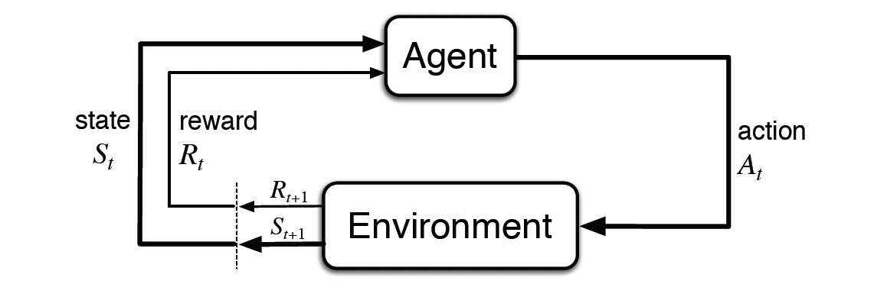

> **Note**: This article **is currently being updated**. The content is in **draft version** and may change. Please check back for the latest version.

## Notations

| Symbol                          | Meaning                                                                 |
| :------------------------------ | :----------------------------------------------------------------------- |
| \(s, s', S_t, S_{t+1}\)         | State, next state, state at time \(t\), state at time \(t+1\)            |
| \(o, o_t\)                      | Observation, observation at time \(t\)                                   |
| \(a, a', A_t, A_{t+1}\)         | Action, next action, action at time \(t\), action at time \(t+1\)        |
| \(r, r_t\)                      | Immediate reward, reward at time \(t\)                                   |
| \(G_t\)                         | Return at time \(t\)                                                     |
| \(R(\tau)\)                     | Return of a trajectory \(\tau\)                                          |
| \(\mathcal{S}\)                 | Set of all possible states                                               |
| \(\mathcal{A}\)                 | Set of all possible actions                                              |
| \(\mathcal{R}\)                 | Set of all possible rewards                                              |
| \(\pi(a\mid s), \pi_\theta(a\mid s)\) | Policy (stochastic), parameterized policy                       |
| \(\mu(s), \mu_\theta(s)\)       | Policy (deterministic), parameterized policy                             |
| \(\theta, \phi, w\)             | Policy or value function parameters                                      |
| \(\gamma\)                      | Discount factor                                                          |
| \(J(\pi)\)                      | Expected return of policy \(\pi\)                                        |
| \(V_\pi(s)\)                    | State-value function for policy \(\pi\)                                  |
| \(Q_\pi(s,a)\)                  | Action-value function for policy \(\pi\)                                 |
| \(V_*(s)\)                      | Optimal state-value function                                             |
| \(Q_*(s,a)\)                    | Optimal action-value function                                            |
| \(A_\pi(s,a)\)                  | Advantage function for policy \(\pi\)                                    |
| \(P(s'\mid s,a)\)               | Transition probability function                                          |
| \(R(s,a,s')\)                   | Reward function                                                          |
| \(\rho_0(s)\)                   | Start-state distribution                                                 |
| \(\tau\)                        | Trajectory                                                               |
| \(D\)                           | Replay memory                                                            |
| \(\alpha\)                      | Learning rate, temperature parameter (in SAC)                            |
| \(\lambda\)                     | Eligibility trace parameter                                              |
| \(\epsilon\)                    | Exploration parameter (e.g., in \(\epsilon\)-greedy), clipping parameter (in PPO) |

## What is Reinforcement Learning?

### Definition

Reinforcement Learning (RL) is a branch of machine learning that trains an **agent** to take a series of **actions** (\(a_t\)) in an **environment**, transitioning through different **states** (\(s_t\)) to achieve a long-term3 goal. 

Unlike supervised learning, which relies on human-labeled data, RL depends on the interaction between the agent and the environment. After each action, the agent receives a **reward** (\(r_t\)) as feedback. The objective of the agent is to learn a **policy** $\pi(s)$, which is a strategy for selecting actions, in order to **maximize the total reward** (\(\sum_{t=0}^{T} r_t\)).

### Applications
RL has achieved remarkable successes in various domains, including:

- **Game Playing**: Mastering complex games like Go (AlphaGo, AlphaGo Zero) and video games (Atari, Dota 2).
- **Robotics**: Controlling robots for tasks like navigation, manipulation, and locomotion.
- **Autonomous Driving**: Developing self-driving vehicles that can perceive their environment and make driving decisions.
- **Resource Management**: Optimizing resource allocation in areas like energy management and traffic control.
- **Personalized Recommendations**: Creating recommendation systems that adapt to user preferences over time.

### Policy

A **policy** \(\pi\) is the strategy an agent employs to decide which action to take in each state. It is the cornerstone of an RL agent, defining its behavior. Policies can be either **deterministic** or **stochastic**.
  
  - **Deterministic Policy** \(\pi(s)\): Maps each state to a single, specific action. For a given state \(s\), the policy \(\pi(s)\) always selects the same action \(a\):
    $$
    \pi(s) = a
    $$

  - **Stochastic Policy** \(\pi(a \mid s)\): Provides a probability distribution over possible actions for each state. For a given state \(s\), \(\pi(a \mid s)\) represents the probability of choosing action \(a\). The agent samples an action based on this distribution:
    $$
    \pi(a \mid s) = \mathbb{P}_\pi[A = a \mid S = s]
    $$

- In **Deep Reinforcement Learning**, policies are typically represented by sophisticated function approximators, such as **neural networks**. These networks, parameterized by weights \(\theta\), learn to map states (or observations) to actions (or action probabilities). The parameterized policies are denoted as:
  - \(\pi_\theta(s)\) for **deterministic policies**
  - \(\pi_\theta(a \mid s)\) for **stochastic policies**

### Trajectories

A **trajectory** (also called **episode**) \(\tau\) is a sequence of states and actions that unfold in an environment:

\[
\tau = (s_0, a_0, s_1, a_1, \ldots)
\]

The initial state of the environment, \(s_0\), is sampled from a predefined start-state distribution, often represented as \(\rho_0\):

\[
s_0 \sim \rho_0(\cdot)
\]

State transitions describe how the environment evolves from one state to the next, specifically from state \(s_t\) at time \(t\) to state \(s_{t+1}\) at time \(t+1\). These transitions are governed by the natural laws of the environment and are influenced solely by the most recent action taken \(a_t\). The transition dynamics can be either:

- **Deterministic**:
  
  \[
  s_{t+1} = f(s_t, a_t)
  \]

- **Stochastic**:
  
  \[
  s_{t+1} \sim P(\cdot \mid s_t, a_t)
  \]

### Reward and Return

In reinforcement learning, **rewards** and **returns** are fundamental concepts that guide an agent's learning process by providing feedback on its actions.

#### Reward

A **reward** is a scalar signal received by the agent after taking an action in a specific state. It serves as immediate feedback to indicate the desirability of the action taken. The reward function, denoted by \( R \), maps state-action pairs to real numbers:

\[
r_t = R(s_t, a_t)
\]

where:
- \( r_t \) is the reward received at time step \( t \),
- \( s_t \) is the state at time step \( t \),
- \( a_t \) is the action taken at time step \( t \).

The reward function encapsulates the goals of the agent by assigning higher rewards to desirable outcomes and lower (or negative) rewards to undesirable ones.

#### Return

The **return**, often denoted by \( G_t \), represents the **total accumulated future rewards** from a specific time step onward. It quantifies the long-term benefit of actions taken by the agent. The return is defined as the sum of discounted rewards:

\[
G_t = \sum_{k=0}^{\infty} \gamma^k r_{t+k}
\]

where:
- \( \gamma \in [0, 1) \) is the **discount factor** that determines the present value of future rewards,
- \( r_{t+k} \) is the reward received \( k \) time steps after \( t \).

The discount factor \( \gamma \) balances the importance of immediate versus future rewards:
- A **higher \( \gamma \)** (close to 1) makes the agent strive for long-term rewards.
- A **lower \( \gamma \)** (close to 0) makes the agent prioritize immediate rewards.

#### Why Use a Discount Factor?

The discount factor \( \gamma \) serves several important purposes in reinforcement learning:

1. **Handling Uncertainty of Future Rewards**:
    - **Higher Uncertainty**: Future rewards are often more uncertain than immediate rewards. For example, in the stock market, predicting long-term returns is more challenging due to market volatility.
    
2. **Preference for Immediate Benefits**:
    - **Human Behavior**: As humans, we might prefer to enjoy rewards today rather than waiting for them years later. This preference is naturally modeled by discounting future rewards.
    
3. **Mathematical Convenience**:
    - **Finite Computation**: Discounting allows us to compute returns without needing to track future steps indefinitely, simplifying calculations and algorithms.
    
4. **Avoiding Infinite Loops**:
    - **Termination Assurance**: In environments with the possibility of infinite loops in state transitions, discounting ensures that the return remains finite, preventing issues with infinite sums.

#### Finite Horizon Return

In scenarios with a finite number of time steps \( T \), the return is calculated up to the terminal time step:

\[
G_t = \sum_{k=0}^{T-t-1} \gamma^k r_{t+k}
\]

This is common in episodic tasks where the interaction between the agent and the environment terminates after a certain number of steps.

### Transition Function and Reward Function

In Reinforcement Learning (RL), a **model** encapsulates the agent’s representation of how the environment behaves. This model typically includes two core components: the **transition function** and the **reward function**.

#### Transition Function

The **transition function** \( P(s' \mid s, a) \) specifies the probability of moving from state \( s \) to state \( s' \) after taking action \( a \). Formally:

\[
P(s' \mid s, a) = \mathbb{P}(S_{t+1} = s' \mid S_t = s, A_t = a)
\]

- **Deterministic Environment**: In a deterministic setting, the transition function assigns a probability of 1 to a single specific next state and 0 to all others:

  \[
  P(s' \mid s, a) = 
  \begin{cases} 
  1 & \text{if } s' = f(s, a),\\
  0 & \text{otherwise}.
  \end{cases}
  \]

- **Stochastic Environment**: In a stochastic environment, the transition function defines a probability distribution over possible next states:

  \[
  P(s' \mid s, a) = \text{Probability of transitioning to } s' \text{ from } s \text{ by taking action } a.
  \]

#### Reward Function

The **reward function** \( R(s, a, s') \) specifies the immediate reward obtained after transitioning from state \( s \) to state \( s' \) via action \( a \). It provides essential feedback that guides the agent's learning. Formally:

\[
R(s, a, s') = \mathbb{E}\bigl[ R_{t+1} \mid S_t = s, A_t = a, S_{t+1} = s' \bigr]
\]

Depending on the problem, the reward function might depend on:

- **State-Action-State**:
  
  \[
  R(s, a, s') = \text{Immediate reward after transitioning from } s \text{ to } s' \text{ using } a.
  \]

- **State-Action**:
  
  \[
  R(s, a) = \mathbb{E}\bigl[ R_{t+1} \mid S_t = s, A_t = a \bigr].
  \]

- **State Only**:
  
  \[
  R(s) = \mathbb{E}\bigl[ R_{t+1} \mid S_t = s \bigr].
  \]

### Value Function

**Value functions** quantify the expected return (sum of discounted future rewards) starting from a given state (or state-action pair). They are central to most RL methods. There are two key types:

#### State-Value Function

The **state-value function** \( V_\pi(s) \) measures the expected return when starting in state \( s \) and following policy \( \pi \) thereafter:

\[
V_\pi(s) = \mathbb{E}_\pi\bigl[ G_t \mid S_t = s \bigr] 
= \mathbb{E}_\pi\Bigl[ \sum_{k=0}^{\infty} \gamma^k R_{t+k+1} \;\big\vert\; S_t = s \Bigr].
\]

#### Action-Value Function (Q-function)

The **action-value function** \( Q_\pi(s, a) \) measures the expected return when starting in state \( s \), taking action \( a \), and thereafter following policy \( \pi \):

\[
Q_\pi(s, a) = \mathbb{E}_\pi\bigl[ G_t \mid S_t = s, A_t = a \bigr]
= \mathbb{E}_\pi\Bigl[ \sum_{k=0}^{\infty} \gamma^k R_{t+k+1} \;\big\vert\; S_t = s, A_t = a \Bigr].
\]

### Advantage Function

The **advantage function** \( A_\pi(s, a) \) indicates how much better (or worse) taking action \( a \) in state \( s \) is compared to the average action under policy \( \pi \). It is defined as:

\[
A_\pi(s, a) = Q_\pi(s, a) - V_\pi(s).
\]

#### Significance of the Advantage Function

- **Variance Reduction**: In policy gradient methods, using the advantage function can reduce the variance of gradient estimates, leading to more stable learning.
- **Policy Improvement**: It highlights which actions are better or worse than the average in a given state, providing a clearer signal for policy updates.

### Optimal Value and Policy

The ultimate goal in RL is to find an **optimal policy** \( \pi_* \) that maximizes the expected return in the long run. Correspondingly, we define **optimal value functions**.

#### Optimal State-Value Function

The **optimal state-value function** \( V_*(s) \) is the maximum state-value attainable at state \( s \) over all possible policies:

\[
V_*(s) = \max_{\pi} V_\pi(s).
\]

#### Optimal Action-Value Function

The **optimal action-value function** \( Q_*(s, a) \) is the maximum action-value attainable for the state-action pair \( (s, a) \) over all possible policies:

\[
Q_*(s, a) = \max_{\pi} Q_\pi(s, a).
\]

#### Optimal Policy

An **optimal policy** \( \pi_* \) is any policy that achieves these optimal value functions. Formally, for all \( s \) and \( a \):

\[
V_{\pi_*}(s) = V_*(s), \quad\text{and}\quad Q_{\pi_*}(s, a) = Q_*(s, a).
\]

#### Challenges in Finding the Optimal Policy

- **Complexity**: Finding \( \pi_* \), \( V_*(s) \), or \( Q_*(s, a) \) can be computationally expensive, especially for large or continuous state and action spaces.
- **Approximation**: Many RL algorithms approximate these optimal functions or directly learn an (approximately) optimal policy through techniques such as dynamic programming, Monte Carlo methods, or temporal-difference learning.

## A Taxonomy of RL Algorithms

Now that we’ve gone through the basics of RL terminology and notation, we can delve into the richer material: the landscape of algorithms in modern RL, along with the trade-offs involved in their design.

### Overview

Creating an accurate and comprehensive taxonomy of modern RL algorithms is challenging due to the modularity and complexity of these algorithms. To keep this introduction digestible, we focus on the foundational design choices in deep RL algorithms, the trade-offs these choices entail, and contextualize some prominent modern algorithms within this framework.

## Key Insights from the RL Algorithms Taxonomy

The comparative table provides a structured overview of various Reinforcement Learning (RL) approaches. Below, we break down the table contents into detailed key insights to better understand the distinctions, strengths, and challenges associated with each category of RL algorithms.

### 1. Model-Free RL: Policy Optimization

- **Key Idea**:  
  Policy Optimization methods focus on directly learning a parameterized policy \( \pi_\theta(a \mid s) \) by maximizing a performance objective \( J(\pi) \). These methods often incorporate learning a value function \( V^\pi(s) \) to facilitate more effective policy updates.

- **On/Off-Policy Setting**:  
  Primarily **on-policy**, meaning updates are based on data collected from the most recent policy.

- **Strengths**:
  - **Stability**: By directly optimizing the policy objective, these methods tend to exhibit stable and reliable convergence.
  - **Simplicity in Updates**: Utilizes gradient-based approaches, making the update process conceptually straightforward.

- **Weaknesses**:
  - **Sample Inefficiency**: Requires fresh interaction data from the current policy for each update, which can be resource-intensive.
  - **High Variance**: Gradient estimates can exhibit high variance, potentially slowing down the learning process.

- **Representative Examples**:  
  A2C, A3C, PPO, TRPO

### 2. Model-Free RL: Q-Learning

- **Key Idea**:  
  Q-Learning methods aim to learn an approximate Q-function \( Q_\theta(s, a) \) that estimates the optimal action-value function \( Q^*(s, a) \). The policy is then derived by selecting actions that maximize the Q-values.

- **On/Off-Policy Setting**:  
  Primarily **off-policy**, allowing the use of data collected from any policy during training.

- **Strengths**:
  - **Sample Efficiency**: Can reuse past experiences effectively, making better use of available data.
  - **Straightforward Objective**: Relies on Bellman backups, providing a clear and direct learning target.

- **Weaknesses**:
  - **Stability Issues**: Susceptible to divergence and instability, especially when combined with function approximation.
  - **Indirect Performance Optimization**: Optimizes the Q-function rather than the policy directly, which can complicate the learning process.

- **Representative Examples**:  
  DQN, C51, QR-DQN

### 3. Model-Based RL

- **Key Idea**:  
  Model-Based methods involve using or learning a model of the environment's dynamics (state transitions and rewards) to facilitate planning or generate additional training data.

- **On/Off-Policy Setting**:  
  Can be **on-policy** or **off-policy** depending on the specific algorithm design.

- **Strengths**:
  - **High Sample Efficiency**: Leveraging a model allows for planning and generating synthetic data, reducing the need for extensive real-world interactions.
  - **Forward Planning**: Enables the agent to "think ahead" by simulating future states and rewards, leading to more informed decision-making.

- **Weaknesses**:
  - **Model Bias**: Inaccuracies in the learned model can lead to suboptimal or even detrimental policy performance in the real environment.
  - **Implementation Complexity**: Incorporating a model adds layers of complexity, making these methods harder to implement and tune effectively.

- **Representative Examples**:  
  MBMF, MBVE, AlphaZero, World Models

### 4. Hybrid / In-Between Approaches

- **Key Idea**:  
  Hybrid methods blend elements from policy optimization, Q-Learning, and planning. For instance, they may learn both a Q-function and a policy simultaneously or embed planning mechanisms directly into the policy structure.

- **On/Off-Policy Setting**:  
  Varies across different algorithms; some are off-policy, others are on-policy, and some employ a mixed approach.

- **Strengths**:
  - **Balanced Strengths**: Capable of harnessing the advantages of multiple RL paradigms, such as the stability of policy optimization and the sample efficiency of Q-Learning.
  - **Enhanced Data Utilization**: Can effectively reuse data while maintaining stable policy updates, leading to improved overall performance.

- **Weaknesses**:
  - **Implementation Complexity**: Managing multiple components (e.g., separate networks for policy and value functions) increases the complexity of the algorithm.
  - **Inherited Failure Modes**: Risks arising from combining different methods can lead to compounded instability or other issues from each constituent approach.

- **Representative Examples**:  
  DDPG, SAC, I2A (Imagination-Augmented Agents)

### Summary of Insights

1. **Diverse Strategies**: RL algorithms can be broadly categorized into model-free and model-based approaches, each with distinct methodologies and trade-offs. Hybrid methods seek to combine these strategies to leverage their respective strengths.

2. **Policy Optimization vs. Q-Learning**:  
   - **Policy Optimization** offers stability and direct optimization but at the cost of sample efficiency.
   - **Q-Learning** provides greater sample efficiency through data reuse but may suffer from stability issues.

3. **Model-Based Advantages and Challenges**:  
   - While model-based methods can significantly enhance sample efficiency and enable forward planning, they are often hindered by the difficulty of accurately modeling complex environments and the increased complexity of implementation.

4. **Hybrid Approaches as a Middle Ground**:  
   - By integrating aspects of both model-free and model-based methods, hybrid algorithms aim to achieve a balance between stability, sample efficiency, and performance. However, this integration introduces additional complexity and potential points of failure.

5. **Representative Algorithms**:  
   - Understanding where prominent algorithms like PPO, DQN, AlphaZero, and SAC fit within this taxonomy helps in selecting the appropriate method based on the specific requirements and constraints of the task at hand.

## Others

### Markov Decision Processes (MDPs)

In reinforcement learning, the interaction between an agent and its environment is often formalized as a **Markov Decision Process (MDP)**. MDPs provide a mathematical framework for modeling decision-making in situations where outcomes are partly random and partly under the control of a decision-maker. An MDP is defined by a 5-tuple \(\langle \mathcal{S}, \mathcal{A}, P, R, \gamma \rangle\):

- \(\mathcal{S}\): A set of possible **states**. This is the set of all possible situations the agent can be in.
- \(\mathcal{A}\): A set of possible **actions**. These are the actions the agent can take in each state.
- \(P(s'\mid s,a)\): The **transition probability function**. It defines the probability of transitioning to a next state \(s'\) from the current state \(s\) when action \(a\) is taken. This function encapsulates the environment's dynamics.
- \(R(s,a,s')\): The **reward function**. It defines the reward received by the agent after transitioning from state \(s\) to \(s'\) due to action \(a\). This function specifies the immediate feedback from the environment.
- \(\gamma \in [0, 1]\): The **discount factor**. It is a value between 0 and 1 that discounts future rewards. A discount factor closer to 0 makes the agent prioritize immediate rewards, while a factor closer to 1 makes it value future rewards more.

The defining characteristic of an MDP is the **Markov property**, which states that the future state and reward depend only on the current state and action, and not on the history of past states and actions. Formally, for any time step \(t\):

\[
\mathbb{P}\bigl[S_{t+1} \mid S_t, A_t\bigr] 
= \mathbb{P}\bigl[S_{t+1} \mid S_1, A_1, S_2, A_2, \ldots, S_t, A_t\bigr]
\]

This property simplifies the problem significantly as the agent only needs to consider the current state to make optimal decisions, without needing to remember the entire history.

In an MDP, the agent's goal is to find a policy \(\pi\) that maximizes the expected cumulative discounted reward, starting from some initial state distribution \(\rho_0(s)\). The sequence of states, actions, and rewards generated by an agent interacting with an MDP is called a **trajectory** or **episode**:

\[
\tau = \bigl(S_0, A_0, R_1, S_1, A_1, R_2, S_2, A_2, \ldots\bigr)
\]

The first state \(S_0\) is sampled from the start-state distribution \(\rho_0(\cdot)\). Subsequent states are determined by the transition probabilities \(P(s'\mid s,a)\), and rewards are given by the reward function \(R(s,a,s')\). Actions \(A_t\) are chosen by the agent according to its policy \(\pi(a\mid s)\).

### Bellman Equations

**Bellman equations** are a set of equations that lie at the heart of dynamic programming and reinforcement learning. They decompose the value function into two parts: the immediate reward and the discounted value of the next state. These equations express a recursive relationship that value functions must satisfy. There are two main types of Bellman equations: **Bellman Expectation Equations** and **Bellman Optimality Equations**.

- **Bellman Expectation Equations**
  - Bellman Expectation Equations are used for **policy evaluation**, i.e., calculating the value functions \(V_\pi(s)\) and \(Q_\pi(s,a)\) for a given policy \(\pi\). They express the value of a state (or state-action pair) in terms of the expected immediate reward and the expected value of the next state, assuming the agent follows policy \(\pi\).
    - **Bellman Expectation Equation for State-Value Function** \(\bigl(V_\pi(s)\bigr)\):
  
      \[
      V_\pi(s) 
      = \mathbb{E}_{\pi}\bigl[R_{t+1} + \gamma V_\pi(S_{t+1}) \mid S_{t}=s\bigr]
      \]
      Expanding this expectation:
      \[
      V_\pi(s) 
      = \sum_{a \in \mathcal{A}} \pi(a \mid s) \sum_{s' \in \mathcal{S}} P(s' \mid s,a)
        \Bigl(R(s, a) + \gamma V_\pi(s')\Bigr)
      \]
      **Derivation**:
  
      \[
      \begin{aligned}
      V_\pi(s)
      &= \mathbb{E}_{\pi}\bigl[G_t \mid S_t=s\bigr] \\
      &= \mathbb{E}_{\pi}\bigl[R_{t+1} + \gamma R_{t+2} + \gamma^2 R_{t+3} + \cdots \mid S_t=s\bigr] \\
      &= \mathbb{E}_{\pi}\bigl[R_{t+1} + \gamma (R_{t+2} + \gamma R_{t+3} + \cdots) \mid S_t=s\bigr] \\
      &= \mathbb{E}_{\pi}\bigl[R_{t+1} + \gamma G_{t+1} \mid S_t=s\bigr] \\
      &= \mathbb{E}_{\pi}\bigl[R_{t+1} + \gamma V_\pi(S_{t+1}) \mid S_t=s\bigr] \\
      &= \sum_{a \in \mathcal{A}} \pi(a \mid s) \sum_{s' \in \mathcal{S}} P(s' \mid s,a)
         \bigl(R(s,a) + \gamma V_\pi(s')\bigr)
      \end{aligned}
      \]
  
    - **Bellman Expectation Equation for Action-Value Function** \(\bigl(Q_\pi(s,a)\bigr)\):
  
      \[
      Q_\pi(s,a)
      = \mathbb{E}_{\pi}\bigl[R_{t+1} + \gamma Q_\pi(S_{t+1}, A_{t+1}) \mid S_t=s, A_t=a\bigr]
      \]
      Expanding this expectation:
      \[
      Q_\pi(s,a)
      = R(s,a) + \gamma \sum_{s' \in \mathcal{S}} P(s' \mid s,a)
        \sum_{a' \in \mathcal{A}} \pi(a' \mid s')\, Q_\pi(s',a')
      \]
      **Derivation**:
  
      \[
      \begin{aligned}
      Q_\pi(s,a)
      &= \mathbb{E}_{\pi}\bigl[G_t \mid S_t=s, A_t=a\bigr] \\
      &= \mathbb{E}_{\pi}\bigl[R_{t+1} + \gamma V_\pi(S_{t+1}) \mid S_t=s, A_t=a\bigr] \\
      &= \mathbb{E}_{\pi}\bigl[R_{t+1} + \gamma \mathbb{E}_{a' \sim \pi} Q_\pi(S_{t+1}, a') 
         \mid S_t=s, A_t=a\bigr] \\
      &= R(s,a) + \gamma \sum_{s' \in \mathcal{S}} P(s' \mid s,a) \sum_{a' \in \mathcal{A}} 
         \pi(a' \mid s') Q_\pi(s',a')
      \end{aligned}
      \]
  
- **Bellman Optimality Equations**
  - Bellman Optimality Equations specify the conditions for optimality for value functions \(V_*(s)\) and \(Q_*(s,a)\). They express the optimal value of a state (or state-action pair) in terms of the optimal values of successor states, assuming optimal actions are taken.
    - **Bellman Optimality Equation for Optimal State-Value Function** \(\bigl(V_*(s)\bigr)\):
  
      \[
      V_*(s)
      = \max_{a \in \mathcal{A}} \mathbb{E}\bigl[R_{t+1} + \gamma V_*(S_{t+1}) \mid S_t=s, A_t=a\bigr]
      \]
      Expanding this expectation:
      \[
      V_*(s)
      = \max_{a \in \mathcal{A}} \Bigl(R(s,a) + \gamma \sum_{s' \in \mathcal{S}} P(s' \mid s,a)\, V_*(s')\Bigr)
      \]
      **Explanation**: To achieve the optimal value in state \(s\), we should choose the action \(a\) that maximizes the sum of the immediate reward \(R(s,a)\) and the discounted optimal value of the next state \(V_*(s')\).
  
    - **Bellman Optimality Equation for Optimal Action-Value Function** \(\bigl(Q_*(s,a)\bigr)\):
  
      \[
      Q_*(s,a)
      = \mathbb{E}\bigl[R_{t+1} + \gamma \max_{a'} Q_*(S_{t+1}, a') \mid S_t=s, A_t=a\bigr]
      \]
      Expanding this expectation:
      \[
      Q_*(s,a)
      = R(s,a) + \gamma \sum_{s' \in \mathcal{S}} P(s' \mid s,a)\, \max_{a' \in \mathcal{A}} Q_*(s',a')
      \]
      **Explanation**: The optimal Q-value for a state-action pair \((s,a)\) is the immediate reward \(R(s,a)\) plus the discounted maximum Q-value achievable from the next state \(s'\), considering all possible actions \(a'\) in \(s'\).
  
These Bellman equations form the basis for many reinforcement learning algorithms, providing a way to compute and improve value functions and policies.

## 2. Fundamental Approaches

### Dynamic Programming

**Dynamic Programming (DP)** provides a collection of algorithms that can be used to compute optimal policies in MDPs, given a complete model of the environment. DP methods are particularly useful when the environment is fully known, meaning we have access to the transition probabilities \(P(s'\mid s,a)\) and the reward function \(R(s,a,s')\). DP algorithms are based on the principle of optimality and utilize Bellman equations to find optimal policies and value functions.

- **Policy Evaluation (Prediction)**
  - **Policy Evaluation**, also known as the prediction problem, aims to compute the state-value function \(V_\pi(s)\) for a given policy \(\pi\). It uses the Bellman Expectation Equation for \(V_\pi(s)\) iteratively.
    - **Iterative Policy Evaluation Algorithm**:
      1. Initialize \(V_0(s) = 0\) for all \(s \in \mathcal{S}\).
      2. For each iteration \(k+1\):
         - For each state \(s \in \mathcal{S}\):
           \[
           V_{k+1}(s)
           = \sum_{a \in \mathcal{A}} \pi(a \mid s)
             \sum_{s', r} P(s', r \mid s, a)\Bigl(r + \gamma V_k(s')\Bigr)
           \]
      3. Repeat until convergence, i.e., until \(V_{k+1}(s) \approx V_k(s)\) for all \(s\).

    - **Explanation**: In each iteration, the value function for each state is updated based on the expected rewards and values of successor states, weighted by the policy and transition probabilities. This process is repeated until the value function converges, meaning the updates become very small.

- **Policy Improvement**
  - **Policy Improvement** is the process of creating a better policy \(\pi'\) from a given policy \(\pi\). The idea is to act greedily with respect to the value function \(V_\pi\) (or action-value function \(Q_\pi\)) of the current policy.
    - **Greedy Policy Improvement**:
      For each state \(s \in \mathcal{S}\), choose a new action \(a'\) that maximizes the action-value function \(Q_\pi(s,a)\):
      \[
      \pi'(s) = \arg\max_{a \in \mathcal{A}} Q_\pi(s,a)
      \]
      where
      \[
      Q_\pi(s,a)
      = \mathbb{E}\bigl[R_{t+1} + \gamma V_\pi(S_{t+1}) \mid S_t=s, A_t=a\bigr]
      = \sum_{s', r} P(s', r\mid s, a)\bigl(r + \gamma V_\pi(s')\bigr).
      \]
    - **Policy Improvement Theorem**: If we improve the policy greedily with respect to \(V_\pi\), the new policy \(\pi'\) is guaranteed to be no worse than \(\pi\), i.e., \(V_{\pi'}(s) \ge V_\pi(s)\) for all \(s \in \mathcal{S}\). If improvement is strict for any state, then \(\pi'\) is strictly better than \(\pi\).

- **Policy Iteration**
  - **Policy Iteration** combines policy evaluation and policy improvement in an iterative process to find an optimal policy. It starts with an arbitrary policy, iteratively evaluates its value function, and then improves the policy based on this value function.
    - **Policy Iteration Algorithm**:
      1. **Initialization**: Initialize a policy \(\pi_0\) (e.g., randomly).
      2. **Policy Evaluation**: Compute the state-value function \(V_{\pi_k}\) for the current policy \(\pi_k\) using iterative policy evaluation.
      3. **Policy Improvement**: Create a new policy \(\pi_{k+1}\) by acting greedily with respect to \(V_{\pi_k}\):
         \[
         \pi_{k+1}(s)
         = \arg\max_{a \in \mathcal{A}} Q_{\pi_k}(s,a)
         \]
      4. **Iteration**: Repeat steps 2 and 3 until policy improvement no longer yields a change in the policy, i.e., \(\pi_{k+1} = \pi_k\). At this point, the policy \(\pi_k\) is guaranteed to be an optimal policy \(\pi_*\), and \(V_{\pi_k} = V_*\).
    - **Generalized Policy Iteration (GPI)**: The general idea of iteratively performing policy evaluation and policy improvement, which underlies many RL algorithms, including policy iteration and value iteration.

### Monte-Carlo Methods

**Monte-Carlo (MC) methods** are a class of model-free reinforcement learning algorithms. Unlike Dynamic Programming, MC methods do not require a complete model of the environment. Instead, they learn directly from **episodes** of experience. An episode is a complete sequence of states, actions, and rewards from a start state to a terminal state. MC methods are used for both prediction (estimating value functions) and control (finding optimal policies).

- **Value Estimation**
  - Monte Carlo methods estimate value functions by averaging the **returns** observed in actual or simulated episodes. The **return** \(G_t\) is the total discounted reward from time step \(t\) onwards in an episode:
    \[
    G_t = R_{t+1} + \gamma R_{t+2} + \cdots + \gamma^{T-t} R_T,
    \]
    where \(T\) is the terminal time step of the episode.
    - **Monte Carlo Value Estimation Algorithm**:
      1. Initialize \(V(s)\) arbitrarily for all \(s \in \mathcal{S}\).
      2. Initialize \(N(s) = 0\) and \(SumOfReturns(s) = 0\) for all \(s \in \mathcal{S}\).
      3. For each episode:
         - Generate an episode following policy \(\pi\): \(S_1, A_1, R_2, S_2, A_2, \ldots, S_T\).
         - For each state \(S_t\) visited in the episode:
           \[
           N(S_t) \leftarrow N(S_t) + 1
           \]
           \[
           SumOfReturns(S_t) \leftarrow SumOfReturns(S_t) + G_t
           \]
           \[
           V(S_t) = \frac{SumOfReturns(S_t)}{N(S_t)}
           \]
      - **Explanation**: For each episode, we calculate the return \(G_t\) for each state \(S_t\) visited in that episode. We then average these returns across all episodes to estimate \(V(s)\). We can use either **first-visit MC**, where we only consider the first visit to a state in an episode, or **every-visit MC**, where we consider every visit.
  
    - **Action-Value Function Estimation**: MC methods can be extended to estimate action-value functions \(Q_\pi(s,a)\) similarly, by averaging returns following each state-action pair \((s,a)\).

### Temporal-Difference (TD) Learning

**Temporal-Difference (TD) learning** is a class of model-free reinforcement learning methods that learn directly from raw experience without a model of the environment, similar to Monte Carlo methods. However, TD learning has a key advantage: it can learn from **incomplete episodes** by bootstrapping, meaning it updates value function estimates based on other estimates, without waiting for the final outcome of an episode. TD learning is central to modern reinforcement learning algorithms.

- **Bootstrapping**
  - **Bootstrapping** is a core concept in TD learning. It means that TD methods update their estimates based in part on other estimates. In value function learning, TD methods update the value of a state based on the estimated value of the next state. This is in contrast to Monte Carlo methods, which wait until the end of an episode to calculate the actual return and use that as the target for updates. Bootstrapping allows TD learning to be more sample-efficient and to learn online, without needing to wait for the end of episodes.

- **Value Estimation**
  - The simplest TD method for prediction is **TD(0)**, also known as one-step TD learning. TD(0) updates the value function \(V(S_t)\) towards a **TD target**, which is an estimate of the return based on the immediate reward \(R_{t+1}\) and the current estimate of the value of the next state \(V(S_{t+1})\).
    - **TD(0) Update Rule for State-Value Function**:
      \[
      V(S_t) \leftarrow V(S_t) + \alpha \Bigl(R_{t+1} + \gamma V(S_{t+1}) - V(S_t)\Bigr),
      \]
      where \(\alpha\) is the learning rate, controlling the step size of the update. The term \(\delta_t = R_{t+1} + \gamma V(S_{t+1}) - V(S_t)\) is called the **TD error**, representing the difference between the TD target and the current estimate.
  
    - **Explanation**: The TD(0) update moves the value function \(V(S_t)\) in the direction of the TD target. If the TD error is positive, it means the current estimate \(V(S_t)\) is lower than the TD target, so we increase \(V(S_t)\). If the TD error is negative, we decrease \(V(S_t)\).

- **SARSA: On-Policy TD Control**
  - **SARSA (State-Action-Reward-State-Action)** is an **on-policy** TD control algorithm for learning action-value functions \(Q_\pi(s,a)\). It learns the Q-function for the policy that is being used to explore the environment. "On-policy" means that SARSA learns about the policy it is currently following.
    - **SARSA Algorithm**:
      1. Initialize \(Q(s,a)\) arbitrarily for all \(s \in \mathcal{S}, a \in \mathcal{A}\).
      2. For each episode:
         - Initialize state \(S_t\).
         - Choose action \(A_t\) using a policy derived from \(Q\) (e.g., \(\epsilon\)-greedy).
         - Repeat for each step of episode:
           1. Take action \(A_t\), observe reward \(R_{t+1}\) and next state \(S_{t+1}\).
           2. Choose next action \(A_{t+1}\) using policy derived from \(Q\) (e.g., \(\epsilon\)-greedy).
           3. Update Q-value for state-action pair \((S_t, A_t)\):
              \[
              Q(S_t, A_t) \leftarrow Q(S_t, A_t) + \alpha \Bigl(R_{t+1} 
              + \gamma Q(S_{t+1}, A_{t+1}) - Q(S_t, A_t)\Bigr).
              \]
           4. \(S_t \leftarrow S_{t+1}\), \(A_t \leftarrow A_{t+1}\).
         - Until \(S_{t+1}\) is terminal.
    - **Explanation**: SARSA updates the Q-value for the state-action pair \((S_t, A_t)\) based on the reward \(R_{t+1}\) and the Q-value of the next state-action pair \((S_{t+1}, A_{t+1})\). The action \(A_{t+1}\) is chosen using the same policy that is being evaluated and improved, hence "on-policy".

- **Q-Learning: Off-Policy TD Control**
  - **Q-Learning** is an **off-policy** TD control algorithm. It learns an estimate of the optimal action-value function \(Q_*(s,a)\), independent of the policy being followed. "Off-policy" means that Q-learning can learn about an optimal policy even while following a different, possibly exploratory, policy.
    - **Q-Learning Algorithm**:
      1. Initialize \(Q(s,a)\) arbitrarily for all \(s \in \mathcal{S}, a \in \mathcal{A}\).
      2. For each episode:
         - Initialize state \(S_t\).
         - Repeat for each step of episode:
           1. Choose action \(A_t\) using a policy derived from \(Q\) (e.g., \(\epsilon\)-greedy).
           2. Take action \(A_t\), observe reward \(R_{t+1}\) and next state \(S_{t+1}\).
           3. Update Q-value for state-action pair \((S_t, A_t)\):
              \[
              Q(S_t, A_t) \leftarrow Q(S_t, A_t) + \alpha \Bigl(R_{t+1} 
              + \gamma \max_{a'} Q(S_{t+1}, a') - Q(S_t, A_t)\Bigr).
              \]
           4. \(S_t \leftarrow S_{t+1}\).
         - Until \(S_{t+1}\) is terminal.
    - **Explanation**: Q-learning updates the Q-value for \((S_t, A_t)\) based on the reward \(R_{t+1}\) and the **maximum** Q-value achievable in the next state \(S_{t+1}\), regardless of which action is actually taken in \(S_{t+1}\). This "max" operation makes Q-learning off-policy because it learns about the optimal policy while potentially following a different behavior policy for exploration.

- **Deep Q-Networks (DQN)**
  - **Deep Q-Networks (DQN)** is a groundbreaking algorithm that combines Q-learning with deep neural networks to handle high-dimensional state spaces, such as images. DQN addresses the instability and convergence issues that arise when using nonlinear function approximation (like neural networks) with bootstrapping and off-policy learning. DQN introduces two key techniques to stabilize Q-learning:
    - **Experience Replay**: DQN stores transitions \(\bigl(s_t, a_t, r_t, s_{t+1}\bigr)\) in a **replay memory** (buffer) \(D\). Instead of updating Q-values online from sequential experiences, DQN samples mini-batches of transitions randomly from \(D\) to perform updates. This breaks the correlation between consecutive samples and smooths the data distribution over updates, improving stability.
    - **Periodically Updated Target Network**: DQN uses two Q-networks: a **Q-network** \(Q(s,a; \theta)\) with parameters \(\theta\) that are being trained, and a **target Q-network** \(Q(s,a; \theta^-)\) with parameters \(\theta^-\) that are periodically updated to be the same as \(\theta\) (e.g., every \(C\) steps) and kept frozen in between. The target network is used to compute the TD target in the Q-learning update, which stabilizes learning by reducing oscillations and divergence.
    - **DQN Loss Function**: The loss function for DQN is the mean squared error between the TD target and the current Q-value:
      \[
      \mathcal{L}(\theta) 
      = \mathbb{E}_{(s,a,r,s') \sim U(D)}\Bigl[\bigl(y - Q(s,a;\theta)\bigr)^2\Bigr],
      \]
      where 
      \[
      y = r + \gamma \max_{a'} Q(s',a'; \theta^-)
      \]
      is the TD target, and \(\bigl(s,a,r,s'\bigr)\) is a transition sampled from the replay memory \(D\). \(U(D)\) denotes uniform sampling from \(D\).
    - **DQN Algorithm Outline**:
      1. Initialize replay memory \(D\) to capacity \(N\).
      2. Initialize Q-network \(Q\) with random weights \(\theta\).
      3. Initialize target Q-network \(\hat{Q}\) with weights \(\theta^- = \theta\).
      4. For each episode:
         - Initialize state \(s_1\).
         - For \(t = 1, \ldots, T\):
           1. Select action \(a_t\) using \(\epsilon\)-greedy policy based on \(Q(s_t,\cdot;\theta)\).
           2. Execute action \(a_t\), observe reward \(r_t\) and next state \(s_{t+1}\).
           3. Store transition \(\bigl(s_t,a_t,r_t,s_{t+1}\bigr)\) in \(D\).
           4. Sample random mini-batch of transitions from \(D\).
           5. Compute TD targets \(y_j = r_j + \gamma \max_{a'} \hat{Q}(s_j',a';\theta^-)\) 
              (or \(y_j = r_j\) if episode terminates).
           6. Perform gradient descent step to minimize 
              \[
              \mathcal{L}(\theta) 
              = \mathbb{E}_j\Bigl[\bigl(y_j - Q(s_j,a_j;\theta)\bigr)^2\Bigr]
              \]
              with respect to \(\theta\).
           7. Every \(C\) steps, reset \(\theta^- = \theta\).
### Combining TD and Monte-Carlo Learning

- **n-step TD Learning**
  - n-step TD learning methods bridge the gap between one-step TD learning (like TD(0)) and Monte Carlo methods by looking ahead \(n\) steps to estimate the return. The **n-step return** \(G_t^{(n)}\) is defined as:
    \[
    G_t^{(n)} = R_{t+1} + \gamma R_{t+2} + \cdots + \gamma^{n-1} R_{t+n} + \gamma^n V(S_{t+n}).
    \]
    For \(n=1\), \(G_t^{(1)} = R_{t+1} + \gamma V(S_{t+1})\), which is the TD target. As \(n \to \infty\), \(G_t^{(n)} \to G_t\), the Monte Carlo return.
  - **n-step TD Update Rule**:
    \[
    V(S_t) \leftarrow V(S_t) + \alpha \bigl(G_t^{(n)} - V(S_t)\bigr).
    \]
  - **Benefits of n-step TD**:
    - Balances bias and variance: n-step returns have lower variance than MC returns and lower bias than 1-step TD targets.
    - Can learn faster than MC methods and be more stable than 1-step TD methods in some environments.

- **TD(\(\lambda\))**
  - **TD(\(\lambda\))** methods generalize n-step TD learning by averaging n-step returns over all possible values of \(n\), weighted by a factor \(\lambda^{n-1}\). The **\(\lambda\)-return** \(G_t^{(\lambda)}\) is defined as:
    \[
    G_t^{(\lambda)} 
    = (1-\lambda) \sum_{n=1}^{\infty} \lambda^{n-1} G_t^{(n)},
    \]
    where \(\lambda \in [0,1]\) is the **trace-decay parameter**.
    - When \(\lambda = 0\), \(G_t^{(\lambda)} = G_t^{(1)}\), which reduces to TD(0).
    - When \(\lambda = 1\), \(G_t^{(\lambda)} = G_t^{(\infty)} = G_t\), which becomes the Monte Carlo return.
  - **TD(\(\lambda\)) Update Rule**:
    \[
    V(S_t) \leftarrow V(S_t) + \alpha \bigl(G_t^{(\lambda)} - V(S_t)\bigr).
    \]
  - **Eligibility Traces**: TD(\(\lambda\)) can be implemented efficiently using **eligibility traces**, which provide a mechanism to assign credit to past states and actions for observed rewards. Eligibility traces maintain a short-term memory of visited states or state-action pairs, allowing updates to propagate back through time more efficiently than with n-step returns alone.

### Policy Gradient Methods

**Policy Gradient methods** are a class of model-free reinforcement learning algorithms that directly learn and optimize the policy \(\pi_\theta(a\mid s)\) without explicitly learning a value function (though value functions are often used to assist policy gradient methods, as in Actor-Critic methods). Policy gradient methods directly search for an optimal policy by optimizing the policy parameters \(\theta\) using gradient ascent on the expected return \(J(\theta)\).

- **Policy Gradient Theorem**
  - The **Policy Gradient Theorem** provides an analytical expression for the gradient of the performance objective \(J(\theta)\) with respect to the policy parameters \(\theta\). This theorem is crucial because it allows us to compute the gradient and perform gradient ascent to improve the policy. The policy gradient theorem states:
    \[
    \nabla_{\theta} J(\theta)
    = \mathbb{E}_{\pi_\theta}\Bigl[\nabla_{\theta} \ln \pi(a\mid s,\theta)\, Q_\pi(s,a)\Bigr].
    \]
    This equation is fundamental to policy gradient methods. It shows that the gradient of the performance objective can be estimated by averaging over trajectories sampled from the policy, where for each time step in a trajectory, we compute the product of the action-value function \(Q_\pi(s,a)\) and the gradient of the log-policy \(\nabla_{\theta} \ln \pi(a\mid s,\theta)\).

  - **Proof of Policy Gradient Theorem**:
    (Detailed derivation already covered in the "Policy Gradient Theorem" section above.)

### Advanced Policy Gradient Algorithms

- **REINFORCE**
  - **REINFORCE**, also known as Monte Carlo Policy Gradient, is a basic policy gradient algorithm that directly implements the policy gradient theorem. It uses Monte Carlo estimates of the action-value function \(Q_\pi(s,a)\) to update the policy parameters. In REINFORCE, the return \(G_t\) from an entire episode is used as an unbiased estimate of \(Q_\pi(S_t,A_t)\).
    - **REINFORCE Algorithm**:
      1. Initialize policy parameters \(\theta\) randomly.
      2. For each episode:
         - Generate an episode trajectory \(\tau = (S_1, A_1, R_2, S_2, A_2, \ldots, S_T)\) following policy \(\pi_\theta\).
         - For each time step \(t = 1, 2, \ldots, T\):
           1. Calculate the return 
              \[
              G_t = \sum_{k=0}^{T-t} \gamma^k R_{t+k+1}.
              \]
           2. Update policy parameters using gradient ascent:
              \[
              \theta \leftarrow \theta + \alpha\, G_t\, \nabla_{\theta} \ln \pi\bigl(A_t \mid S_t,\theta\bigr).
              \]
    - **Explanation**: REINFORCE updates the policy parameters in the direction that increases the probability of actions that led to higher returns in the episode. The gradient update is proportional to \(G_t\) and \(\nabla_{\theta} \ln \pi(A_t\mid S_t,\theta)\).

- **Actor-Critic Variants**
  - **A2C (Advantage Actor-Critic)**: Advantage Actor-Critic (A2C) is the synchronous, deterministic counterpart to Asynchronous Advantage Actor-Critic (A3C). A2C runs multiple agents in parallel environments and waits for all agents to complete their steps before performing a synchronized update of the global network. This synchronous update often leads to more stable and efficient learning, especially when using GPUs for training. A2C typically uses the advantage function \(A_\pi(s,a) = Q_\pi(s,a) - V_\pi(s)\) to reduce variance and improve the gradient signal.
  - **A3C (Asynchronous Advantage Actor-Critic)**: Asynchronous Advantage Actor-Critic (A3C) is a parallel, asynchronous framework where multiple independent agents (actors) run in parallel environments to collect experience and update a shared global network asynchronously. A3C is known for its efficiency in utilizing multi-core CPUs. It typically uses the advantage function \(A_\pi(s,a) = Q_\pi(s,a) - V_\pi(s)\) to reduce variance in policy gradient updates.

- **Off-Policy Policy Gradient**
  - **Off-Policy Policy Gradient methods** learn a policy using data generated by a different policy, called the **behavior policy**, rather than the policy being optimized, called the **target policy**. This is in contrast to **on-policy** methods, where the behavior policy and target policy are the same. Off-policy methods offer several advantages:
    - **Sample Efficiency**: They can reuse past experiences stored in a replay buffer, making learning more data-efficient.
    - **Exploration**: They can use a behavior policy that is more exploratory than the target policy, facilitating better exploration of the environment.
    - **Flexibility**: They allow learning from diverse datasets, including data collected from human experts or other agents.
  - **Importance Sampling**: A key technique in off-policy policy gradient methods is **importance sampling**. It is used to correct for the mismatch between the distribution of data generated by the behavior policy and the distribution under the target policy. For policy gradient, importance sampling weights are used to adjust the gradient estimates. For example, in off-policy policy gradient updates, the gradient is weighted by the ratio \(\frac{\pi_\theta(a\mid s)}{\beta(a\mid s)}\), where \(\beta\) is the behavior policy.

- **Advantage Actor-Critic (A2C)**
  - Advantage Actor-Critic (A2C) is the synchronous counterpart to A3C, running multiple agents in parallel environments and performing synchronized updates. It uses the advantage function to reduce variance in the policy gradient estimates, leading to more stable and efficient learning.

- **Deterministic Policy Gradient (DPG)**
  - **Deterministic Policy Gradient (DPG)** is a policy gradient algorithm designed for continuous action spaces. Unlike stochastic policy gradient methods that learn a probability distribution over actions, DPG learns a **deterministic policy** \(\mu_\theta(s)\) that directly outputs a specific action for each state. DPG is based on the Deterministic Policy Gradient Theorem, which provides a way to compute the gradient of the performance objective for deterministic policies.
    - **Deterministic Policy Gradient Theorem**:
      \[
      \nabla_\theta J(\theta)
      = \mathbb{E}_{s \sim \rho^\mu}\bigl[\nabla_a Q_\mu(s,a)\,\nabla_\theta \mu_\theta(s)\bigr] 
      \Bigm|_{a = \mu_\theta(s)},
      \]
      where \(\rho^\mu(s)\) is the state distribution under the deterministic policy \(\mu_\theta(s)\), and \(Q_\mu(s,a)\) is the action-value function for policy \(\mu_\theta(s)\).

- **Deep Deterministic Policy Gradient (DDPG)**
  - **Deep Deterministic Policy Gradient (DDPG)** is an off-policy actor-critic algorithm that combines DPG with techniques from DQN to enable deep reinforcement learning in continuous action spaces. DDPG is essentially a deep learning version of DPG, incorporating experience replay and target networks to stabilize training.
    - **Key Features of DDPG**:
      - **Actor-Critic Architecture**: Uses two neural networks: an actor network \(\mu_\theta(s)\) and a critic network \(Q_w(s,a)\).
      - **Experience Replay**: Stores transitions in a replay buffer and samples mini-batches for updates, similar to DQN.
      - **Target Networks**: Uses target networks for both actor \(\mu_{\theta^-}(s)\) and critic \(Q(s,a; w^-)\), updated slowly by soft updates.
      - **Deterministic Policy**: Learns a deterministic policy, well-suited for continuous action spaces.
      - **Exploration**: Uses Ornstein-Uhlenbeck process or Gaussian noise added to actions for exploration.

- **Distributed Distributional DDPG (D4PG)**
  - **Distributed Distributional DDPG (D4PG)** is an extension of DDPG that incorporates:
    - **Distributional Critic**: Learns a distribution over returns instead of a single Q-value.
    - **N-step Returns**: Uses n-step TD targets to reduce variance.
    - **Multiple Distributed Parallel Actors**: Collects experience in parallel, improving data throughput.
    - **Prioritized Experience Replay (PER)**: Samples transitions with probabilities proportional to their TD errors.

- **Multi-Agent DDPG (MADDPG)**
  - **Multi-Agent DDPG (MADDPG)** extends DDPG to multi-agent environments, addressing non-stationarity where multiple agents learn simultaneously.
    - **Centralized Critic, Decentralized Actors**: Each agent’s critic has access to global information, while each actor only sees its local observations.
    - **Learning with Other Agents’ Policies**: Helps handle changing dynamics as other agents learn.

- **Trust Region Policy Optimization (TRPO)**
  - **Trust Region Policy Optimization (TRPO)** is an on-policy policy gradient algorithm that ensures monotonic policy improvement by constraining the size of each policy update, measured by KL divergence.
    - **TRPO Objective**:
      \[
      \max_{\theta}\,\mathbb{E}_{s \sim \rho^{\pi_{\theta_\text{old}}},\,a \sim \pi_{\theta_\text{old}}}
      \Bigl[\frac{\pi_\theta(a\mid s)}{\pi_{\theta_\text{old}}(a\mid s)}\,\hat{A}_{\theta_\text{old}}(s,a)\Bigr]
      \]
      subject to a KL-divergence constraint \(\le \delta\).
    - **Explanation**: TRPO keeps the new policy \(\pi_\theta\) within a "trust region" of the old policy \(\pi_{\theta_\text{old}}\), preventing large, destabilizing updates.

- **Proximal Policy Optimization (PPO)**
  - **Proximal Policy Optimization (PPO)** simplifies TRPO and is more practical to implement while maintaining similar performance. PPO uses a clipped surrogate objective to bound the policy update.
    - **PPO Clipped Objective**:
      \[
      J^{\mathrm{CLIP}}(\theta)
      = \mathbb{E}\Bigl[\min\bigl(r(\theta)\,\hat{A}_{\theta_\text{old}}(s,a),\,\mathrm{clip}\bigl(r(\theta),1-\epsilon,1+\epsilon\bigr)\,\hat{A}_{\theta_\text{old}}(s,a)\bigr)\Bigr],
      \]
      where \(r(\theta) = \frac{\pi_\theta(a\mid s)}{\pi_{\theta_\text{old}}(a\mid s)}\).
    - **Explanation**: By clipping the ratio \(r(\theta)\), PPO avoids excessively large updates that could harm performance.

- **Phasic Policy Gradient (PPG)**
  - **Phasic Policy Gradient (PPG)** is an on-policy algorithm that separates policy and value function updates into distinct phases, improving sample efficiency and stability.
    - **Policy Phase**: Optimizes a PPO-like objective.
    - **Auxiliary Phase**: Improves the value function and keeps policy from drifting too far.
    - **Benefits**: More stable updates and better sample reuse compared to PPO.

- **Actor-Critic with Experience Replay (ACER)**
  - **Actor-Critic with Experience Replay (ACER)** is an off-policy actor-critic algorithm combining experience replay, Retrace for stable off-policy Q-value estimation, truncated importance weights with bias correction, and an efficient TRPO-like update.
    - **Key Ideas**:
      - Off-policy correction via truncated importance sampling.
      - Retrace for unbiased and low-variance Q-value estimation.
      - Trust region updates for stable learning.

- **Actor-Critic using Kronecker-Factored Trust Region (ACKTR)**
  - **Actor-Critic using Kronecker-Factored Trust Region (ACKTR)** leverages Kronecker-Factored Approximate Curvature (K-FAC) for more efficient and stable updates.
    - **K-FAC**: Approximates the Fisher information matrix via Kronecker products for natural gradient updates.
    - **Natural Gradient**: Helps optimize in directions that consider curvature, often improving convergence speed and stability.

- **Soft Actor-Critic (SAC)**
  - **Soft Actor-Critic (SAC)** is an off-policy actor-critic algorithm featuring **maximum entropy** RL. It maximizes both return and policy entropy, encouraging exploration and robustness.
    - **Maximum Entropy Objective**:
      \[
      J(\pi) = \sum_{t=1}^{T} \mathbb{E}\bigl[r(s_t,a_t) + \alpha\,\mathcal{H}\bigl(\pi_\theta(\cdot\mid s_t)\bigr)\bigr],
      \]
      where \(\alpha\) is a temperature parameter.
    - **Soft Q-function and Soft Value Function**: Incorporates entropy terms into the Bellman backup.
    - **Automatic Temperature Adjustment**: \(\alpha\) can be learned to balance exploration and exploitation.

- **Twin Delayed DDPG (TD3)**
  - **Twin Delayed DDPG (TD3)** is an improvement over DDPG that addresses overestimation bias and improves stability.
    - **Clipped Double Q-learning**: Uses two critics and takes the minimum of both Q-values to reduce overestimation.
    - **Delayed Policy Updates**: Updates the policy less frequently than the critics.
    - **Target Policy Smoothing**: Adds noise to target actions for smoother Q-value estimates.

- **Stein Variational Policy Gradient (SVPG)**
  - **Stein Variational Policy Gradient (SVPG)** uses Stein Variational Gradient Descent (SVGD) to maintain an ensemble of policy "particles," encouraging diversity.
    - **SVGD**: Iteratively updates a set of particles to approximate a target distribution.
    - **Kernel Function**: Encourages particles to spread out, improving exploration.

- **Importance Weighted Actor-Learner Architectures (IMPALA)**
  - **Importance Weighted Actor-Learner Architectures (IMPALA)** is a highly scalable RL framework with decoupled actors and learners, using **V-trace** to handle off-policy corrections.
    - **Decoupled Architecture**: Multiple actors generate data in parallel, sending trajectories to a central learner.
    - **V-trace**: Corrects off-policy data from actors running slightly outdated policies.
    - **High Throughput**: Achieves efficient large-scale training in complex environments.
