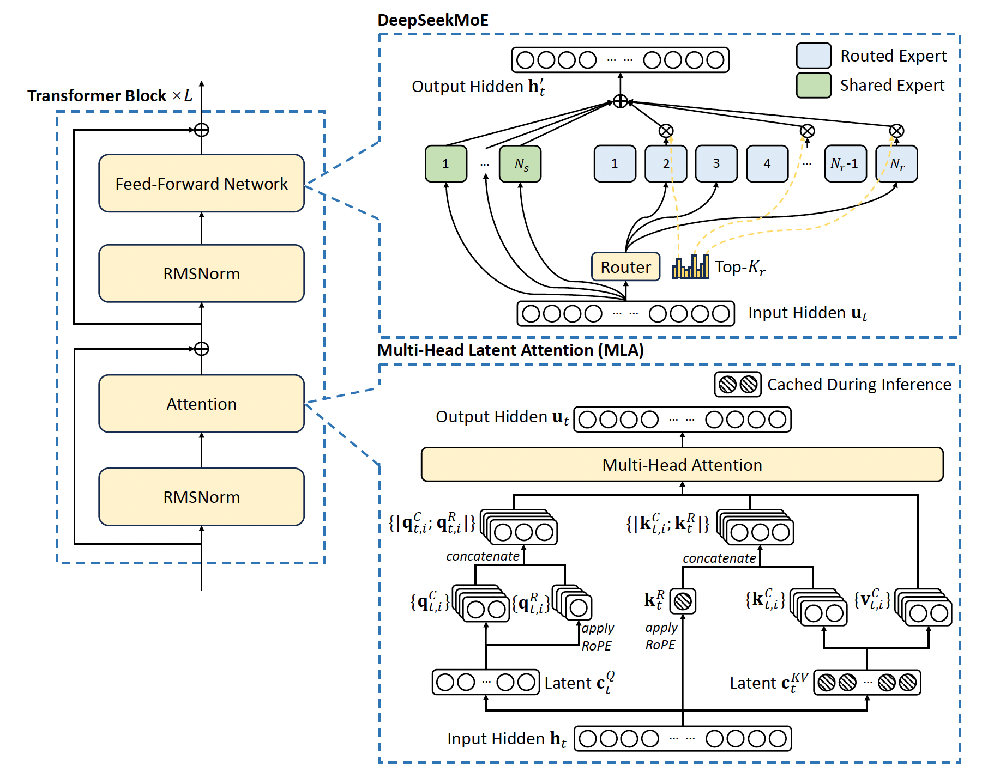

> **注意**: 本文**正在更新中**，内容只是**草稿版本**，并不完善，后续会有变动。请随时关注最新版本。

## 引言

本篇文章将系统梳理市面上开放权重的多种大语言模型，重点关注 **DeepSeek** 和 **Qwen** 系列。我们将深入解析其模型架构、训练数据和训练方法，并通过表格揭示各版本间的核心差异与演进。

## DeepSeek 系列模型

**DeepSeek AI** 专注于通用人工智能研究，推出了一系列高性能开源模型，尤其在代码和数学领域表现突出，并积极探索 MoE 等高效架构。

### DeepSeek LLM (Base Models)

**DeepSeek LLM** ([DeepSeek-AI, 2023](https://github.com/deepseek-ai/deepseek-llm)) 是该系列的 foundational work，发布于 2023 年底，提供了强大的开源基础模型。

**核心特点:**

*   **参数规模**: 提供 **7B** 和 **67B** 两种规模的基础 (Base) 和对话 (Chat) 模型。
*   **训练数据**: 在 **2 万亿 (2T) tokens** 的高质量中英文语料上从头训练。
*   **性能**: **67B 模型**在代码、数学、推理上优于 LLaMA-2 70B；Chat 版本优于 GPT-3.5。
*   **Scaling Laws 研究**: 强调高质量数据的重要性，发现高质量数据下扩展模型比扩展数据更有效。

**关键技术:**

*   **架构**: 类 LLaMA 架构（RMSNorm, SwiGLU, RoPE），调整了学习率调度器；67B 模型采用 **GQA** 提升推理效率。上下文长度 4096 tokens。
*   **数据处理**: 严格的去重、过滤、重混流程保证数据质量。
*   **对齐**: Chat 版本使用 **SFT** 和 **DPO** 进行对齐。

**意义：** DeepSeek-LLM 作为系列开篇，证明了自研的开源模型可以比肩甚至超越国外同级模型（LLaMA2），为后续的 MoE 模型提供了强大的密集模型基线。

### DeepSeekMoE

**DeepSeekMoE** ([Dai et al., 2024](https://arxiv.org/abs/2401.06066)) 是在**混合专家 (MoE)** 架构上的重要创新，旨在提升模型效率和专家特化程度。

**核心特点:**

*   **核心创新**:
    1.  **细粒度专家分割**: 将 FFN 专家进一步拆分为多个更小的专家，路由时激活多个细粒度专家组合，提高灵活性和表达能力。
    2.  **共享专家隔离**: 引入一部分始终被激活的共享专家处理通用知识，减少路由专家之间的知识冗余，促进路由专家的特化。
*   **效率**: 在相似计算成本下性能优于传统 MoE（如 GShard Top-2），以更少计算量（约 40%）即可达到同等规模稠密模型（如 LLaMA2-7B）的性能。

**关键技术:**

*   **路由机制**: Top-K 路由结合细粒度分割和共享专家。
*   **负载均衡**: 采用专家级和设备级平衡损失（后续版本中可能优化为无辅助损失）。
*   **参数效率**: 通过专家特化提高参数利用率。

**验证模型：** 团队发布了 **DeepSeekMoE-16B**（激活约 2.4B 参数）模型进行验证，证明了该架构的有效性。

**意义：** DeepSeekMoE 验证了 MoE 架构的可行性和优越性，为后续更大规模的 MoE 模型（V2, V3）打下基础，并为 MoE 领域贡献了新的架构思路。

### DeepSeek-V2

**DeepSeek-V2** ([DeepSeek-AI, 2024a](https://arxiv.org/abs/2405.04434)) 是一款强大的开源 **MoE** 模型，平衡了模型强度、训练成本和推理效率。

**核心特点:**

*   **参数规模**: **236B** 总参数，每个 token 激活 **21B** 参数 (稀疏激活)。
*   **上下文长度**: 支持高达 **128K tokens**。
*   **核心架构**: 结合 **DeepSeekMoE** 和创新的 **多头潜在注意力 (Multi-head Latent Attention, MLA)**。
*   **效率提升**:
    *   训练成本比 DeepSeek 67B 降低 42.5%。
    *   **KV 缓存大小减少 93.3%** (通过 MLA)。
    *   最大生成吞吐量提升 5.76 倍。
*   **性能**: 发布时成为最强开源 MoE 之一，性能优于 Llama2-70B 等。

**关键技术:**

*   **MLA (Multi-head Latent Attention)**: 通过将 Key-Value 缓存压缩到低秩潜在空间，**显著降低长上下文推理时的显存占用**，并提升吞吐量。MLA 是实现 128k 上下文的关键。
*   **DeepSeekMoE 应用**: 应用于 FFN 层，实现稀疏计算和专家特化。可能采用了无需辅助损失的负载均衡策略。
*   **训练数据**: 在 **8.1T tokens** 高质量多源语料上训练。
*   **训练流程**: 预训练 + SFT + RLHF 三阶段。
*   **上下文扩展**: 可能使用了如 YaRN 等技术辅助 RoPE 扩展到 128k。

**意义：** DeepSeek-V2 首次在开源社区大规模验证了 MLA 技术，并成功将 MoE 模型扩展到 200B+ 级别，同时实现了超长上下文处理能力，是开源 MoE 模型发展的重要里程碑。

### DeepSeek-V3

**DeepSeek-V3** ([DeepSeek-AI, 2024c](https://arxiv.org/abs/2412.19437)) 是 DeepSeek 最新的旗舰 **MoE** 模型，性能接近顶尖闭源模型。

**核心特点:**

*   **参数规模**: **671B** 总参数，每个 token 激活 **37B** 参数。
*   **核心架构**: 沿用 **MLA** 和 **DeepSeekMoE**，并引入新创新。
*   **关键创新**:
    1.  **无辅助损失的负载均衡**: 通过改进路由策略（可能涉及动态调整专家偏置）实现专家负载均衡，避免辅助损失对性能的潜在影响。
    2.  **多 Token 预测 (MTP)**: 训练时引入预测多个未来 token 的目标，增加训练信号，提升模型性能，并可用于加速推理（推测式解码）。
*   **训练效率**: 采用 **FP8** 混合精度训练和优化的训练框架 (DualPipe)，以极低的成本（约 2.78M H800 GPU·h）完成了超大规模模型的训练。
*   **性能**: 在知识、代码、数学、推理、长上下文等基准上达到 **SOTA 开源水平**，可媲美 GPT-4o、Claude 3.5 Sonnet 等。

**关键技术:**

*   **架构**: MLA + DeepSeekMoE + 无辅助损失均衡 + MTP。
*   **训练数据**: 在 **14.8T tokens** 高质量、多样化语料上训练，增加了数学、编程、多语言比例。
*   **知识蒸馏**: 受益于 **DeepSeek-R1** 系列模型的推理能力蒸馏（可能在微调阶段）。
*   **Tokenizer**: 扩展并优化词汇表（具体大小未明确，但应大于 DeepSeek-LLM）。

**意义：** DeepSeek-V3 将开源 MoE 模型推向了 600B+ 参数的新高度，并在性能上实现了对顶级闭源模型的有力挑战。它展示了通过架构创新和高效训练技术，开源社区也能在有限资源下训练出超大规模、高性能的模型。

### DeepSeek-Coder

**DeepSeek-Coder** ([Guo et al., 2024](https://arxiv.org/abs/2401.14196); [DeepSeek-AI, 2024b](https://github.com/deepseek-ai/DeepSeek-Coder-V2)) 是专为**代码智能**设计的系列模型。

**核心特点:**

*   **版本**: 包括初版 DeepSeek-Coder 和升级版 DeepSeek-Coder-V2。
*   **参数规模 (Coder-V2)**: 提供 **16B (激活 2.4B)** 和 **236B (激活 21B)** 两种 MoE 规模。
*   **训练数据 (Coder-V2)**: 基于 DeepSeek-V2 checkpoint，额外使用 **6T tokens** 的代码和数学相关语料进行继续预训练。
*   **核心技术**:
    1.  **仓库级预训练**: 增强跨文件理解能力。
    2.  **填充中间 (FIM)**: 提升代码补全能力。
    3.  **多语言支持 (Coder-V2)**: 支持多达 **338 种**编程语言。
*   **上下文长度 (Coder-V2)**: 继承 V2 的 **128K tokens**。
*   **性能 (Coder-V2)**: 在代码生成、补全、数学推理等方面表现 **SOTA**，超越 GPT-4 Turbo 等闭源模型。

**关键技术:**

*   **数据构成**: 大量高质量项目级代码，覆盖广泛的编程语言。
*   **训练目标**: Next Token Prediction + FIM。
*   **架构 (Coder-V2)**: 基于 DeepSeek-V2 (MoE + MLA)。

**意义：** DeepSeek-Coder 系列，特别是 V2，填补了开源社区在顶级代码生成模型上的空白，为开发者提供了强大的、可本地部署的 AI 编程助手。

### DeepSeek-R1

**DeepSeek-R1** ([DeepSeek-AI, 2025](https://arxiv.org/abs/2501.12948)) 是利用**强化学习 (RL)** 显著增强 LLM **推理能力**的第一代模型。

**核心特点:**

*   **核心方法**: 广泛使用 **RL**（特别是 GRPO 算法）直接培养模型的复杂推理能力，减少对 SFT 数据的依赖。
*   **关键模型**:
    *   **DeepSeek-R1-Zero**: 基于 DeepSeek-V3，通过纯 RL 训练涌现出复杂推理行为（如长链思考、自我反思）。
    *   **DeepSeek-R1**: 在 R1-Zero 基础上，结合冷启动策略、面向推理的 RL 和拒绝采样/SFT 进行多阶段训练，提升实用性。
*   **性能**: 在 **AIME、MATH、Codeforces** 等高难度推理基准上取得 **SOTA** 性能，可媲美 OpenAI 的 o1 系列推理模型。
*   **能力蒸馏**: 成功将 R1 的强大推理能力蒸馏到一系列更小的密集模型（基于 Qwen 和 Llama 架构，1.5B 到 70B）。

**关键技术:**

*   **RL 激励**: 主要依赖基于规则的奖励系统或模型自我评估。
*   **训练流程**: 精心设计的多阶段流程结合 SFT 和 RL。
*   **涌现能力**: RL 驱动模型发展出复杂推理行为。

**意义：** DeepSeek-R1 探索了通过强化学习提升 LLM 深度推理能力的新范式，证明了模型可以通过自我探索变得更“聪明”，并为社区提供了强大的开源推理模型（及其蒸馏版本）。

### DeepSeek 系列模型特性对比

| 特性               | DeepSeek LLM (2023/11) | DeepSeek-V2 (2024/05) | DeepSeek-V3 (2024/12) | DeepSeek-Coder-V2 (2024/11) | DeepSeek-R1 (2025/01) |
|--------------------|------------------------|------------------------|------------------------|-----------------------------|------------------------|
| **基础模型**        | -                      | -                      | -                      | DeepSeek-V2                 | DeepSeek-V3            |
| **模型最大规模**    | 67B (Dense)            | 236B (MoE)             | **671B (MoE)**         | 236B (MoE)                  | 671B (MoE, Base for RL)|
| **激活参数量**      | 67B                    | 21B                    | 37B                    | 2.4B / 21B                  | 37B                    |
| **训练数据量**      | 2T tokens              | 8.1T tokens            | **14.8T tokens**       | V2 + 6T Code/Math tokens    | V3 + RL Data           |
| **上下文长度**      | 4K / 32K (扩展)        | **128K tokens**        | **128K tokens**        | **128K tokens**             | **128K tokens**        |
| **Tokenizer**      | Custom BPE             | Custom BPE (Optimized) | Custom BPE (Expanded)  | Inherited from V2           | Inherited from V3      |
| **位置编码**        | RoPE                   | RoPE                   | RoPE                   | RoPE                        | RoPE                   |
| **注意力/推理优化** | GQA + KV Cache         | **MoE + MLA** + KV Cache | **MoE + MLA** + KV Cache | **MoE + MLA** + KV Cache    | **MoE + MLA** + KV Cache |
| **归一化**        | RMSNorm                | RMSNorm                | RMSNorm                | RMSNorm                     | RMSNorm                |
| **激活函数**        | SwiGLU                 | SwiGLU                 | SwiGLU                 | SwiGLU                      | SwiGLU                 |
| **关键创新**        | -                      | MLA, DeepSeekMoE       | MTP, FP8 Training      | Code/Math Specialization    | Pure RL Reasoning      |
| **模型类别**        | 基座/对话模型          | 基座/对话模型 (MoE)    | 基座/对话模型 (MoE)    | 代码/数学模型 (MoE)         | 推理增强模型 (MoE)     |

## Qwen 系列模型

阿里巴巴达摩院的通义千问（**Qwen**）系列模型是大型语言模型（LLM）及多模态模型领域的重要贡献者。自 2023 年发布以来，Qwen 系列不断迭代，涵盖从小型到超大规模的基础模型、对话模型（Qwen-Chat），以及针对代码（Qwen-Coder）、数学（Qwen-Math）、视觉（Qwen-VL）、音频（Qwen-Audio）乃至全模态（Qwen-Omni）的专用模型。Qwen 系列以其强大的性能、广泛的多语言支持和持续的开源贡献，在社区中产生了广泛影响。下面我们按照发布时间顺序，依次介绍 Qwen 系列的主要模型。

### Qwen (Qwen 1.0)

**发布时间：** 约 2023 年 8-9 月

**关键特性:** 作为 Qwen 系列的开山之作，Qwen 旨在提供强大的中英双语基础模型 ([Bai et al., 2023](https://arxiv.org/abs/2309.16609)).
*   **模型规模:** 发布了 7B 和 14B 两个尺寸。
*   **训练数据:** 在约 **2.2 万亿 tokens** 的高质量数据上训练，以中英文为主，包含代码数据。
*   **上下文长度:** 基础模型支持 2048 tokens，通过增量训练使 7B 支持 32K，14B 支持 8K。
*   **架构:** 基于标准 Transformer 解码器，采用 RoPE 位置编码、RMSNorm 和 SwiGLU 激活函数。
*   **对齐:** 发布了 Qwen-Chat 模型，通过 SFT 和 RLHF 进行对齐。

**性能:** Qwen-14B 在 MMLU 上得分约 70，在当时开源模型中表现突出，尤其是在中文任务上 ([Bai et al., 2023](https://arxiv.org/abs/2309.16609)).

**总结:** Qwen 1.0 以其在中英双语上的优异表现和扎实的架构设计，成功打响了 Qwen 系列的名号，为后续快速迭代奠定了基础。

### Qwen1.5

**发布时间：** 约 2024 年 2 月

**关键特性：** Qwen1.5 是对 Qwen1.0 的改进版本，重点提升了多语言能力和易用性 ([Qwen Team, 2024g](https://qwenlm.github.io/blog/qwen1.5/)).
*   **模型规模:** 开源了 0.5B, 1.5B, 7B, 14B, 32B, 70B (后改为 72B?) 以及一个 110B MoE 模型。
*   **多语言:** 显著增强了非英语语言的处理能力。
*   **上下文长度:** 全系支持 **32K tokens** 上下文。
*   **架构:** 引入 untied embeddings 和去 Bias 化等微调。与 HuggingFace Transformers 深度集成，使用更方便。
*   **对齐:** 改进了 Chat 模型的对话能力和指令跟随。

**性能:** Qwen1.5-72B 在 MMLU 上得分约 77，相比 Qwen1.0 有显著提升。Chat 模型在 MT-Bench 上表现良好 ([Qwen Team, 2024g](https://qwenlm.github.io/blog/qwen1.5/)).

**总结:** Qwen1.5 承接 Qwen1.0，在多语言、长上下文和易用性上做了关键改进，并扩展了模型规模选项，为 Qwen2 的大规模升级铺平了道路。

### Qwen2

**发布时间：** 约 2024 年 6 月

**关键特性：** Qwen2 是 Qwen1.5 的重要迭代，显著提升了多语言能力、上下文长度和模型规模 ([Bai et al., 2024b](https://arxiv.org/abs/2406.17849)).
*   **模型规模:** 开源了 0.5B, 1.5B, 7B, 14B, 72B 以及一个 57B-A14B 的 MoE 变体。
*   **训练数据:** 扩展到 **7 万亿 tokens**，覆盖 **27 种语言**，并增加了代码和数学数据比例。
*   **上下文长度:** 全系原生支持 **128K tokens** 的长上下文。
*   **架构:** 延续 Transformer，使用 GQA（Grouped Query Attention）优化大模型推理效率。
*   **对齐:** 使用数十万指令数据进行 SFT 和 RLHF，引入了工具使用能力。
*   **多模态扩展:** 同期发布了 Qwen2-VL 和 Qwen2-Audio 模型。

**性能:** Qwen2-72B 在 MMLU 上达到 84.2，HumanEval 64.6，GSM8K 88.7 ([Bai et al., 2024b](https://arxiv.org/abs/2406.17849)). 在多语言基准（如 Flores）上表现优异。

**总结:** Qwen2 通过扩大数据、增长上下文、优化架构（GQA）和引入工具使用，实现了性能的全面飞跃，并为后续 Qwen2.5 奠定了基础。

### Qwen2.5 (Base Models)

**发布时间：** 约 2024 年 9 月

**设计动机:** 作为 Qwen2.0 的重要升级，Qwen2.5 旨在全面提升模型的通用能力（知识、推理、语言理解）、指令跟随效果和易用性 ([Qwen Team, 2024f](https://qwenlm.github.io/blog/qwen2.5/)). 主要通过**大幅增加预训练数据**（从 7T 到 18T tokens）、**改进对齐策略**（百万级指令数据、多阶段 RLHF）和**提供更丰富的模型规模**（0.5B 到 72B）来实现。

**模型架构:** 沿用 Transformer 解码器架构，提供 0.5B, 1.5B, 3B, 7B, 14B, 32B, 72B 密集模型。内部训练了 MoE 变体（Turbo/Plus）用于云服务。继续使用 RoPE、RMSNorm、SwiGLU 等优化组件。支持 128K 上下文，并可能利用位置插值技术增强超长上下文外推能力。

**预训练与对齐策略:** 预训练数据量达 **18 万亿 tokens**，包含更多多语种文本、更新的知识、专业领域数据（法律、医疗等）以及代码和数学数据 ([Qwen Team, 2024f](https://qwenlm.github.io/blog/qwen2.5/)). 指令微调使用超过 **100 万条**高质量指令数据，并采用**多阶段 RLHF** 进行精细对齐，提升人类偏好评分和安全性。

**性能评估:** Qwen2.5 系列在各项基准上表现优异。
*   **MMLU:** 72B 模型达到 85+，接近 Llama3-405B ([Qwen Team, 2024f](https://qwenlm.github.io/blog/qwen2.5/)).
*   **HumanEval:** 72B 模型约 65 分 ([Bai et al., 2024b](https://arxiv.org/abs/2406.17849)).
*   **GSM8K:** 72B 模型达 89.5 分 ([Bai et al., 2024b](https://arxiv.org/abs/2406.17849)).
*   **MT-Bench / Arena Hard:** 72B Chat 模型评分 9.1 / 48.1，居开源模型前列 ([Bai et al., 2024b](https://arxiv.org/abs/2406.17849)).
Qwen2.5-72B 已成为最强的开源通用模型之一。

**开源情况:** 开源了 **0.5B 到 72B** 共 7 个尺寸的基础和指令模型（Apache 2.0），可在 Hugging Face 获取 ([Qwen Team, 2024f](https://huggingface.co/collections/Qwen/qwen25-670f0f0ce9bffc6a01e4bebf)). 提供量化模型、微调脚本和示例。**Qwen2.5-Turbo/Plus** (MoE) 通过 API 提供。

**特色能力:**
*   广博的知识储备和多语言能力（支持 30+ 种语言）。
*   生成结构良好的超长内容。
*   支持 JSON、表格等结构化输出。
*   通过系统提示进行角色扮演和语气控制。
*   强大的工具使用（函数调用）能力。
*   长对话一致性和较低的幻觉率。

**应用场景:** 智能客服、内容创作、教育辅导、科研助手、数据分析（结合工具）、医疗与法律辅助等通用 NLP 任务。

**未来展望:** 更大规模模型（Qwen 3.0）、更深度多模态融合、自动化持续学习、模型压缩与终端部署、AI 安全与伦理强化。

### Qwen2.5-Coder

**发布时间：** 约 2024 年 9 月

**设计动机:** Qwen2.5-Coder 是 Qwen 系列新一代代码专用模型，旨在打造开源顶尖代码模型，缩小与最强闭源代码模型（如 GPT-4 Codex 能力）的差距 ([Qwen Team, 2024e](https://qwenlm.github.io/blog/qwen-coder/)). 目标是提升多语言代码生成质量、增强复杂编程任务理解，并结合 Qwen2.5 的通用知识进行代码解释和调试。更名 Coder 也寓意其作为更智能、人性化的“编码助手”。

**模型架构:** 基于 Qwen2.5 LLM 主干，针对代码任务进行调整：
*   **优化的 Tokenizer:** 更好地处理代码缩进、符号和关键字。
*   **插入位置支持:** 使用特殊提示或标记支持在代码中间插入内容（代码补全）。
*   **长上下文:** 支持至少 8K-32K 上下文，便于处理长文件和多文件项目。
*   依赖 Transformer 自身能力，未引入 AST 解析器等外部模块。

**预训练与对齐策略:** 在 Qwen2.5 基础上，使用海量高质量、经清洗的多语言代码语料（GitHub、竞赛题解等）进行继续预训练。指令微调阶段使用大规模指令数据（人工编写、用户反馈、自我改进数据），训练模型遵循编程任务描述、生成高质量代码、注释和文档。可能使用 RLHF 优化代码风格和优雅性。

**性能评估:** Qwen2.5-Coder 在多项代码基准上取得开源 SOTA 成绩 ([Qwen Team, 2024e](https://qwenlm.github.io/blog/qwen-coder/)).
*   **HumanEval (Python):** 32B 模型通过率接近 65%，与 GPT-4o 相当或更高 ([Bai et al., 2024b](https://arxiv.org/abs/2406.17849)).
*   **LeetCode:** 在中等难度问题上通过率远超 Code Llama 等。
*   **MultiPL-E:** 在 C++, Java 等多语言上表现均衡且领先。
*   在代码审查、重构和调试任务上表现优于同类开源模型。

**开源情况:** 全面开源 **1.5B, 7B, 32B** 三个尺寸的模型权重（Apache 2.0），可在 Hugging Face 和 ModelScope 获取 ([Qwen Team, 2024e](https://huggingface.co/collections/Qwen/qwen25-coder-66e932484f95e00f01164a9f)). 提供 Transformers 支持、量化模型和微调示例。

**特色能力:**
*   精通多种编程语言。
*   代码解释、文档生成和错误调试。
*   智能代码补全和重构。
*   结合自然语言生成技术文档。
*   理解常用框架和工具上下文。

**应用场景:** IDE 插件（补全、调试）、Code Review 自动化、技术支持问答、编程学习与培训、企业内部代码生成服务。

**未来展望:** 支持更多语言和领域、与 IDE 环境深度结合、持续学习新框架、更精细的多目标对齐、结合语义搜索处理超大代码库。

### QwQ (Qwen with Questions)

**发布时间：** 约 2024 年 11 月 (预览版)

**设计动机:** QwQ-32B 是一款**实验性预览模型**，旨在探索提升大模型**推理和自我反思**能力 ([Qwen Team, 2024d](https://qwenlm.github.io/blog/qwen-qxq/)). 其名称寓意“提问”和“深思”，希望模型能像哲学家一样“知其无知”，通过主动质疑和反复校正来提高复杂推理（数学、逻辑、常识）的可靠性。

**模型架构:** 基于 Qwen2.5-32B-Instruct，核心仍是 Transformer 解码器。通过 Prompt 设计和微调实现增强推理流程：
*   **显式思考链:** 输出答案前会以特殊格式（如“思考：”）输出中间推理步骤和子问题。
*   **不确定性标记:** 可能引入机制让模型在不确定时标记或主动寻求澄清。
*   **长上下文增强:** 支持 32K 上下文以容纳推理链。
*   沿用 RoPE、SwiGLU、RMSNorm 等优化组件 ([Bai et al., 2023](https://arxiv.org/abs/2309.16609)).

**预训练与对齐策略:** 基于 Qwen2.5-Chat 进行微调。微调数据包含大量需要多步推理的问题及其详细解析过程（类似 CoT 数据）。特别训练模型在回答前先提出澄清性子问题。可能使用 RLHF 奖励详尽、逻辑自洽且正确的推理链。

**性能评估:** QwQ-32B 在 **GPQA**（通用解难问答）基准上得分超过 GPT-4o 和 Claude 3.5 Sonnet ([Qwen Team, 2024d](https://huggingface.co/Qwen/QwQ-32B-Chat)). 在 **MATH** 数据集和 **AQUA-RAT**（代数问答）上表现优异，推理步骤更完整合理。在代码推理（如 APE）上也取得领先。社区测试表明其在抗幻觉和自我纠错方面有优势。

**开源情况:** **QwQ-32B-Preview** 模型权重已开源（Apache 2.0），可在 Hugging Face 获取 ([Qwen Team, 2024d](https://huggingface.co/Qwen/QwQ-32B-Chat)).

**特色能力:**
*   强烈的质疑意识和审慎态度。
*   自我检查和纠错能力。
*   条理清晰的论证过程。
*   减少幻觉产生。
*   潜在的教学能力（通过展示解题思路）。

**应用场景:** 科研辅助、教育答疑、代码审查调试、法律分析、高可靠场景 AI 助手。

**未来展望:** 将 QwQ 技术融入更大模型、更精细的反思机制、自动化思维链数据生成、用户可控的思维输出、与外部工具结合、改善效率。

### Qwen2.5-1M

**发布时间：** 约 2024 年 11-12 月

**设计动机：** 为了满足处理超长文本（如书籍、大型代码库、长篇报告）的需求，Qwen2.5-1M 将模型上下文长度扩展到 **1,000,000 tokens** ([Qwen Team, 2024c](https://qwenlm.github.io/blog/qwen2.5-1m/)). 主要动机是突破 Transformer 的长度瓶颈，在百万级上下文下实现高效且性能不衰减的推理，同时降低长上下文训练和推理的成本。

**模型架构：** 基于 Qwen2.5-7B/14B 模型，针对长序列进行了架构和推理优化：
*   **稀疏局部注意力:** 采用滑动窗口或分层注意力等稀疏模式，降低 $O(n^2)$ 复杂度，实现 3-7 倍推理加速 ([Qwen Team, 2024c](https://qwenlm.github.io/blog/qwen2.5-1m/)).
*   **分块预填充 (Chunked Prefill):** 将长序列分块输入，利用并行和流水线优化显存和计算峰值 ([Qwen Team, 2024c](https://qwenlm.github.io/blog/qwen2.5-1m/)).
*   **长度外推技术:** 利用 RoPE 的可外推性或位置插值等方法，无需完全重训即可将 128K 模型扩展到 1M 上下文 ([Qwen Team, 2024c](https://qwenlm.github.io/blog/qwen2.5-1m/)).
*   **优化的推理引擎:** 定制 CUDA 核、流水线并行、调度优化等工程手段保障端到端速度。
模型采用渐进式训练，逐步增加上下文长度。

**预训练与对齐策略：** 预训练数据强调长文本，可能使用拼接文档构造超长样本。加入特殊任务（如长文中间摘要、远距离问答）训练长程依赖。指令微调使用百万级长上下文指令数据，训练模型在长文档中搜索、关联信息和遵循指令。RLHF 用于优化长文本生成的稳定性和质量。

**性能评估：** Qwen2.5-1M 在长文档问答任务上显著优于同类模型（如 GPT-4o-mini），支持的上下文长度是其 8 倍 ([Qwen Team, 2024c](https://qwenlm.github.io/blog/qwen2.5-1m/)). 在长文本摘要、代码跨文件理解、多轮长程对话中表现出色，展现了惊人的记忆力和全局一致性。推理效率通过优化大幅提升，处理 1M token 的速度接近处理 128K 的量级。

**开源情况：** 开源了 **Qwen2.5-7B-Instruct-1M** 和 **Qwen2.5-14B-Instruct-1M** 模型（Apache 2.0），以及配套的长文本推理框架 ([Qwen Team, 2024c](https://huggingface.co/collections/Qwen/qwen25-1m-670f1127384613c1a138a431)). **Qwen2.5-Turbo-1M** (MoE) 通过 API 提供。

**特色能力：**
*   超长上下文记忆（百万 token 级别）。
*   生成全局一致的超长文稿。
*   即时跨文档查询与精确引用。
*   耐久对话与持续学习能力。
*   复杂的多文档、跨篇章推理。

**应用场景：** 企业知识库问答、法律分析、学术研究、金融分析、大型代码库理解、超长文学创作、长对话陪伴。

**未来展望：** 更长甚至无限上下文、长程交互算法改进、片段版权与来源追踪、稀疏 MoE 结合、长上下文评测标准、训练成本进一步降低。

### Qwen2.5-VL

**发布时间：** 约 2024 年 11-12 月

**设计动机：** 作为 Qwen 系列新一代旗舰视觉语言模型，Qwen2.5-VL 旨在提升对**任意分辨率图像**的适应性、增强**长视频理解**能力，并在多模态推理和多语言图像理解上达到业界领先水平 ([Qwen Team, 2024b](https://qwenlm.github.io/blog/qwen2.5-vl/)). 它希望解决传统视觉模型缩放图像导致细节丢失的问题，并满足对长时序视频分析的需求。

**模型架构：** Qwen2.5-VL 采用 **ViT 视觉编码器**与 **Qwen2.5 语言模型**结合的架构。关键改进包括：
*   **原生动态分辨率 (Naive Dynamic Resolution):** 允许输入任意尺寸图像，ViT 在训练时处理不同数量的 patch，保留图像原始细节和比例 ([Bai et al., 2024](https://arxiv.org/abs/2408.11701)).
*   **增强的多模态 RoPE (M-ROPE):** 优化了对 2D 图像和 3D 时空（视频）位置的编码，通过将位置拆分为时间、高度、宽度维度并应用旋转变换，显式建模视觉信号的空间/时间对应关系 ([Bai et al., 2024](https://arxiv.org/abs/2408.11701)).
视觉编码器本身参数量较大（约 6 亿），采用先预训练 ViT 再与 LLM 联合微调的策略。

**预训练与对齐策略：** 使用了包含亿级图文对（不同分辨率）、百万级视频文本对、多语言 OCR 数据在内的超大规模多模态数据集 ([Qwen Team, 2024b](https://qwenlm.github.io/blog/qwen2.5-vl/)). 预训练目标是根据视觉输入生成文本。训练中随机改变图像尺寸和视频长度以适应动态分辨率和 M-ROPE。对齐阶段进行指令微调和基于人类反馈的 RLHF，优化答案质量、格式遵循和视觉相关的安全性。

**性能评估：** Qwen2.5-VL 在 DocVQA、RealWorldQA、MathVista 等图像理解基准上取得 SOTA 或接近 SOTA 的成绩，超越了许多开源和闭源模型 ([Qwen Team, 2024b](https://qwenlm.github.io/blog/qwen2.5-vl/)). 能够处理长达 20 分钟的视频问答，并在多语言 OCR 和图像文本理解上表现突出。Qwen2.5-VL-72B 在 OpenCompass 等综合评测中位居前列 ([Qwen Team, 2024b](https://huggingface.co/collections/Qwen/qwen25-vl-67394505f55508a7797a021a)).

**开源情况：** 开源了 **Qwen2.5-VL-7B** 和 **Qwen2.5-VL-2B** 模型权重（Apache 2.0），可在 Hugging Face 获取 ([Qwen Team, 2024b](https://huggingface.co/collections/Qwen/qwen25-vl-67394505f55508a7797a021a)). **Qwen2.5-VL-72B** 通过阿里云 API 提供服务。官方提供了推理代码、优化工具（vLLM 适配）和评测数据集示例。

**特色能力：**
*   处理任意分辨率和长图文档（如小票、扫描件）。
*   复杂场景的多模态推理。
*   同时处理多张图像或图像+视频。
*   具备一定的视觉代理（UI 操作规划）能力。
*   结合 Qwen2.5 的知识库进行视觉问答。

**应用场景：** 文档信息抽取、安防监控、媒体内容审核、多媒体搜索推荐、辅助创作、机器人视觉。

**未来展望：** 融合更丰富模态（3D）、引入推理链、结合知识库、模型压缩部署、更复杂的视觉指令交互、多模态安全提升。

### QVQ (Qwen with Vision & Questions)

**发布时间：** 约 2024 年 12 月 (预览版)

**设计动机：** QVQ-72B 是 Qwen 团队推出的**实验性多模态推理模型**，旨在提升模型在复杂视觉推理任务上的能力，使其不仅能描述图像，还能进行涉及常识和多步推理的深度思考 ([Qwen Team, 2024d](https://qwenlm.github.io/blog/qwen-qxq/)). 其名称寓意“质疑”，希望模型能像哲学家一样“看”世界并提出问题，探索模型的“自我反思”能力。

**模型架构：** 基于 Qwen2.5-VL-72B，保留了 ViT 编码器、M-ROPE 和 72B 解码器。针对推理进行了优化：
*   **插入式思维链 (Chain-of-Thought):** 模型在解码时可输出隐藏的推理步骤，再给出最终答案，训练时可能使用了 CoT 格式的数据。
*   **更大的上下文窗口:** 可能支持 128K 或更长上下文以容纳复杂推理链。
*   **多模态融合:** 深度融合视觉感知与语言推理能力。

**预训练与对齐策略:** 基于 Qwen2.5-VL 进行微调，加入大量需要多步视觉推理的指令数据（如图片逻辑题、看图推断社会现象等）。可能引入了让模型在不确定时主动提问或标记不确定性的训练策略。

**性能评估:** QVQ-72B 在高难度的多模态基准 **MMMU** 上取得了 **70.3%** 的准确率，达到 SOTA 水平，超越了 GPT-4o 等模型 ([Qwen Team, 2024d](https://qwenlm.github.io/blog/qwen-qxq/)). 这证明了其在复杂视觉推理上的强大实力。

**开源情况:** 作为研究预览版，**QVQ-72B-Chat** 模型权重已开源 ([Qwen Team, 2024d](https://huggingface.co/Qwen/QVQ-72B-Chat)).

**特色能力:**
*   深度视觉推理（超越表面描述）。
*   潜在的自我反思和提问能力。
*   结合视觉信息进行多步逻辑推断。

**应用场景:** 复杂图像分析、视觉常识问答、需要深度理解的图像场景（如医学影像初步分析、科学图表解读）。

**未来展望:** 将 QVQ 的推理能力融入主流多模态模型，提升可靠性和可解释性。

### Qwen2.5-Omni

**发布时间：** 约 2024 年 12 月 / 2025 年初

**设计动机：** Qwen2.5-Omni 旨在打造一个能够处理文本、图像、音频、视频多种模态输入的“全能”（omni-modal）AI 助手，实现端到端的感知和实时交互 ([Qwen Team, 2024a](https://qwenlm.github.io/blog/qwen2.5/)). 其目标是模拟人类多感官交互，让 AI 能够同时“看”、“听”、“说”，提供自然流畅的人机对话体验。

**模型架构：** Qwen2.5-Omni 采用了创新的 **“思考者-说话人”（Thinker-Talker）架构** ([Qwen Team, 2024a](https://qwenlm.github.io/blog/qwen2.5/)).
*   **Thinker:** 基于 Transformer 解码器，整合了视觉和音频编码器，负责理解多模态输入并生成高层语义表示和文本输出。引入了**时间对齐多模态 RoPE (TMRoPE)** 来同步视频帧和音频序列的时间轴 ([Qwen Team, 2024a](https://qwenlm.github.io/blog/qwen2.5/)).
*   **Talker:** 采用**双轨自回归 Transformer 解码器**，接收 Thinker 的表示，以流式方式合成语音输出。使用了**滑动窗口离散表示 Transformer (sliding-window DiT)** 来实现低延迟的实时语音合成 ([Qwen Team, 2024a](https://qwenlm.github.io/blog/qwen2.5/)).
该架构实现了端到端训练，无需独立的 TTS 模块。

**预训练与对齐策略：** 模型在包含文本、图文对、音文对、视频文本对的大规模多模态语料上进行预训练。损失函数结合了文本生成的交叉熵损失和语音 codec token 生成的损失。对齐阶段采用**监督微调 (SFT)** 和**人类反馈对齐**（包括文本 RLHF 和语音质量优化），确保模型遵循指令并生成高质量、安全的多模态响应 ([Qwen Team, 2024a](https://qwenlm.github.io/blog/qwen2.5/)).

**性能评估：** Qwen2.5-Omni 在多模态综合基准 Omni-Bench 上达到 SOTA 水平。其单项能力（语音理解、视觉问答）可媲美同规模的专用模型（如 Qwen2-Audio, Qwen2.5-VL）。在端到端语音指令跟随任务上表现出色，语音合成质量也超过了许多实时 TTS 系统 ([Qwen Team, 2024a](https://qwenlm.github.io/blog/qwen2.5/)).

**开源情况：** 已开源 **Qwen2.5-Omni-7B** 模型权重（基础版和聊天版），采用 Apache 2.0 许可证 ([Qwen Team, 2024a](https://huggingface.co/Qwen/Qwen2.5-Omni-7B)). 更大模型通过阿里云 API 提供服务。相关的推理代码和语音解码库也在 GitHub 提供。

**特色能力：**
*   全模态输入输出（文本、图像、音频、视频输入；文本+语音输出）。
*   实时对话与连续理解（流式处理）。
*   复杂的跨模态推理。
*   支持情感和多语种的语音合成。
*   继承 Qwen 系列的工具使用和行动规划能力。

**应用场景：** 智能客服、教育科普、无障碍辅助、内容创作与审核、机器人控制等。

**未来展望：** 更大规模模型、更长时空理解、更自然的语音合成、多模态知识推理、与外部工具交互、推理性能优化。

---

## Qwen 系列模型特性对比

| 特性             | Qwen (1.0) (2023/09) | Qwen1.5 (2024/02)        | Qwen2 (2024/06)          | Qwen2.5 (2024/09+)       | Qwen2.5-Specialized (Coder/VL/Omni/1M/QwQ/QVQ) |
|------------------|----------------------|--------------------------|--------------------------|--------------------------|-------------------------------------------------|
| **模型规模 (开源)** | 7B, 14B              | 0.5B-14B, 32B, 70B?      | 0.5B-14B, 72B (+MoE)     | **0.5B-14B, 32B, 72B**   | 1.5B-72B (Depends on model)                     |
| **训练数据量**    | ~2.2T tokens         | > 2.2T (多语言增强)      | **7T+ tokens**           | **18T+ tokens**          | Base + Domain Specific Data                     |
| **语言覆盖**      | 中英为主             | 多语言增强               | **27+ 种语言**           | **30+ 种语言**           | Base + Domain Specific (e.g., Code languages)   |
| **上下文长度**    | 2K (可扩展 8K/32K)   | **32K**                  | **128K**                 | **128K** (可扩展 **1M**) | 32K - **1M** (Depends on model)                 |
| **Tokenizer**    | BPE                  | BPE                      | BPE                      | BPE                      | BPE (可能针对代码等优化)                        |
| **位置编码**      | RoPE                 | RoPE                     | RoPE                     | RoPE (M-ROPE for VL/Omni)| RoPE / M-ROPE                                   |
| **注意力/推理优化**| MHA                  | MHA (+Untied Emb)        | MHA / **GQA**            | MHA / **GQA**            | GQA / Sparse Attention (1M)                     |
| **归一化**      | RMSNorm (PreNorm)    | RMSNorm (PreNorm)        | RMSNorm (PreNorm)        | RMSNorm (PreNorm)        | RMSNorm (PreNorm)                               |
| **激活函数**      | SwiGLU               | SwiGLU                   | SwiGLU                   | SwiGLU                   | SwiGLU                                          |
| **模型类别**      | 基座/对话模型        | 基座/对话模型            | 基座/对话/多模态/MoE     | 基座/对话/MoE            | **代码/视觉/音频/全模态/长上下文/推理增强**     |
| **开源许可**      | Apache 2.0 / Tongyi Lic.| Apache 2.0             | Apache 2.0             | Apache 2.0             | Apache 2.0                                      |

## 关键技术解析

以下是目前基座大模型所采用的关键技术的详细解析，包括数学公式和相关说明。

### Multi-Head Latent Attention (MLA)

**原理简介：** Multi-Head Latent Attention (MLA) 是 DeepSeek-V2/V3 中引入的一种创新的注意力机制，旨在解决超长上下文（如 128k tokens）带来的 KV 缓存爆炸和计算瓶颈问题 ([DeepSeek-AI, 2024a](#ref-13))。

**机制：** MLA 的核心思想是将长序列的 Key 和 Value 信息压缩到一个固定大小（远小于序列长度）的**潜在表示 (latent representation)** 中。当前的 Query 不再直接关注原始的长序列 K/V，而是关注这个压缩后的潜在 K/V。这可以通过学习一个低秩投影或引入可学习的潜在 token 来实现。

**优势：**
- **极大压缩 KV 缓存：** KV 缓存大小从与序列长度 \(L\) 相关降低到与潜在表示大小 \(M\) 相关（\(M \ll L\)），DeepSeek-V2 报告减少了 93.3%。
- **提升推理吞吐量：** 减少了内存访问和通信开销，显著提高了长序列生成的吞吐量（DeepSeek-V2 报告提升 5.76 倍）。
- **支持超长上下文：** 使得处理 128k 甚至更长的上下文成为可能。

**挑战：** 压缩可能导致信息损失，需要精心设计潜在表示和训练策略（如 DeepSeek-V3 中的解耦 RoPE）来保持性能。

**应用：** DeepSeek-V2 和 DeepSeek-V3 使用 MLA 成功实现了 128k 的上下文窗口。MLA 被认为是 GQA/MQA 之后处理长上下文的更先进方案。

### Mixture-of-Experts (MoE)

**原理简介：** Mixture-of-Experts (MoE) 是一种稀疏激活的神经网络架构。它将网络中的某些层（通常是 FFN 层）替换为多个并行的“专家”子网络，并通过一个门控网络 (gating network) 为每个输入 token 选择性地激活其中少数几个专家进行计算。

**机制：**
- **专家 (Experts):** \(N\) 个并行的子网络（如 FFN）。
- **门控网络 (Gating Network):** 根据输入 \(x\) 计算每个专家的权重或选择概率 \(G(x)\)。
- **稀疏激活:** 通常只选择 Top-K (K 通常为 1 或 2) 个专家进行计算。
- **输出:** 选中专家的输出根据门控权重加权求和：\(y = \sum_{i \in \text{TopK}(G(x))} G(x)_i \cdot E_i(x)\)。

**优势：**
- **参数规模与计算解耦：** 允许模型拥有巨大的总参数量（通过增加专家数量），但每次前向传播的计算量只取决于激活的少数专家，远低于同等总参数的密集模型。
- **专家特化：** 理论上，不同专家可以学习处理不同类型的数据或任务，提高模型能力和泛化性。

**挑战：**
- **负载均衡：** 需要确保专家被均匀利用，避免部分专家过载或闲置。通常需要引入辅助损失。
- **通信开销：** 在分布式训练和推理中，需要在不同设备间进行 All-to-All 通信以路由 token 到正确的专家。
- **训练稳定性：** MoE 训练可能比密集模型更不稳定。

**DeepSeek MoE 创新：** DeepSeekMoE 架构通过**细粒度专家分割**和**共享专家隔离**来提升专家特化程度和负载均衡效果 ([Dai et al., 2024](#ref-10))。DeepSeek-V3 进一步实现了**无辅助损失的负载均衡**。

**应用：** Google 的 Switch Transformer、GLaM 以及 DeepSeek 系列的 MoE、V2、V3、Coder-V2、R1 都采用了 MoE 架构。MoE 被认为是扩展模型规模、突破密集模型瓶颈的关键技术之一。

## 参考文献

*   Ainslie, J., et al. (2023). GQA: Training Generalized Multi-Query Transformer Models from Multi-Head Checkpoints. *arXiv preprint arXiv:2305.13245*. ([Link](https://arxiv.org/abs/2305.13245))
*   AI at Meta. (2024a). Introducing Meta Llama 3: The most capable openly available LLM to date. ([Link](https://ai.meta.com/blog/meta-llama-3/))
*   AI at Meta. (2024b). Introducing Llama 3.1: Our most capable models to date. ([Link](https://ai.meta.com/blog/meta-llama-3-1/))
*   Chi, Z., et al. (2024). Llama Guard 3 Vision: Advancing Multimodal Safety. *arXiv preprint arXiv:2411.10414*. ([Link](https://arxiv.org/abs/2411.10414))
*   Dai, W., et al. (2024). DeepSeekMoE: Towards Ultimate Expert Specialization in Mixture-of-Experts Language Models. *arXiv preprint arXiv:2401.06066*. ([Link](https://arxiv.org/abs/2401.06066))
*   Dao, T., et al. (2022). FlashAttention: Fast and Memory-Efficient Exact Attention with IO-Awareness. *arXiv preprint arXiv:2205.14135*. ([Link](https://arxiv.org/abs/2205.14135))
*   DeepSeek-AI. (2023). DeepSeek LLM: Scaling Open-Source Language Models with Longtermism. *GitHub Repository*. ([Link](https://github.com/deepseek-ai/deepseek-llm)) (Corresponds to arXiv:2401.02954)
*   DeepSeek-AI. (2024a). DeepSeek-V2: A Strong, Economical, and Efficient Mixture-of-Experts Language Model. *arXiv preprint arXiv:2405.04434*. ([Link](https://arxiv.org/abs/2405.04434))
*   DeepSeek-AI. (2024b). DeepSeek-Coder-V2: Breaking the Barrier of Closed-Source Models in Code Intelligence. *GitHub Repository*. ([Link](https://github.com/deepseek-ai/DeepSeek-Coder-V2))
*   DeepSeek-AI. (2024c). DeepSeek-V3 Technical Report. *arXiv preprint arXiv:2412.19437*. ([Link](https://arxiv.org/abs/2412.19437))
*   DeepSeek-AI. (2025). DeepSeek-R1: Incentivizing Reasoning Capability in LLMs via Reinforcement Learning. *arXiv preprint arXiv:2501.12948*. ([Link](https://arxiv.org/abs/2501.12948))
*   Grattafiori, D., et al. (2024). The Llama 3 Herd of Models. *arXiv preprint arXiv:2407.21783*. ([Link](https://arxiv.org/abs/2407.21783))
*   Guo, D., et al. (2024). DeepSeek-Coder: When the Large Language Model Meets Programming – The Rise of Code Intelligence. *arXiv preprint arXiv:2401.14196*. ([Link](https://arxiv.org/abs/2401.14196))
*   Inan, H., et al. (2023). Llama Guard: LLM-based Input-Output Safeguard for Human-AI Conversations. *arXiv preprint arXiv:2312.06674*. ([Link](https://arxiv.org/abs/2312.06674))
*   Rozière, B., et al. (2023). Code Llama: Open Foundation Models for Code. *arXiv preprint arXiv:2308.12950*. ([Link](https://arxiv.org/abs/2308.12950))
*   Shazeer, N. (2020). GLU Variants Improve Transformer. *arXiv preprint arXiv:2002.05202*. ([Link](https://arxiv.org/abs/2002.05202v1))
*   Su, J., et al. (2021). RoFormer: Enhanced Transformer with Rotary Position Embedding. *arXiv preprint arXiv:2104.09864*. ([Link](https://arxiv.org/abs/2104.09864))
*   Touvron, H., et al. (2023a). LLaMA: Open and Efficient Foundation Language Models. *arXiv preprint arXiv:2302.13971*. ([Link](https://arxiv.org/abs/2302.13971))
*   Touvron, H., et al. (2023b). Llama 2: Open Foundation and Fine-Tuned Chat Models. *arXiv preprint arXiv:2307.09288*. ([Link](https://arxiv.org/abs/2307.09288))
*   Vidgen, B., et al. (2024). Building a Taxonomy and Datasets for Safe AI Dialogue. *arXiv preprint arXiv:2404.12241*. ([Link](https://arxiv.org/abs/2404.12241))
*   Zhang, B., & Sennrich, R. (2019). Root Mean Square Layer Normalization. *Advances in Neural Information Processing Systems 32 (NeurIPS 2019)*. ([Link](https://arxiv.org/abs/1910.07467))
*   Zhu, Y., et al. (2024). TransMLA: Multi-Head Latent Attention Is All You Need. *arXiv preprint arXiv:2502.07864*. ([Link](https://arxiv.org/abs/2502.07864))