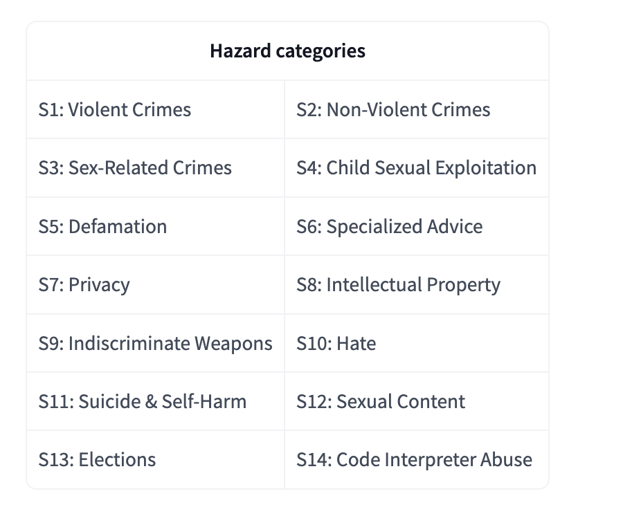
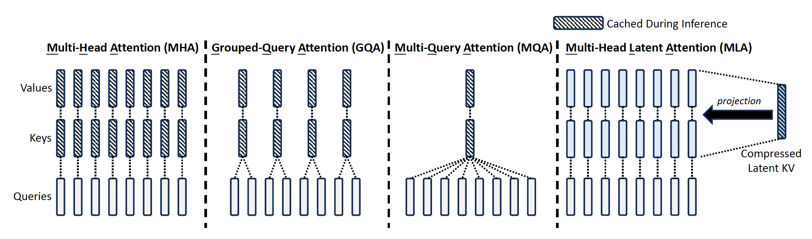
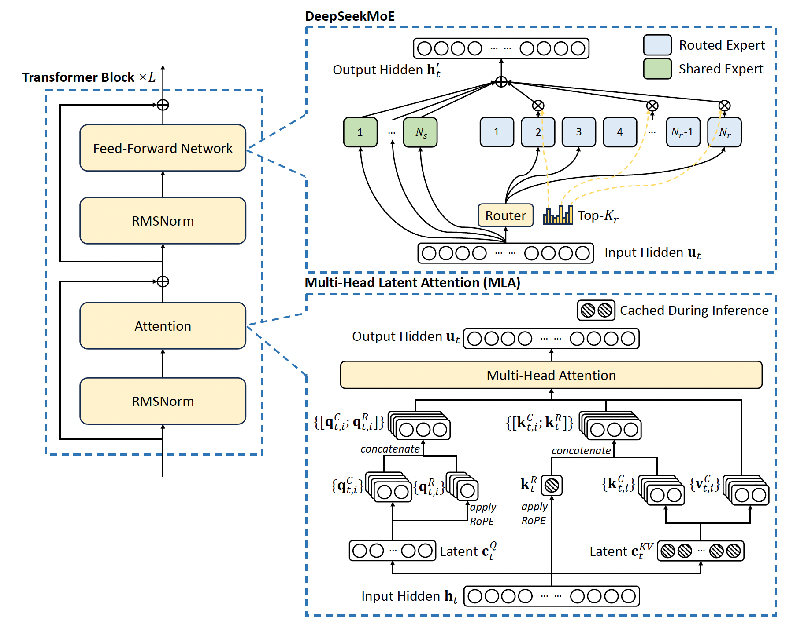

> **注意**: 本文**正在更新中**，内容只是**草稿版本**，并不完善，后续会有变动。请随时关注最新版本。

## 引言

本篇文章将系统梳理市面上开放权重的多种大语言模型，重点关注 **LLaMA** 和 **DeepSeek** 系列。我们将深入解析其模型架构、训练数据和训练方法，并通过表格揭示各版本间的核心差异与演进。

## LLaMA 系列模型

Meta 推出的 **LLaMA** 系列大语言模型自 2023 年起对开源社区产生了深远影响。每一代模型都在规模、数据、性能及应用范围上有所突破。

### LLaMA1

**LLaMA1** ([Touvron et al., 2023](https://arxiv.org/abs/2302.13971)) 于 2023 年 2 月发布，是 LLaMA 系列的开创性工作，以其优异的性能和开放的研究性质迅速获得关注。

**核心特点:**

*   **参数规模**: 提供 **7B、13B、30B 和 65B** 四个版本。
*   **训练数据**: 使用了超过 **1.4 万亿 (1.4T) tokens** 的公开数据集。
*   **训练资源**: 65B 模型在 2048 张 A100 80GB GPU 上训练约 21 天。
*   **性能**: **LLaMA-65B** 在多数基准上性能优于当时的 **GPT-3 (175B)**。

**关键技术:**

*   **架构优化**: 采用 **Pre-normalization** 结合 **RMSNorm** 替代 LayerNorm，提升训练稳定性与速度。
*   **激活函数**: 使用 **SwiGLU** 替代 ReLU，并调整 FFN 隐藏层维度。
*   **位置编码**: 应用 **Rotary Embeddings (RoPE)** 增强长序列建模能力。

### LLaMA2

**LLaMA2** ([Touvron et al., 2023](https://arxiv.org/abs/2307.09288)) 作为第二代模型，在 2023 年中发布，带来了显著的性能提升和更长的上下文处理能力。

**核心特点:**

*   **参数规模**: 覆盖 **7B、13B、34B、70B** 四种规模。
*   **训练数据**: 扩展至 **2 万亿 (2T) tokens**，数据量增加约 40%。
*   **上下文长度**: 提升至 **4096 tokens**，是 LLaMA1 的两倍。
*   **推理效率**: 引入 **分组查询注意力 (Group Query Attention, GQA)** 优化推理速度和显存占用。

**关键技术:**

*   **GQA (Grouped Query Attention)**: 通过查询分组减少注意力计算开销，尤其利好大模型推理。
*   **KV Cache**: 推理时利用 KV 缓存加速解码过程。

### Code Llama



**Code Llama** ([Rozière et al., 2023](https://arxiv.org/abs/2308.12950)) 是基于 LLaMA2 针对**代码任务**进行特化训练和微调的版本。

**核心特点:**

1.  **参数规模**: 提供 **7B、13B、34B、70B** 版本。
2.  **代码数据训练**: 7B/13B/34B 基于 **500B tokens** 代码数据训练，70B 基于 **1T tokens** 代码数据训练。
3.  **长上下文支持**: 通过 **长上下文微调 (LCFT)**，支持处理高达 **16k 甚至 100k tokens** 的代码序列。

**关键技术:**

*   **架构基础**: 继承 LLaMA2 架构，针对代码进行优化。
*   **数据构成**: 主要使用公开代码库，辅以少量自然语言数据保持通用性。
*   **填充中间 (FIM)**: 支持在代码中任意位置进行补全，适用于 IDE 场景。
*   **长上下文微调 (LCFT)**: 使用 16k 序列长度进行额外微调，调整 RoPE 适应长输入。
*   **指令微调**: 结合安全指令和自生成单元测试数据，提升指令遵循和安全性。

### Llama Guard



**Llama Guard** ([Inan et al., 2023](https://arxiv.org/abs/2312.06674)) 是为 LLaMA 系列设计的**安全过滤模型**，用于评估和过滤潜在不安全内容。

**核心特点:**

*   **多版本**:
    *   **Llama Guard 3 1B**: 基础文本安全评估。
    *   **Llama Guard 3 8B**: 增强版，特别关注代码解释器滥用 (S14) 检测。
    *   **Llama Guard 3 Vision** ([Chi et al., 2024](https://arxiv.org/abs/2411.10414)): 支持**图像和文本**的综合多模态安全评估。



**关键技术:**

*   **多模态处理**: 使用特殊 `<|image|>` token 整合图像信息进行安全审查。

*   **安全分类**: 基于 ML Commons 的 13 个类别 (S1-S13)([Vidgen et al., 2024)](https://arxiv.org/abs/2404.12241))，新增 S14 (代码解释器滥用)。
*   **评估机制**: 输入安全类别定义和对话内容，输出“安全/不安全”判定及违规类别。

### LLaMA3



**LLaMA3** ([Grattafiori et al., 2024](https://arxiv.org/abs/2407.21783)) 是 LLaMA 系列的第三代，在规模、多语言、多模态能力和效率上均有显著提升。

**核心特点:**

*   **参数规模**: 覆盖从 **1B 到 405B** 的广泛范围 (1B, 3B, 11B, 70B, 90B, 405B)。
*   **训练数据**: 达到 **15 万亿 (15T) tokens**，是 LLaMA2 的 7.5 倍。
*   **Tokenizer**: 采用效率更高的 `tiktoken`，词表从 32k 扩展至 **128k**。
*   **上下文长度**: 大幅提升至 **128k tokens**。
*   **多语言与多模态**: 支持 8 种语言，11B 和 90B 版本具备**视觉语言处理能力**。
*   **轻量化**: 1B 和 3B 版本通过剪枝和蒸馏技术，**适配边缘设备**。

**关键技术:**

*   **全面采用 GQA**: 所有规模模型均使用 GQA 优化注意力计算。
*   **先进训练方法**: 结合 **SFT、拒绝采样 (RS)、直接策略优化 (DPO)** 等提升模型能力。
*   **多模态整合**: 支持图像、视频、语音的综合处理。

### LLaMA 系列模型特性对比

| 特性               | LLaMA1               | LLaMA2                       | Code Llama                   | Llama Guard                  | LLaMA3                              |
|--------------------|----------------------|------------------------------|------------------------------|------------------------------|-------------------------------------|
| **发布时间**        | 2023年2月            | 2023年7月                    | 2023年8月                    | 2023年12月             | 2024年4月                           |
| **基础模型**        | -                    | -                           | LLaMA2                       | LLaMA2/3                     | -                     |
| **模型规模**        | 7B, 13B, 30B, 65B    | 7B, 13B, 34B, 70B             | 7B, 13B, 34B, 70B             | 1B, 8B (+Vision)             | 1B, 3B, 11B, 70B, 90B, 405B         |
| **训练数据量**      | 1.4T+ tokens         | 2T+ tokens                   | + 500B/1T Code tokens        |  大约 40k 安全分类数据    | **15T+ tokens**                     |
| **上下文长度**      | 2048 tokens          | 4096 tokens                  | **16k-100k tokens**          | 基于 LLaMA2/3       | **128k tokens**                     |
| **Tokenizer**      | SentencePiece (32k)  | SentencePiece (32k)          | SentencePiece (32k)          | 基于 LLaMA2/3   | **tiktoken (128k)**                 |
| **位置编码**        | RoPE                 | RoPE                         | RoPE (LCFT adjusted)         | RoPE                         | RoPE                                |
| **注意力/推理优化** | MHA                   | **GQA** + KV Cache           | 基于 LLaMA2                     | 基于 LLaMA2/3       | **GQA** + KV Cache                  |
| **归一化**        | RMSNorm               | RMSNorm                      | 基于 LLaMA2                        | RMSNorm                      | RMSNorm                             |
| **激活函数**        | SwiGLU               | SwiGLU                       | 基于 LLaMA2                         | SwiGLU                       | SwiGLU                              |
| **模型类别**        | 基座模型     | 基座模型      | 代码模型   | 安全分类模型     |  多模态基座模型|

## DeepSeek 系列模型

**DeepSeek AI** 专注于通用人工智能研究，推出了一系列高性能开源模型，尤其在代码和数学领域表现突出，并积极探索 MoE 等高效架构。

---

### DeepSeek LLM (Base Models)

**DeepSeek LLM** ([DeepSeek-AI, 2023](https://github.com/deepseek-ai/deepseek-llm)) 是该系列的 foundational work，发布于 2023 年底，提供了强大的开源基础模型。

**核心特点:**

*   **参数规模**: 提供 **7B** 和 **67B** 两种规模的基础 (Base) 和对话 (Chat) 模型。
*   **训练数据**: 在 **2 万亿 (2T) tokens** 的高质量中英文语料上从头训练。
*   **性能**: **67B 模型**在代码、数学、推理上优于 LLaMA-2 70B；Chat 版本优于 GPT-3.5。
*   **Scaling Laws 研究**: 强调高质量数据的重要性，发现高质量数据下扩展模型比扩展数据更有效。

**关键技术:**

*   **架构**: 类 LLaMA 架构，调整了学习率调度器；67B 模型采用 **GQA** 提升推理效率。
*   **数据处理**: 严格的去重、过滤、重混流程保证数据质量。
*   **对齐**: Chat 版本使用 **SFT** 和 **DPO** 进行对齐。

---

### DeepSeekMoE

**DeepSeekMoE** ([Dai et al., 2024](https://arxiv.org/abs/2401.06066)) 是在**混合专家 (MoE)** 架构上的重要创新，旨在提升模型效率和专家特化程度。

**核心特点:**

*   **核心创新**:
    1.  **细粒度专家分割**: 将 FFN 专家进一步拆分，激活更多细粒度专家组合。
    2.  **共享专家隔离**: 部分专家始终激活处理通用知识，降低路由专家冗余。
*   **效率**: 在相似计算成本下性能优于传统 MoE，以更少计算量接近稠密模型性能。

**关键技术:**

*   **路由机制**: Top-K 路由结合细粒度分割和共享专家。
*   **负载均衡**: 采用专家级和设备级平衡损失。
*   **参数效率**: 通过专家特化提高参数利用率。

---

### DeepSeek-V2

**DeepSeek-V2** ([DeepSeek-AI, 2024](https://github.com/deepseek-ai/DeepSeek-V2)) 是一款强大的开源 **MoE** 模型，平衡了模型强度、训练成本和推理效率。

**核心特点:**

*   **参数规模**: **236B** 总参数，每个 token 激活 **21B** 参数 (稀疏激活)。
*   **上下文长度**: 支持高达 **128K tokens**。
*   **核心架构**: 结合 **DeepSeekMoE** 和创新的 **多头潜在注意力 (MLA)**。
*   **效率提升**:
    *   训练成本比 DeepSeek 67B 降低 42.5%。
    *   **KV 缓存大小减少 93.3%** (通过 MLA)。
    *   最大生成吞吐量提升 5.76 倍。
*   **性能**: 发布时成为最强开源 MoE 之一。

**关键技术:**

*   **MLA (Multi-head Latent Attention)**: 通过低秩 Key-Value 联合压缩，**显著降低推理显存占用**，提升吞吐量。
*   **DeepSeekMoE 应用**: 应用于 FFN 层，实现稀疏计算和专家特化。
*   **训练数据**: 在 **8.1T tokens** 高质量多源语料上训练。
*   **上下文扩展**: 使用 **YaRN** 技术扩展上下文窗口。

### DeepSeek-V3

**DeepSeek-V3** ([DeepSeek-AI, 2024](https://github.com/deepseek-ai/DeepSeek-V3)) 是 DeepSeek 最新的旗舰 **MoE** 模型，性能接近顶尖闭源模型。

**核心特点:**

*   **参数规模**: **671B** 总参数，每个 token 激活 **37B** 参数。
*   **核心架构**: 沿用 **MLA** 和 **DeepSeekMoE**，并引入新创新。
*   **关键创新**:
    1.  **无辅助损失的负载均衡**: 通过动态调整专家偏置实现均衡，避免辅助损失影响性能。
    2.  **多 Token 预测 (MTP)**: 训练时预测多个未来 token，增加训练信号，提升性能。
*   **训练效率**: 采用 **FP8** 训练和优化框架 (DualPipe)，成本极低。
*   **性能**: 在知识、代码、数学、推理、长上下文等基准上达 **SOTA 开源水平**，可媲美 GPT-4o 等。

**关键技术:**

*   **架构**: MLA + DeepSeekMoE + 无辅助损失均衡 + MTP。
*   **训练数据**: 在 **14.8T tokens** 高质量、多样化语料上训练，增加数学、编程、多语言比例。
*   **知识蒸馏**: 受益于 **DeepSeek-R1** 系列模型的推理能力蒸馏。
*   **Tokenizer**: 扩展并优化词汇表。

### DeepSeek-Coder

**DeepSeek-Coder** ([Guo et al., 2024](https://arxiv.org/abs/2401.14196)) 是专为**代码智能**设计的系列模型。

**核心特点:**

*   **参数规模**: 提供从 **1.3B 到 33B** 的多个版本。
*   **训练数据**: 在 **2T tokens** 代码密集型数据上训练 (含 87 种编程语言)。
*   **核心技术**:
    1.  **仓库级预训练**: 增强跨文件理解能力。
    2.  **填充中间 (FIM)**: 提升代码补全能力。
*   **上下文长度**: 支持 **16K tokens**。
*   **性能**: 在代码生成、补全、跨文件理解等方面表现 **SOTA**。

**关键技术:**

*   **数据构成**: 87% 代码，10% 英文代码相关 NL，3% 中文 NL。
*   **训练目标**: Next Token Prediction + FIM。
*   **版本**: Base 模型、Instruct 模型、v1.5 (增强 NL 和数学能力)。

### DeepSeek-R1

**DeepSeek-R1** ([DeepSeek-AI, 2024](https://github.com/deepseek-ai/DeepSeek-R1)) 是利用**强化学习 (RL)** 显著增强 LLM **推理能力**的第一代模型。

**核心特点:**

*   **核心方法**: 广泛使用 **RL** 直接培养推理能力，减少对 SFT 依赖。
*   **关键模型**:
    *   **DeepSeek-R1-Zero**: 证明大规模 RL 可涌现复杂推理能力。
    *   **DeepSeek-R1**: 多阶段训练 (SFT -> RL -> 拒绝采样 -> RL)。
*   **性能**: 在 **AIME、MATH、Codeforces** 等推理基准上取得 **SOTA** 性能。
*   **能力蒸馏**: 成功将推理能力蒸馏到更小模型。

**关键技术:**

*   **RL 激励**: 主要依赖基于规则的奖励系统。
*   **训练流程**: 精心设计的多阶段流程结合 SFT 和 RL。
*   **涌现能力**: RL 驱动模型发展出复杂推理行为 (如自验证、反思)。

---

### DeepSeek 系列模型特性对比

| 特性               | DeepSeek LLM     | DeepSeek-V2     | DeepSeek-V3     | DeepSeek-Coder  | DeepSeek-R1            |
|--------------------|------------------------|------------------------|------------------------|------------------------|------------------------|
| **发布时间**        | 2023年11月             | 2024年5月              | 2024年10月             | 2024年1月              | 2024年10月             |
| **基础模型**        | -                      | -                      | -                      | -                      | DeepSeek-V3            |
| **模型最大规模**        | 67B                    | 236B                   | 671B                   | 33B             | 671B         |
| **激活参数量**| 67B (Dense)            | **21B (MoE)**          | **37B (MoE)**          | 1.3B - 33B (Dense)     | **37B (MoE)**          |
| **训练数据量**      | 2T tokens              | 8.1T tokens            | **14.8T tokens**       | 2T Code tokens         | SFT 和 RL Data      |
| **上下文长度**      | 4K (默认) / 32K (扩展) | **128K tokens**        | **128K tokens**        | 16K tokens             | **128K tokens**        |
| **Tokenizer**      | Custom BPE             | Custom BPE (Optimized) | Custom BPE (Expanded)  | Custom BPE (Code)      | Inherited from V3      |
| **位置编码**        | RoPE                   | RoPE                   | RoPE                   | RoPE                   | RoPE                   |
| **注意力/推理优化** | GQA + KV Cache         | **MoE + MLA** + KV Cache | **MoE + MLA** + KV Cache | GQA + KV Cache         | **MoE + MLA** + KV Cache |
| **归一化**        | RMSNorm                | RMSNorm                | RMSNorm                | RMSNorm                | RMSNorm                |
| **激活函数**        | SwiGLU/GeGLU           | SwiGLU/GeGLU           | SwiGLU/GeGLU           | SwiGLU/GeGLU           | SwiGLU/GeGLU           |
| **模型类别**        | 基座模型       | 基座模型      | 基座模型  | 代码模型               | 推理模型           |

## 关键技术解析

以下是目前基座大模型所采用的关键技术的详细解析，包括数学公式和相关说明。

### RMS Normalization

在深度学习中，归一化技术在加速训练、提升模型性能和稳定性方面起着至关重要的作用。RMS Normalization ([Zhang, et al., 2019](https://arxiv.org/abs/1910.07467)) 是一种简化的归一化方法，通过仅计算输入向量的均方根（RMS）进行归一化，从而减少计算开销。其数学表达式如下：

$$
\text{RMSNorm}(x) = \frac{x}{\sqrt{\frac{1}{d} \sum_{i=1}^{d} x_i^2 + \epsilon}} \cdot \gamma
$$

其中：
- \( x \) 为输入向量。
- \( d \) 为特征维度的大小。
- \( \epsilon \) 为一个极小的常数，用于防止分母为零。
- \( \gamma \) 为可学习的缩放参数。

LLaMA3 中选择 **RMSNorm** 作为其归一化方法，主要基于以下考虑：

- **计算效率**：RMSNorm 相比 LayerNorm、BatchNorm 和WeightNorm 计算量更低，仅计算输入向量的均方根，适合 LLM 的高效训练。
- **训练稳定性**：RMSNorm 在保持训练稳定性的同时，能够适应更大的学习率，促进模型的快速收敛。
- **资源优化**：减少计算开销有助于在资源受限的环境中部署模型，提高训练和推理的效率。
- **简化实现**：RMSNorm 的实现相对简单，便于在复杂模型中集成和优化。

> 关于各种 Norm 的对比和代码实现，可参考博客：[Normalization in Deep Learning](https://syhya.github.io/posts/2025-02-01-normalization/)。

### FFN_SwiGLU

Swish-Gated Linear Unit ([Shazeer, 2020](https://arxiv.org/abs/2002.05202v1)) 是 LLaMA 中用于增强前馈网络（Feed-Forward Network, FFN）非线性表达能力的关键技术。SwiGLU 结合了 Swish 激活函数和门控机制，显著提升了模型的表现力和性能。此外，与 PaLM ([Chowdhery, 2022](https://arxiv.org/abs/2204.02311)) 中使用的$4 d$隐藏维度不同，LLaMA 采用了 $\frac{2}{3}d$ 的隐藏维度，从而在保持参数量和计算量不变的情况下，实现了更高的参数效率。

数学表达式：
$$
\operatorname{FFN}_{\mathrm{SwiGLU}}\left(x, W_1, W_3, W_2\right)=\left(\operatorname{Swish}\left(x W_1\right) \otimes x W_3\right) W_2
$$
其中：
- \( \text{Swish}(x) = x \cdot \sigma(x) \)（Swish 激活函数）。
- \( \sigma(x) = \frac{1}{1 + e^{-x}} \)（Sigmoid 函数）。
- \( \otimes \) 表示逐元素相乘。
- \( W_1, W_2, W_3 \) 为线性变换矩阵。

**优势**：
- **增强非线性表达**：SwiGLU 通过结合 Swish 激活函数与门控机制，能够更有效地捕捉复杂的模式和关系，提升 FFN 层的表达能力。
- **参数效率**：采用 $\frac{2}{3}d$ 的隐藏维度，在引入额外的线性变换矩阵的同时，保持了总参数量不变，实现了参数的高效利用。
- **性能提升**：在多项基准测试中，FFN_SwiGLU 显著提升了模型的性能，尤其在处理复杂任务和长文本时表现尤为出色。例如，在文本生成和理解任务中，SwiGLU 帮助模型更好地理解上下文和长距离依赖关系。

**实现细节**：
- **权重矩阵调整**：为了保持与传统 FFN 层相同的参数量和计算量，SwiGLU 通过减少隐藏层的维度（例如，将隐藏层大小从 4d 调整为 $\frac{2}{3}d$），在引入额外的线性变换矩阵的同时，确保整体模型的效率不受影响。
- **兼容性**：SwiGLU 作为 GLU 家族的一员，能够无缝集成到现有的 Transformer 架构中，替代传统的 ReLU 或 GELU 激活函数，提升模型的整体性能。

> 实现代码可以参考这个文件：[swiglu.py](https://github.com/syhya/syhya.github.io/blob/main/content/zh/posts/2025-01-22-llama3/swiglu.py)

### Grouped Query Attention (GQA)

Grouped Query Attention (GQA) ([Ainslie, 2023](https://arxiv.org/pdf/2305.13245)) 是 LLaMA3 中用于优化自注意力计算的关键技术。在大规模语言模型的推理过程中，每个注意力头（head）拥有独立的键（Key）和值（Value）参数会导致巨大的内存消耗。**Grouped Query Attention (GQA)** 旨在通过将多个查询（Query）头分组，并让每组共享一组键值头，从而在模型性能与推理效率之间取得更优的平衡。GQA 是 **Multi-Head Attention (MHA)** 和 **Multi-Query Attention (MQA)** 之间的一种折中方案：

- **MHA**：每个注意力头都有独立的 \(\mathbf{K}\) 和 \(\mathbf{V}\)。
- **MQA**：所有注意力头共享一组 \(\mathbf{K}\) 和 \(\mathbf{V}\)。
- **GQA**：将 \(H\) 个查询头划分为 \(G\) 组，每组共享一组 \(\mathbf{K}\) 和 \(\mathbf{V}\)（其中 \(1 < G < H\)）。

#### 1. 投影 (Projections)

给定输入序列 \(\mathbf{X} \in \mathbb{R}^{B \times S \times d}\)，首先通过线性变换投影得到查询、键和值矩阵：

$$
\mathbf{Q} = \mathbf{X} W_Q, \quad
\mathbf{K} = \mathbf{X} W_K, \quad
\mathbf{V} = \mathbf{X} W_V,
$$

其中，\(W_Q, W_K, W_V \in \mathbb{R}^{d \times d}\) 为可学习的投影矩阵。

#### 2. 头与分组 (Heads and Grouping)

- **头的切分**：将 \(\mathbf{Q}\)、\(\mathbf{K}\) 和 \(\mathbf{V}\) 分割成 \(H\) 个头，每个头的向量维度为 \(d_{\text{head}} = \frac{d}{H}\)。

$$
\mathbf{Q} = [\mathbf{Q}_1; \mathbf{Q}_2; \dots; \mathbf{Q}_H], \quad
\mathbf{K} = [\mathbf{K}_1; \mathbf{K}_2; \dots; \mathbf{K}_H], \quad
\mathbf{V} = [\mathbf{V}_1; \mathbf{V}_2; \dots; \mathbf{V}_H]
$$

- **分组**：将这 \(H\) 个查询头进一步划分为 \(G\) 组（\(1 < G < H\)）。对于第 \(g\) 组，包含 \(\frac{H}{G}\) 个查询头，并共享一组键值头 \(\mathbf{K}^g\) 和 \(\mathbf{V}^g\)。

$$
\mathcal{G} = \left\{ \mathcal{G}_1, \mathcal{G}_2, \dots, \mathcal{G}_G \right\}, \quad |\mathcal{G}_g| = \frac{H}{G} \quad \forall g \in \{1, 2, \dots, G\}
$$

下图展示了 GQA 与传统 MHA 和 MQA 的对比，可见在 GQA 中，**每组查询头公用一组键值头**。



#### 3. 组内注意力 (Intra-Group Attention)

对于第 \(g\) 组，令该组的查询向量为 \(\{\mathbf{Q}_i\}_{i \in \mathcal{G}_g}\)，共享的键值向量为 \(\mathbf{K}^g\) 和 \(\mathbf{V}^g\)。组内注意力的计算公式为：

$$
\text{Attention}_g(\mathbf{Q}_i, \mathbf{K}^g, \mathbf{V}^g) = \text{softmax}\left( \frac{\mathbf{Q}_i (\mathbf{K}^g)^\top}{\sqrt{d_{\text{head}}}} \right) \mathbf{V}^g
$$

其中，\(\sqrt{d_{\text{head}}}\) 为缩放因子，用于稳定梯度和数值计算。

#### 4. 拼接输出 (Concatenate & Output)

将所有组的注意力结果在通道维度上拼接，得到矩阵 \(\mathbf{O}\)，然后通过线性变换矩阵 \(W_O \in \mathbb{R}^{d \times d}\) 得到最终输出：

$$
\mathbf{O} = \text{Concat}\left( \text{Attention}_1, \text{Attention}_2, \dots, \text{Attention}_G \right) W_O
$$

其中，\(\text{Concat}\) 表示在通道维度上的拼接操作。

> 更多关于注意力机制在 **MHA**、**MQA** 和 **GQA** 之间的详细对比及代码示例，可参考博客：[Attention Mechanisms in Transformers: Comparing MHA, MQA, and GQA](https://syhya.github.io/posts/2025-01-16-group-query-attention/#grouped-query-attention-gqa)。

#### Rotary Positional Embeddings (RoPE)

**Rotary Positional Embeddings (RoPE)** 是LLaMA3中用于表示序列中位置关系的技术，通过对Query和Key向量应用旋转变换，增强了模型对相对位置信息的感知能力。

**优势**：
1. **相对位置感知**：RoPE能够自然地捕捉词汇之间的相对位置关系，提升了长距离依赖的建模效果。
2. **计算效率高**：无需额外的计算，位置编码与词向量的结合在计算上是高效的，适用于大规模模型。
3. **适应不同长度的序列**：RoPE可以灵活处理不同长度的输入序列，不受固定位置编码的限制。
4. **兼容线性注意力**：RoPE 可以与线性注意力机制结合，保持注意力计算的线性复杂度，进一步提升处理长序列的效率。

理解单词在序列中的位置关系对于成功训练大型语言模型（LLM）至关重要。循环神经网络（RNN）通过递归计算隐藏状态来自然地捕捉序列中的位置信息。然而，Transformer这类基于自注意力机制的模型由于其并行计算的特性，无法直接感知单词之间的相对位置关系，因此需要额外的位置编码来提供这一信息。

位置编码的方法主要分为绝对位置编码和相对位置编码两大类。RoPE 则是一种创新性的绝对位置编码方法，旨在结合绝对位置编码和相对位置编码的优点，通过旋转变换实现相对位置感知。

#### 绝对位置编码

绝对位置编码通过为每个位置生成一个固定或可训练的位置向量，并将其与词向量相加，从而为模型提供位置信息。常见的绝对位置编码方法包括：

- **三角函数位置编码**：例如，Vaswani 等人（2017）提出的使用正弦和余弦函数生成的位置编码。
  
  数学表达式：
  $$
  p_i = \left[\sin\left(\frac{i}{10000^{2j/d}}\right), \cos\left(\frac{i}{10000^{2j/d}}\right)\right]_{j=1}^{d/2}
  $$
  其中，\( p_i \) 是位置 \( i \) 的位置编码向量，\( d \) 是词向量的维度。

  **优点**：
  - 实现简单，与词向量的结合方式直接。

  **缺点**：
  - 无法自然地捕捉词汇之间的相对位置关系，限制了模型对长距离依赖的建模能力。
  - 对于不同长度的序列，可能需要重新生成位置编码。

- **可训练位置编码**：如BERT和GPT中使用的可训练位置编码。

#### 相对位置编码

相对位置编码旨在让模型关注词汇之间的相对距离，而不是绝对位置。这样，模型可以更灵活地处理不同长度的序列，并更有效地捕捉长距离依赖关系。

**常见方法**：
- **Google式相对位置编码**：在论文《Self-Attention with Relative Position Representations》中，Shaw 等人（2018）提出了一种扩展自注意力机制以考虑相对位置的方法。

  **优点**：
  - 自然地捕捉词汇之间的相对位置信息，有助于长距离依赖的建模。
  - 提高模型对序列长度的灵活适应能力。

  **缺点**：
  - 实现相对复杂，尤其是在自注意力机制中的集成。
  - 计算效率相对较低，特别是在处理长序列时。

### 旋转位置编码（RoPE）的原理与实现

#### RoPE 的设计思路

RoPE 的核心理念是通过旋转变换将绝对位置信息转化为相对位置信息，从而结合绝对位置编码和相对位置编码的优点。具体而言，RoPE 通过将查询（Query）和键（Key）向量分别乘以与其位置相关的旋转矩阵，使得内积计算中自然地体现了相对位置关系。

#### 数学表达式与推导

##### 维情况下的 RoPE 推导

为了更深入理解 RoPE 在二维情况下的工作原理，以下通过数学推导展示其如何实现相对位置编码。

**引言**

在二维空间中，向量的旋转可以通过复数的乘法来简化理解。RoPE 利用这一性质，通过对查询（Query）和键（Key）向量施加旋转变换，实现相对位置编码。

**复数与二维向量的对应关系**

- 一个复数 \( z = a + ib \) 可以表示为二维向量 \( \mathbf{v} = [a, b]^T \)。
- 复数的乘法对应于二维向量的旋转和缩放。

利用欧拉公式：
$$
e^{i\theta} = \cos\theta + i\sin\theta
$$
可以将复数旋转表示为二维向量的旋转矩阵。

**RoPE 的基本操作**

假设有二维的查询向量 \( \mathbf{q}_m \) 和键向量 \( \mathbf{k}_n \)，分别位于位置 \( m \) 和 \( n \)。RoPE 的目标是通过旋转变换，使得它们的内积仅依赖于相对位置 \( m - n \)。

**步骤 1：表示为复数**

将二维向量表示为复数形式：
$$
\mathbf{q}_m = q_m^{(1)} + i q_m^{(2)} \\
\mathbf{k}_n = k_n^{(1)} + i k_n^{(2)}
$$

**步骤 2：应用旋转变换**

对查询和键向量分别应用与其位置相关的旋转变换：
$$
f_q(\mathbf{q}_m, m) = \mathbf{q}_m \cdot e^{im\theta} = (q_m^{(1)} + i q_m^{(2)}) (\cos(m\theta) + i\sin(m\theta)) \\
f_k(\mathbf{k}_n, n) = \mathbf{k}_n \cdot e^{in\theta} = (k_n^{(1)} + i k_n^{(2)}) (\cos(n\theta) + i\sin(n\theta))
$$
其中，\( \theta \) 是一个预先定义的常数，用于控制旋转的速度。

**步骤 3：计算内积**

为了实现相对位置编码，计算内积：
$$
\langle f_q(\mathbf{q}_m, m), f_k(\mathbf{k}_n, n) \rangle = \text{Re}\left[ f_q(\mathbf{q}_m, m) \cdot \overline{f_k(\mathbf{k}_n, n)} \right]
$$
其中，\( \overline{f_k(\mathbf{k}_n, n)} \) 是 \( f_k \) 的共轭复数。

展开后：
$$
\langle f_q(\mathbf{q}_m, m), f_k(\mathbf{k}_n, n) \rangle = (q_m^{(1)}k_n^{(1)} + q_m^{(2)}k_n^{(2)})\cos((m-n)\theta) + (q_m^{(1)}k_n^{(2)} - q_m^{(2)}k_n^{(1)})\sin((m-n)\theta)
$$
这个结果表明，内积的计算中自然地引入了相对位置 \( m - n \) 的影响。

**步骤 4：将二维向量与旋转矩阵对应**

将复数形式转化为矩阵形式：

查询向量 \( \mathbf{q}_m = [q_m^{(1)}, q_m^{(2)}]^T \) 和键向量 \( \mathbf{k}_n = [k_n^{(1)}, k_n^{(2)}]^T \)，旋转后的向量表示为：
$$
f_q(\mathbf{q}_m, m) = R(m\theta) \mathbf{q}_m \\
f_k(\mathbf{k}_n, n) = R(n\theta) \mathbf{k}_n
$$
其中，\( R(\phi) \) 是角度 \( \phi \) 的旋转矩阵：
$$
R(\phi) = \begin{bmatrix}
\cos\phi & -\sin\phi \\
\sin\phi & \cos\phi
\end{bmatrix}
$$

因此，内积可以表示为：

$$
\langle f_q(\mathbf{q}_m, m), f_k(\mathbf{k}_n, n) \rangle = [q_m^{(1)}, q_m^{(2)}] R((n - m)\theta) \mathbf{k}_n
$$

进一步展开：
$$
= q_m^{(1)} k_n^{(1)} \cos((m - n)\theta) + q_m^{(2)} k_n^{(2)} \cos((m - n)\theta) \\
+ q_m^{(1)} k_n^{(2)} \sin((m - n)\theta) - q_m^{(2)} k_n^{(1)} \sin((m - n)\theta)
$$
与前述结果一致，验证了 RoPE 在二维情况下实现相对位置编码的有效性。

**总结二维 RoPE 的实现步骤**：
1. **表示向量为复数**：将二维的查询和键向量表示为复数形式。
2. **应用旋转变换**：根据各自的位置 \( m \) 和 \( n \)，分别将查询和键向量旋转 \( m\theta \) 和 \( n\theta \) 的角度。
3. **计算内积的实部**：通过复数的乘法和内积运算，确保内积结果仅依赖于相对位置 \( m - n \)。
4. **利用旋转矩阵**：通过旋转矩阵的性质，将复数形式转化为矩阵形式，使得旋转操作更加直观和易于扩展到高维情况。

##### 3.2.2 高维情况下的 RoPE

对于词向量维度 \( d \) 为偶数的情况，RoPE 通过将向量拆分为 \( d/2 \) 个二维子向量，并对每个子向量应用独立的旋转矩阵，从而实现高维度的旋转位置编码。

**具体实现**：
$$
f_{\{q, k\}}(x_m, m) = R_{\Theta, m}^d \cdot W_{\{q, k\}} \cdot x_m
$$
其中，\( R_{\Theta, m}^d \) 是一个块对角矩阵，由 \( d/2 \) 个二维旋转矩阵组成，每个旋转矩阵对应一个不同的角度 \( \theta_i = 10000^{-2(i-1)/d} \)。

旋转矩阵的形式为：
$$
R_{\Theta, m}^d = \begin{bmatrix}
\cos(m\theta_1) & -\sin(m\theta_1) & & & \\
\sin(m\theta_1) & \cos(m\theta_1) & & & \\
& & \cos(m\theta_2) & -\sin(m\theta_2) & \\
& & \sin(m\theta_2) & \cos(m\theta_2) & \\
& & & & \ddots \\
\end{bmatrix}
$$

应用于自注意力机制中的查询和键向量：
$$
q_m^\top k_n = (R_{\Theta, m}^d W_q x_m)^\top (R_{\Theta, n}^d W_k x_n) = x_m^\top W_q^\top R_{\Theta, m}^{d\top} R_{\Theta, n}^d W_k x_n = x_m^\top W_q^\top R_{\Theta, n-m}^d W_k x_n
$$
其中，\( R_{\Theta, n-m}^d = R_{\Theta, m}^{d\top} R_{\Theta, n}^d \)，体现了相对位置信息。

#### 3.3 RoPE 的性质

**3.3.1 远程衰减特性**

通过选择 \( \theta_i = 10000^{-2(i-1)/d} \)，RoPE 的内积计算结果随着相对位置 \( |m - n| \) 增大而衰减。这一特性符合自然语言中的直觉，即距离较远的单词对当前词的影响应当较小。

**3.3.2 兼容线性注意力机制**

RoPE 的旋转操作保持了向量的范数不变，使其可以与线性注意力机制（如 Performer）无缝结合，进一步提升模型在处理长序列时的计算效率。

---

### 4. 总结

RoPE 通过旋转变换将绝对位置信息转化为相对位置信息，结合了绝对位置编码和相对位置编码的优点。其核心机制确保了模型对相对位置关系的感知能力，并且保持了高效的计算性能，特别是在处理长序列任务时表现出色。通过详细的数学推导，特别是在二维情况下的实现，RoPE 展示了其在自注意力机制中引入相对位置编码的有效性和灵活性。

### BPE

**tiktoken** tokenizer是LLaMA3采用的新一代分词器，相较于LLaMA2使用的SentencePiece BPE，tiktoken在以下方面有所改进：

1. **词汇表扩展**：词汇表从32k扩展至128k，覆盖更多语言和专业术语，减少了分词次数，提升了生成质量。
2. **编码效率**：优化了编码算法，减少了分词时间，提高了处理速度。
3. **生成质量**：通过更细粒度的词汇表示，提升了模型生成文本的连贯性和准确性。

数学表达式（简化版）：
$$
\text{Tokenize}(w) = \text{BPE}(w) \quad \text{vs} \quad \text{Tokenize}(w) = \text{tiktoken\_BPE}(w)
$$
- 其中，\( w \) 为输入词汇，tiktoken\_BPE通过更大词汇表减少了分词次数。

**优势**：
- **减少分词次数**：更大的词汇表使得更多词汇能作为单一token处理，减少了分词次数，提高了生成效率和质量。
- **提升生成质量**：更细粒度的词汇表示，使模型在生成文本时能够更准确地表达复杂语义。
- **编码速度快**：优化的编码算法提升了分词速度，适用于大规模模型的高效训练和推理。

#### 轻量级模型

为了适应边缘设备和移动设备的需求，LLaMA3推出了**1B和3B参数量的轻量级模型**，采用以下技术：

1. **剪枝技术**：通过系统性地移除网络中的冗余参数，减小模型规模，同时保持核心性能。
2. **知识蒸馏**：让小模型从大模型中学习，提升其在特定任务上的表现。
3. **优化部署**：针对移动设备的硬件架构进行优化，如针对Arm处理器的性能调优，确保模型在资源受限环境中的高效运行。

数学表达式（简化版）：
$$
\text{Pruned\_Model} = \text{Prune}(\text{Original\_Model}, \text{Pruning\_Rate})
$$
$$
\text{Distilled\_Model} = \text{Distill}(\text{Large\_Model}, \text{Small\_Model})
$$
- 其中，Prune表示剪枝操作，Distill表示知识蒸馏过程。

**优势**：
- **适应资源受限设备**：减小模型规模，使其适用于边缘设备和移动设备，推动了大语言模型的普及。
- **保持性能**：通过剪枝和知识蒸馏技术，保持了模型的核心性能和表现。
- **高效运行**：优化的模型结构和权重格式（如BFloat16）提升了计算效率，确保在移动设备上的高效运行。

#### 训练方法

**LLaMA3**在训练数据和方法上进行了全面升级，采用了更大规模的数据和更先进的训练技术：

1. **预训练阶段**：
   - **大规模数据扩展**：训练数据量达到15万亿token，覆盖更多语言、专业领域和多模态数据，提升了模型的泛化能力和多语言支持。
   - **扩展法则（Scaling Laws）**：
     - 根据Chinchilla扩展法则，优化模型的训练数据量和参数规模平衡，确保模型在关键任务上的最佳性能。
     - 数学表达式：
       $$
       \text{Optimal Data} \propto \text{Model Size}^{4/3}
       $$
       这一公式指导了数据和模型规模的平衡，确保随着模型规模的增加，训练数据量也按比例增长，避免模型过拟合或欠拟合。

2. **并行训练策略**：
   - **数据并行**：将训练数据分布到多个GPU上，提升数据处理速度。
   - **模型并行**：将模型的不同部分分布到多个GPU上，支持更大规模的模型训练。
   - **流水并行**：分阶段处理模型的不同部分，提高训练效率。
   
   数学表达式：
   $$
   \text{Total Throughput} = \text{Data Parallelism} \times \text{Model Parallelism} \times \text{Pipeline Parallelism}
   $$
   - 其中，总吞吐量（Total Throughput）是数据并行、模型并行和流水并行的乘积，显著提升了训练效率。

3. **硬件优化**：
   - **高效利用GPU**：在16K GPU上实现每GPU超过400 TFLOPS的计算利用率，通过定制的24K GPU集群进行训练，确保训练过程的高效性和稳定性。
   - **错误处理与存储优化**：
     - **自动错误检测与处理**：确保训练过程的连续性和高效性。
     - **可扩展存储系统**：减少检查点和回滚的开销，提高数据存储效率。

4. **微调阶段**：
   - **多轮对齐步骤**：
     - **监督微调（SFT）**：使用高质量的标注数据进一步优化模型性能。
     - **拒绝采样（Rejection Sampling）**：通过拒绝低质量内容，提升生成文本的质量。
     - **近端策略优化（Proximal Policy Optimization, PPO）和直接策略优化（Direct Policy Optimization, DPO）**：结合两者的优势，优化模型的生成策略，使其更符合人类偏好。
   
   数学表达式：
   $$
   \mathcal{L}_{\text{RLHF}} = \mathbb{E}_{\theta \sim \pi_{\theta}} \left[ r(s, a) \right]
   $$
   - 其中，\( \mathcal{L}_{\text{RLHF}} \)为RLHF的损失函数，\( \pi_{\theta} \)为策略分布，\( r(s, a) \)为奖励函数。

5. **多模态训练**：
   - **视觉语言模型**：结合图像和文本数据，提升模型在多模态任务中的表现。
   - **代码数据扩展**：增加代码token数量，提升模型在编程任务中的表现。

6. **模型安全与质量控制**：
   - **数据过滤pipeline**：
     - **启发式过滤器**：基于规则的过滤，提高数据质量。
     - **NSFW过滤器**：去除不适内容，确保数据的安全性。
     - **语义重复数据删除**：使用语义分析技术，删除内容高度相似的数据。
     - **文本分类器**：预测数据质量，进一步优化数据集。

7. **优化训练堆栈**：
   - **高级训练堆栈**：自动检测和处理训练过程中的错误，提升硬件可靠性。
   - **性能调优**：针对不同硬件平台进行优化，确保训练过程的高效性。

**LLaMA3**通过这些先进的训练方法和优化策略，显著提升了模型的性能和适应性，成为开源大语言模型领域的领先者。

## 总结

## 参考资料

1. [Hendrycks and Gimpel, 2016](https://arxiv.org/pdf/1606.08415.pdf)
2. [GLU Variants Improve Transformer](https://arxiv.org/pdf/2002.05202.pdf)
3. [LLaMA: Open and Efficient Foundation Language Models](https://arxiv.org/abs/2302.13971)
4. [LLaMA2: Open Foundation and Fine-Tuned Chat Models](https://arxiv.org/pdf/2307.09288)
5. [meta-llama repo](https://github.com/meta-llama/llama/blob/main/llama/model.py)