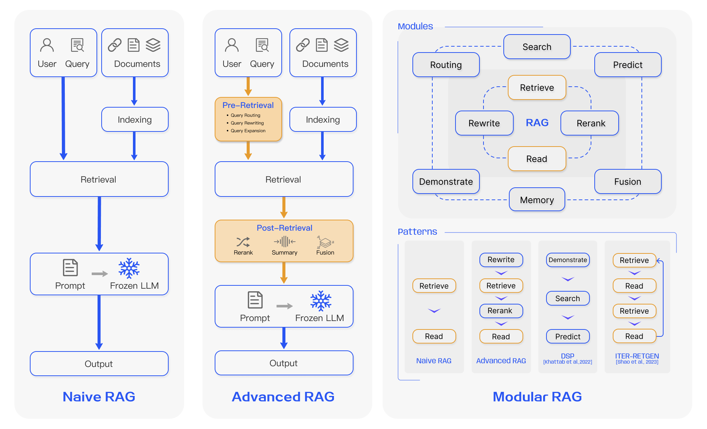

> **注意**: 本文正在更新中，内容只是**草稿版本，并不完善，后续会有较大变动**。请随时关注最新版本。

大型语言模型（Large Language Models, LLMs）在自然语言处理领域取得了革命性的进展，展现出强大的文本理解和生成能力。然而，LLMs 并非完美无缺，它们仍然面临着一些固有的挑战，例如：

1.  **知识截止性**: LLMs 的知识库通常仅限于其预训练数据，对于训练数据截止日期之后的新信息或事件，它们往往无法准确回答。
2.  **幻觉**: LLMs 有时会“一本正经地胡说八道”，即生成看似合理但实际上是虚假或不准确的信息。
3.  **领域知识和长尾知识缺乏**: 对于特定垂直领域或私有知识库，通用 LLMs 可能缺乏足够的专业知识。正如 ([Kandpal et al., 2022](https://arxiv.org/abs/2211.08411))的研究指出，LLMs 在学习长尾知识方面存在困难，而 RAG 正是解决这一问题的有效途径。
4.  **可解释性与可追溯性差**: LLMs 的决策过程通常是一个“黑箱”，难以追溯其生成内容的具体来源和依据。
5.  **上下文窗口限制**: LLMs 的上下文窗口长度有限，无法处理过长的输入文本，直接将多个过长的文档输入给 LLM 会导致超过模型的上下文窗口限制，并且推理成本较高。

为了克服这些局限性，**检索增强生成（Retrieval-Augmented Generation, RAG）** 技术应运而生。RAG 的核心思想是将 LLMs 的强大生成能力与外部知识库的实时、准确信息检索能力相结合，从而提升模型输出的质量、时效性和可信度。

## RAG 基础知识

在深入探讨 RAG 的高级技术之前，我们首先需要理解其基本工作流程和核心组件。一个典型的 RAG 系统主要包含数据处理（或称索引）、检索和生成三个阶段。




图 1 展示了一个标准的 RAG 工作流程，其核心思想是在 LLM 生成答案之前，先从外部知识源中检索相关信息，并将这些信息作为上下文提供给 LLM。

### 1. 数据处理与索引 (Data Processing and Indexing)

RAG 的第一步是准备和处理外部知识源。这些知识源可以是各种形式的文档，如 PDF、网页、数据库记录、代码库、甚至是多模态数据（如图像、音视频）。

*   **文档加载 (Document Loading)**: 从不同的数据源（文件系统、数据库、API、Sharepoint 等）加载原始数据。
*   **文本分块 (Chunking / Segmentation)**: 将加载的文档分割成较小的文本块（chunks）。这是因为 LLMs 的上下文窗口长度有限（尽管现代 LLM 的上下文窗口越来越大，如 Gemini 1.5 Pro 的百万级 token 上下文，但过长的上下文仍可能导致“大海捞针”或“中间遗忘”问题 ([Liu et al., 2023a](https://arxiv.org/abs/2307.03172))），并且更小的文本块有助于提高检索的精确度。
    *   **分块策略 (Chunking Strategies)**: 常见的策略包括：
        *   **固定大小分块 (Fixed-size Chunking)**: 将文本按固定数量的 token 或字符分割。简单但可能切断语义单元。
        *   **基于字符分块 (Character-based Chunking)**: 根据特定的字符（如换行符 `\n\n`、句号 `. `）进行分割。
        *   **递归分块 (Recursive Character Text Splitting)**: 尝试按一系列分隔符递归地分割文本，直到块大小满足要求。这有助于保持语义块的完整性，是 LangChain 等框架中常用的方法。
        *   **语义分块 (Semantic Chunking)**: 利用 NLP 技术（如句子嵌入、主题模型）来识别文本中的语义边界，并据此进行分块。例如，可以基于句子嵌入的差异来判断语义是否发生较大转变，从而确定分块点。
        *   **文档特定分块 (Document Specific Chunking)**: 针对特定文档类型（如 Markdown、HTML、代码文件）的结构进行分块，例如按标题、段落、代码块等。
    *   **块大小 (Chunk Size)**: 需要根据具体任务、LLM 的上下文窗口大小、嵌入模型的最佳输入长度以及数据的特性来选择。通常在几百到一千 tokens 之间。
    *   **重叠 (Overlap)**: 在相邻块之间设置一定的重叠内容（如 50-100 tokens），以保证语义的连续性，避免关键信息在分块边界被切断。
*   **文本嵌入 (Text Embedding)**: 使用预训练的文本嵌入模型（如 OpenAI's `text-embedding-3-small/large`）将每个文本块转换为高维向量。这些向量能够捕捉文本块的语义信息，使得语义相似的文本块在向量空间中距离更近。查询 \( q \) 也会被同一个嵌入模型转换为向量 \( \mathbf{v}_q = E(q) \)，而每个文本块 \( c \) 被转换为 \( \mathbf{v}_c = E(c) \)。
*   **向量存储与索引 (Vector Storage and Indexing)**: 将所有文本块的向量表示存储在专门的向量数据库（Vector Database）中。向量数据库不仅存储向量，还为这些向量建立高效的索引（如 FAISS ([Johnson et al., 2021](https://arxiv.org/abs/1702.08734)), HNSW, IVFADC, SCANN 等），以加速后续的相似性搜索。常用的向量数据库有 Pinecone, Weaviate, Milvus, ChromaDB, Qdrant, 以及云服务商提供的向量搜索服务（如 Azure AI Search, Google Vertex AI Vector Search, Amazon OpenSearch）。
    *   **索引类型**:
        *   **Flat**: 精确搜索，但对于大规模数据效率较低。
        *   **IVF (Inverted File Index)**: 通过聚类将向量分组，搜索时只在相关的簇内进行。
        *   **HNSW (Hierarchical Navigable Small World)**: 基于图的索引，通过构建多层图结构实现高效的近似最近邻搜索。
        *   **LSH (Locality Sensitive Hashing)**: 通过哈希函数将相似的向量映射到相同的桶中。



图 3 展示了几种常见的向量索引类型及其在检索质量、速度和内存消耗方面的权衡。

### 2. 检索 (Retrieval)

当用户提出一个查询 \( q \) (或 \( Q \)) 时，RAG 系统会执行以下检索步骤：

1.  **查询嵌入 (Query Embedding)**: 使用与文档处理阶段相同的嵌入模型将用户查询 \( q \) 转换为查询向量 \( \mathbf{v}_q \)。
2.  **相似性搜索 (Similarity Search)**: 在向量数据库中，计算查询向量 \( \mathbf{v}_q \) 与所有已索引文本块向量 \( \mathbf{v}_c \) 之间的相似度。最常用的相似度度量是**余弦相似度 (Cosine Similarity)**：
    \[
    \text{sim}(\mathbf{v}_q, \mathbf{v}_c) = \frac{\mathbf{v}_q \cdot \mathbf{v}_c}{\|\mathbf{v}_q\| \|\mathbf{v}_c\|}
    \]
    其中 \( \cdot \) 表示向量点积，\( \|\cdot\| \) 表示向量的欧几里得范数（L2 范数）。其他相似度度量还包括：
    *   **点积 (Dot Product / Inner Product)**: \( S_{\text{dot}}(\mathbf{v}_q, \mathbf{v}_c) = \mathbf{v}_q \cdot \mathbf{v}_c \)。如果向量已归一化，则等价于余弦相似度。
    *   **欧氏距离 (Euclidean Distance / L2 Distance)**: \( L_2(\mathbf{v}_q, \mathbf{v}_c) = \|\mathbf{v}_q - \mathbf{v}_c\| = \sqrt{\sum_{i=1}^{n} (v_{q_i} - v_{c_i})^2} \)。距离越小表示越相似。
3.  **上下文选择 (Context Selection)**: 选择与查询向量最相似的 \( K \) 个文本块 \( \{C_1, C_2, \ldots, C_K\} \) 作为增强 LLM 上下文的背景知识。\( K \) 值的选择是一个超参数，需要根据任务和 LLM 的上下文窗口大小进行调整。

### 3. 生成 (Generation)

检索到相关的文本块后，RAG 系统将这些信息与原始用户查询结合起来，输入给 LLM 以生成最终答案：

1.  **提示构建 (Prompt Engineering)**: 将用户查询 \( q \) 和检索到的 \( K \) 个文本块 \( \{C_1, \ldots, C_K\} \) 组合成一个结构化的提示 \( P \)。一个常见的提示模板如下：
    ```
    请根据以下提供的上下文信息来回答用户的问题。如果上下文信息不足以回答问题，请明确指出。

    上下文信息：
    ---
    [上下文块 1: C_1 的内容]
    ---
    [上下文块 2: C_2 的内容]
    ---
    ...
    ---
    [上下文块 K: C_K 的内容]
    ---

    用户问题：[用户查询 q 的内容]

    答案：
    ```
    提示的设计对 RAG 系统的性能至关重要。
    
2.  **LLM 推理 (LLM Inference)**: 将构建好的提示 \( P \) 输入给 LLM，LLM 会基于其预训练知识和提供的上下文信息生成答案 \( A = \text{LLM}(P) \)。

通过这种方式，RAG 系统能够利用外部知识库的最新和特定领域信息来增强 LLM 的回答，从而提高答案的准确性、相关性和时效性。

### RAG 与模型微调的对比

在将领域知识融入 LLM 时，RAG 和模型微调 (Fine-tuning, FT) 是两种主要的技术路径。它们各有优劣，适用于不同的场景。

| 特性             | RAG (检索增强生成)                                     | 模型微调 (Fine-tuning)                                   |
| :--------------- | :----------------------------------------------------- | :------------------------------------------------------- |
| **知识更新**     | 实时，通过更新外部知识库即可实现                         | 滞后，需要重新训练模型以融入新知识                       |
| **计算成本**     | 推理时有检索开销；知识库构建成本相对较低                 | 训练成本高昂，尤其对于大型模型；推理成本固定             |
| **幻觉问题**     | 显著减少，答案基于检索到的事实                           | 仍可能存在，尤其对于训练数据未覆盖的知识                 |
| **可解释性**     | 较高，可以追溯答案来源                                   | 较低，模型决策过程不透明                                 |
| **领域适应性**   | 强，易于接入不同领域的知识库                             | 强，模型可以深度学习特定领域的语言模式和知识             |
| **数据隐私**     | 外部知识库可以保持私有，不直接暴露给 LLM 服务提供商        | 训练数据可能需要上传给模型服务提供商，存在隐私风险       |
| **实现复杂度**   | 相对较高，需要构建和维护检索系统                         | 较高，需要准备高质量的微调数据集和专业的训练技巧         |
| **适用场景**     | 动态知识、事实问答、需要溯源的场景、减少幻觉             | 学习特定风格、语气、格式，或深度掌握特定领域知识的场景 |

在许多实际应用中，RAG 和微调并非互斥，而是可以结合使用。例如，可以先对 LLM 进行领域相关的微调，使其更好地理解领域术语和概念，然后再结合 RAG 来获取最新的动态信息。

## RAG 的核心技术与范式演进




RAG 技术自提出以来，经历了从简单到复杂，从通用到模块化的演进过程。理解这些演进有助于我们更好地设计和优化 RAG 系统。

### 1. 朴素 RAG (Naive RAG)

朴素 RAG (或称简单 RAG) 是 RAG 技术最初也是最基础的形态，其流程如上一节所述，遵循“索引-检索-生成”的线性模式。

*   **索引 (Indexing)**: 文档被分割成文本块，通过嵌入模型转换为向量，并存储在向量数据库中。
*   **检索 (Retrieval)**: 用户查询被嵌入后，在向量数据库中进行相似性搜索，找出最相关的文本块。
*   **生成 (Generation)**: 将检索到的文本块与用户查询一起构建成提示，输入给 LLM 生成答案。

**局限性**:
朴素 RAG 虽然直接有效，但也面临一些挑战:
*   **检索质量**:
    *   **低精确率 (Low Precision)**: 检索到的上下文中可能包含大量与问题不直接相关或冗余的信息（噪声），导致 LLM 分心或生成不相关的答案。
    *   **低召回率 (Low Recall)**: 可能未能检索到所有相关的关键信息，导致答案不完整或不准确。
    *   **过时信息 (Outdated Information)**: 如果向量数据库中的知识未及时更新，检索到的信息可能是过时的。
*   **生成质量**:
    *   **幻觉 (Hallucination)**: 即使有检索到的上下文，LLM 仍可能生成与上下文不符或完全捏造的内容。
    *   **不连贯/重复 (Incoherence/Repetition)**: LLM 可能难以将多个检索到的文本块融合成一个连贯、流畅的答案，或者在答案中重复某些信息。
    *   **上下文整合不佳 (Poor Context Integration)**: LLM 可能未能充分利用所有相关的上下文信息，或者错误地理解/组合了上下文。
*   **增强过程的挑战**:
    *   **分块策略与大小选择 (Chunking Strategy and Size Selection)**: 块太小可能丢失上下文，块太大可能引入噪声并增加处理成本。
    *   **上下文窗口限制 (Context Window Limitation)**: 检索到的上下文总长度可能超出 LLM 的上下文窗口限制。
    *   **成本与延迟 (Cost and Latency)**: 嵌入、索引、检索和 LLM 生成都需要计算资源和时间。

### 2. 高级 RAG (Advanced RAG)

为了克服朴素 RAG 的局限性，研究者们提出了多种高级 RAG 技术，主要围绕优化检索和生成过程展开。

#### 2.1 优化检索过程 (Optimizing Retrieval)

提升检索质量是高级 RAG 的核心目标之一。

*   **预检索策略 (Pre-retrieval Strategies)**: 这些策略在实际检索发生之前对数据或查询进行优化。
    *   **数据清洗与优化 (Data Cleaning and Optimization)**:
        *   **数据清洗**: 去除无关字符、格式化文本、处理噪声数据。
        *   **元数据提取与增强 (Metadata Extraction and Enrichment)**: 从文档中提取结构化信息（如标题、作者、日期、章节、关键词、文件来源、上次修改时间等）作为元数据，并在检索时用于过滤或加权。例如，可以根据文档的创建日期过滤掉过时的信息，或者优先检索来自特定作者的文档。
        *   **信息提取与结构化**: 将非结构化文本中的关键信息（如实体、关系）提取出来，并可能将其转换为结构化格式（如知识图谱节点/边），以便后续更精确的检索。
    *   **索引结构优化 (Index Structure Optimization)**:
        *   **分块策略优化 (Chunking Strategy Optimization)**:
            *   **内容感知分块 (Content-aware Chunking)**: 例如，基于 NLP 的句子分割、段落分割，或者使用 LLM 来判断最佳分块点。LlamaIndex 中的 `SemanticSplitterNodeParser` 是一种尝试。
            *   **滑动窗口 (Sliding Window)**: 在文本切分时，采用重叠的滑动窗口，以避免重要信息在块边界被切断。
            *   **小块到大块 (Small-to-Big / Parent Document Retriever)**: 索引较小的、更具针对性的文本块，但在检索到这些小块后，将其父文档或更大的上下文窗口提供给 LLM。这有助于平衡检索精度和上下文完整性。LlamaIndex 中的 `ParentDocumentRetriever` 就是一个例子。
            *   **摘要嵌入 (Summary Embedding / Proposition Indexing)**: 为每个文档或大块文本生成摘要或原子性的命题（propositions），然后对摘要/命题进行嵌入和索引。检索时先匹配摘要/命题，再定位到原始文档或相关块。DenseX ([Chen et al., 2023d](#chen-et-al-2023d)) 提出使用命题作为检索单元。
        *   **多向量检索器 (Multi-Vector Retriever)**: 为同一个文档块生成多个向量表示，以从不同角度捕捉其语义。例如：
            *   **小块向量**: 将文档分割成更小的子块，为每个子块生成向量。
            *   **摘要向量**: 为文档块生成摘要，并对摘要进行嵌入。
            *   **假设性问题向量 (Hypothetical Questions)**: 为每个文档块生成一些可能由该块回答的问题，然后对这些问题进行嵌入。检索时，将用户查询与这些假设性问题进行匹配。
    *   **查询优化 (Query Optimization)**:
        *   **查询扩展 (Query Expansion)**: 使用同义词、相关术语、LLM 生成的多个查询变体或子问题来扩展原始查询，以召回更全面的相关文档 ([Jagerman et al., 2023](https://arxiv.org/abs/2305.03653))。Query2Doc ([Wang et al., 2023c](https://arxiv.org/abs/2303.07678)) 使用 LLM 生成伪文档来扩展查询。
        *   **查询转换/重写 (Query Transformation/Rewriting)**: 利用 LLM 将用户的原始查询重写为更清晰、更适合检索的表达形式。例如，去除歧义、补充上下文、明确意图。Rewrite-Retrieve-Read ([Ma et al., 2023](https://arxiv.org/abs/2305.14283)) 框架就是一个例子。
        *   **查询路由 (Query Routing)**: 根据查询的类型或意图，将其路由到不同的索引、数据源或检索策略。例如，事实性问题可能路由到向量索引，而分析性问题可能需要更复杂的检索流程或知识图谱查询。
        *   **HyDE (Hypothetical Document Embeddings)** ([Gao et al., 2022](https://arxiv.org/abs/2212.10496)): LLM 根据用户查询生成一个假设性的答案文档 \(D_{hypo}\)。然后，使用 \(D_{hypo}\) 的嵌入 \( \mathbf{v}_{D_{hypo}} = E(D_{hypo}) \) 来检索真实的文档块。这种方法认为，与查询直接相关的文档，其语义可能更接近于一个理想的答案，而不是查询本身。
        *   **步退提示 (Step-Back Prompting)** ([Zheng et al., 2023](https://arxiv.org/abs/2310.06117)): 对于特定、细节性的问题，先让 LLM 生成一个更泛化、更高层次的“步退问题”，然后检索与这个步退问题相关的上下文，再结合原始问题进行回答。这有助于获取更全面的背景知识。

*   **检索中策略 (During-retrieval Strategies)**: 这些策略在检索过程中动态调整。
    *   **嵌入模型微调 (Fine-tuning Embedding Models)**: 在特定领域的数据集或与任务相关的查询-文档对上微调嵌入模型。可以使用对比学习损失（如 InfoNCE）来拉近相关对的距离，推远不相关对的距离。
        \[ \mathcal{L}_{\text{InfoNCE}} = -\log \frac{\exp(\text{sim}(\mathbf{v}_Q, \mathbf{v}_{C^+}) / \tau)}{\sum_{i=0}^{N} \exp(\text{sim}(\mathbf{v}_Q, \mathbf{v}_{C_i}) / \tau)} \]
        其中 \( \mathbf{v}_{C^+} \) 是与查询 \( \mathbf{v}_Q \) 相关的正例文本块嵌入，\( \mathbf{v}_{C_i} \) 是负例文本块嵌入（通常包括批内负例和难负例），\( \tau \) 是温度超参数。BGE M3-Embedding ([Chen et al., 2024](https://arxiv.org/abs/2402.03216)) 通过自知识蒸馏和高效批处理策略训练多语言、多功能、多粒度的文本嵌入。
    *   **混合检索 (Hybrid Search)**: 结合稀疏检索（如 BM25，基于词频统计）和稠密检索（向量检索，基于语义相似性）的结果。通常通过对两种检索器的得分进行加权求和或使用更复杂的融合策略（如 Reciprocal Rank Fusion, RRF）来实现。

*   **后检索策略 (Post-retrieval Strategies)**: 这些策略在检索到初步结果后进行优化。
    *   **重排序 (Re-ranking)**: 对初步检索到的 \( K \) 个文本块进行二次排序，以提高排序顶部的相关性。
        *   **基于模型的重排序**: 使用更强大的模型（如 Cross-Encoder，它将查询和每个文档块拼接后输入模型进行打分，计算成本较高但通常更准确）或专门的重排序模型（如 Cohere Rerank, bge-reranker-large）。
        *   **基于 LLM 的重排序**: 提示 LLM 对检索到的文本块列表进行相关性打分或排序。
    *   **上下文压缩与选择 (Context Compression and Selection)**:
        *   **LLMLingua** ([Jiang et al., 2023](https://arxiv.org/abs/2310.05736)): 使用小型 LLM 来识别和移除提示中的冗余词元，从而在保持关键信息的同时压缩上下文长度，减少 LLM 推理成本和延迟。
        *   **选择性上下文 (Selective Context)**: 根据某些启发式规则或小型模型来选择最重要的文本块或句子，而不是使用所有检索到的内容。
        *   **信息过滤**: 过滤掉与查询主题无关或质量较低的检索结果。FILCO ([Wang et al., 2023](https://arxiv.org/abs/2311.08377)) 学习过滤上下文以增强 RAG。
        *   **RECOMP (Retrieve, Compress, Prepend)** ([Xu et al., 2023](https://arxiv.org/abs/2310.04408)): 检索文档后，使用 LLM 将其压缩成摘要，然后将摘要添加到原始查询前，再输入给 LLM 生成答案。

#### 2.2 优化生成过程 (Optimizing Generation)

除了优化检索，提升 LLM 在 RAG 框架下的生成能力也至关重要。

*   **LLM 微调 (Fine-tuning LLMs for RAG)**:
    *   **特定任务微调**: 在包含“上下文-查询-答案”三元组的数据集上微调 LLM，使其更擅长利用检索到的上下文来回答问题。RETRO ([Borgeaud et al., 2022](https://arxiv.org/abs/2112.04426)) 就是一个在预训练阶段就进行检索增强的例子。RA-DIT ([Lin et al., 2023b](https://arxiv.org/abs/2310.01352)) 提出了一种检索增强的双指令微调方法。
    *   **指令微调 (Instruction Tuning)**: 使用包含各种指令的数据集进行微调，使 LLM 更好地遵循 RAG 流程中的指令（如“根据以下上下文回答问题”）。
*   **提示工程 (Prompt Engineering for RAG)**:
    *   **结构化提示**: 精心设计提示的结构，清晰地分隔查询、上下文和生成指令。
    *   **角色扮演**: 指示 LLM 扮演特定角色（如“你是一个乐于助人的 AI 助手”）。
    *   **思维链提示 (Chain-of-Thought Prompting, CoT)**: 引导 LLM 在生成答案前先进行一步步的推理。IRCoT ([Trivedi et al., 2022](https://arxiv.org/abs/2212.10509)) 将 CoT 与检索交错进行。
    *   **处理噪声和矛盾**: 在提示中加入如何处理上下文中噪声或矛盾信息的指令。
    *   **引用来源**: 要求 LLM 在答案中明确指出信息的来源（来自哪个检索到的文本块）。

### 3. 模块化 RAG (Modular RAG)

模块化 RAG 将 RAG 系统视为一个由多个可插拔、可替换、可配置的模块组成的灵活框架。这种范式允许根据具体需求定制和优化 RAG 流程，是当前 RAG 发展的主流趋势。


*   **核心模块 (Core Modules)**:
    *   **搜索模块 (Search Module)**: 负责执行实际的检索操作，可以集成多种检索引擎（向量搜索、关键词搜索、图搜索）和数据库。
    *   **记忆模块 (Memory Module)**: 存储和利用历史交互信息（如对话历史、用户偏好、先前检索结果）来个性化检索和生成过程，或支持多轮对话。Self-Mem ([Cheng et al., 2023](https://arxiv.org/abs/2305.02437)) 利用迭代的检索增强生成器构建记忆池。
    *   **融合模块 (Fusion Module)**: 当从多个来源或通过多种方法检索到信息时，融合模块负责将这些信息整合起来，例如对不同检索器的结果进行加权融合或选择最佳结果。RAG-Fusion ([Raudaschl, 2023](https://arxiv.org/abs/2402.03367)) 采用多查询策略并对结果进行重排序融合。
    *   **路由模块 (Routing Module)**: 根据查询的类型、意图或复杂性，将查询导向不同的处理路径、知识源或特定工具。例如，简单的事实查询可能直接由 LLM 回答，而复杂查询则需要经过多步检索和推理。
    *   **预测模块 (Predict Module)**: 在某些场景下，可以预测用户可能需要的下一步信息或操作，主动提供相关内容或建议。GenRead ([Yu et al., 2022]https://arxiv.org/abs/2209.10063)) 提出用 LLM 生成的上下文替代检索。
    *   **任务适配器 (Task Adapter Module)**: 针对特定的下游任务（如问答、摘要、对话、代码生成）调整 RAG 的行为、提示和输出格式。PROMPTAGATOR ([Dai et al., 2022](https://arxiv.org/abs/2209.11755)) 或 UPRISE ([Cheng et al., 2023](https://aclanthology.org/2023.emnlp-main.758/)) 为特定任务自动检索提示。

*   **交互模式 (Interaction Patterns)**:
    *   **重写-检索-阅读 (Rewrite-Retrieve-Read)**: 先利用 LLM 重写用户查询（例如，使其更清晰、更具体，或分解为子查询），再进行检索，最后让 LLM 基于检索结果生成答案。
    *   **生成-阅读 (Generate-Read / Retrieve-then-Read with Generated Content)**: 先让 LLM 生成初步内容（如假设性答案、草稿、或与查询相关的关键词/概念），再将这些生成的内容用于检索相关信息，最后进行修正或完善。
    *   **迭代检索 (Iterative Retrieval)**: 多轮检索和生成，每一轮的输出可以作为下一轮检索的输入或引导，逐步逼近最终答案。这对于需要多步推理的复杂问题尤其有效。例如，第一轮检索可能提供初步线索，LLM 基于这些线索生成新的查询或细化方向，进行第二轮检索。ITER-RETGEN ([Shao et al., 2023](https://arxiv.org/abs/2305.15294)) 就是一个迭代检索和生成的例子。
    *   **自适应检索 (Adaptive Retrieval)**:
        *   **Self-RAG** ([Asai et al., 2023](https://arxiv.org/abs/2310.11511)): LLM 在生成过程中动态决定是否需要检索以及检索什么内容。它会生成“反思令牌 (reflection tokens)”（如 `[Retrieve]`, `[NoRetrieve]`, `[Critique]`）来评估当前生成内容的质量和是否需要外部知识。如果判断需要检索，它会生成检索查询，获取信息，然后继续生成。它还可以对检索到的段落进行批判性评估，判断其相关性。
        *   **FLARE (Forward-Looking Active REtrieval augmented generation)** ([Jiang et al., 2023](https://arxiv.org/abs/2305.06983)): 一种主动检索方法。LLM 在生成答案时，会临时生成一个短期的未来句子。如果这个未来句子中包含低概率的词元（表明模型对这部分内容不确定），系统就会触发一次检索，查询与这个未来句子相关的信息，然后用检索到的信息重新生成。
        *   **SKR (Self-Knowledge Guided Retrieval Augmentation)** ([Wang et al., 2023](https://arxiv.org/abs/2310.05002)): 利用 LLM 自身的知识判断是否需要检索。
        *   **AdaptiveRAG** ([Jeong et al., 2024](https://arxiv.org/abs/2403.14403)): 通过分类器判断查询复杂度，动态选择检索策略。
    *   **递归/分层检索 (Recursive/Hierarchical Retrieval)**: 例如 **RAPTOR (Recursive Abstractive Processing for Tree-Organized Retrieval)** ([Sarthi et al., 2024](https://arxiv.org/abs/2401.18059))，它通过递归地聚类文本块并生成摘要来构建一个树状的索引结构。查询时，可以从树的不同层级进行检索，从而在不同粒度上获取信息。

模块化 RAG 的设计理念使得 RAG 系统更加灵活、强大和易于维护，能够适应更广泛和复杂的应用场景。

## 核心检索技术详解

检索是 RAG 系统中至关重要的一环，其目的是从海量数据中快速准确地找到与用户查询最相关的信息。现代 RAG 系统，特别是与 Azure AI Search 等企业级搜索服务结合时，会利用多种先进的检索技术。

### 1. 全文检索 (Full-Text Search) - BM25

全文检索是一种经典的基于词频的稀疏向量检索方法。**BM25 (Best Matching 25)** 及其变种是目前最常用和最有效的全文检索算法之一 ([Robertson and Zaragoza, 2009](https://www.google.com/search?q=BM+25+Robertson+and+Zaragoza%2C+2009&sca_esv=dcbcb42698f92788&sxsrf=AE3TifPfNYHznc6FhfjQevIIMilNVSSaKQ%3A1748531269131&ei=RXg4aPDkB5Olvr0PxsiPgQY&ved=0ahUKEwiwm7PJ-siNAxWTkq8BHUbkI2AQ4dUDCBA&uact=5&oq=BM+25+Robertson+and+Zaragoza%2C+2009&gs_lp=Egxnd3Mtd2l6LXNlcnAiIkJNIDI1IFJvYmVydHNvbiBhbmQgWmFyYWdvemEsIDIwMDkyBxAhGKABGAoyBxAhGKABGApI4wNQPlg-cAF4AZABAJgB8QGgAfEBqgEDMi0xuAEDyAEA-AEC-AEBmAICoAL5AcICChAAGLADGNYEGEeYAwCIBgGQBgiSBwUxLjAuMaAHvwOyBwMyLTG4B_YBwgcDMC4yyAcE&sclient=gws-wiz-serp))。它通过计算查询词在文档中的词频 (Term Frequency, TF) 和逆文档频率 (Inverse Document Frequency, IDF) 来评估文档与查询的相关性。

BM25 的评分公式通常如下：
$$ \text{score}(Q, D) = \sum_{q_i \in Q} \text{IDF}(q_i) \cdot \frac{f(q_i, D) \cdot (k_1 + 1)}{f(q_i, D) + k_1 \cdot (1 - b + b \cdot \frac{|D|}{\text{avgdl}})} $$
其中：
*   \( Q = \{q_1, q_2, \ldots, q_m\} \) 是用户查询，包含 \( m \) 个查询词。
*   \( D \) 是一个待评分的文档。
*   \( \text{IDF}(q_i) \) 是查询词 \( q_i \) 的逆文档频率，衡量词语的稀有程度。计算方式通常为：
    $$ \text{IDF}(q_i) = \log\left(1 + \frac{N - n(q_i) + 0.5}{n(q_i) + 0.5}\right) $$
    其中 \( N \) 是文档总数，\( n(q_i) \) 是包含查询词 \( q_i \) 的文档数。
*   \( f(q_i, D) \) 是查询词 \( q_i \) 在文档 \( D \) 中的词频。
*   \( |D| \) 是文档 \( D \) 的长度（通常指词数）。
*   \( \text{avgdl} \) 是数据集中所有文档的平均长度。
*   \( k_1 \) 和 \( b \) 是可调参数：
    *   \( k_1 \) (通常取值在 1.2 到 2.0 之间) 控制词频饱和度，即词频对相关性得分的非线性影响。较高的 \( k_1 \) 值意味着词频对得分的贡献更大，直到达到一个饱和点。
    *   \( b \) (通常取值在 0.75 左右) 控制文档长度归一化的程度。当 \( b=1 \) 时，文档长度的影响被完全归一化；当 \( b=0 \) 时，不考虑文档长度。

BM25 的优点在于其简单、高效，并且在很多场景下能提供良好的基线性能。然而，它无法理解词语的语义相似性，例如无法识别同义词或近义词。

### 2. 向量搜索 (Vector Search) 与近似最近邻 (ANN)

向量搜索通过将文本（查询和文档块）转换为稠密的数值向量（嵌入向量, embeddings），然后在向量空间中查找与查询向量最相似的文档向量。这种方法能够捕捉文本的语义信息。

生成嵌入向量通常使用预训练的深度学习模型，如 BERT、Sentence-BERT、OpenAI Ada、BGE 等。相似度计算常用余弦相似度（已在“RAG 基础知识”中定义）。

由于向量数据库可能包含数百万甚至数十亿个向量，进行精确的暴力搜索（称为 **Flat** 搜索或 K-Nearest Neighbors, KNN）计算成本非常高。因此，实际应用中广泛采用**近似最近邻 (Approximate Nearest Neighbor, ANN)** 算法，它们牺牲一定的精度来换取检索速度的大幅提升。常见的 ANN 算法（如 LSH, IVF）已在“RAG 基础知识”的索引部分提及，这里重点介绍 HNSW：

*   **分层可导航小世界图 (Hierarchical Navigable Small World, HNSW):** HNSW 是一种基于图的 ANN 算法，因其出色的性能（高召回率和高查询速度）而被广泛应用 ([Malkov and Yashunin, 2016](https://arxiv.org/abs/1603.09320))。
    *   **构建过程:** HNSW 构建一个多层图结构。最底层包含所有数据点。每一层都是下一层的一个子集，层数越高，节点越稀疏，连接的边也越长（跳跃性更大）。在每一层中，节点都与其“近邻”相连，形成一个可导航的小世界网络。新节点插入时，会从顶层开始贪婪地搜索其最近邻，并在每一层找到的最近邻基础上，在下一层继续搜索，直到到达底层。然后，新节点会与找到的最近邻建立连接。
    *   **搜索过程:** 查询时，从顶层的入口点（entry point）开始，贪婪地向着查询向量方向在当前层图上移动，直到找到局部最优（即当前节点的所有邻居中没有比它更接近查询向量的）。然后，将这个局部最优点作为下一层的入口点，重复此过程，直到到达最底层。在最底层找到的若干最近邻即为最终的近似结果。
    *   HNSW 的关键参数包括 `M`（每个节点的最大出度）、`efConstruction`（构建图时动态候选列表的大小）和 `efSearch`（搜索时动态候选列表的大小）。


### 3. 混合搜索 (Hybrid Search) 与 RRF

混合搜索结合了全文检索（如 BM25）和向量搜索的优点。全文检索擅长匹配关键词，而向量搜索擅长理解语义。通过融合两者的结果，可以获得更全面和相关的搜索结果。Azure AI Search 等现代搜索引擎提供了强大的混合搜索功能。

**倒数排序融合 (Reciprocal Rank Fusion, RRF)** 是一种常用的无参数结果融合算法，它根据文档在不同检索系统结果列表中的排名来计算最终得分 ([Cormack et al., 2009](chrome-extension://efaidnbmnnnibpcajpcglclefindmkaj/https://plg.uwaterloo.ca/~gvcormac/cormacksigir09-rrf.pdf))。
RRF 的评分公式为：
$$ \text{RRFScore}(D) = \sum_{r \in R_{systems}} \frac{1}{k_{rrf} + \text{rank}_r(D)} $$
其中：
*   \( D \) 是一个待评分的文档。
*   \( R_{systems} \) 是参与融合的检索系统（例如，一个 BM25 检索器和一个向量检索器）的集合。
*   \( \text{rank}_r(D) \) 是文档 \( D \) 在检索系统 \( r \) 返回结果列表中的排名（从1开始）。如果文档 \( D \) 未被系统 \( r \) 检索到，则其排名可以视为无穷大，或者该项不参与求和。
*   \( k_{rrf} \) 是一个小常数（例如 60），用于平滑排名影响，减少排名靠前但仅被一个系统检索到的文档的权重过高问题。

RRF 的优点在于其简单性、无需训练参数，并且对不同检索系统的得分范围不敏感，只依赖于排名。

### 4. 重排序 (Reranking)

重排序是在初步检索（召回阶段）之后，对候选文档列表进行更精细的排序，以提高最终结果的质量。召回阶段通常使用计算效率较高的方法（如 BM25、ANN）快速筛选出大量潜在相关的文档，而重排序阶段则可以使用计算成本较高但更精确的模型来处理这个较小的候选集。

常见的重排序方法包括：
*   **基于交叉编码器的重排序 (Cross-encoder Reranking):** 交叉编码器（如基于 BERT 的模型）将查询和每个候选文档拼接起来作为输入，共同编码后输出一个相关性得分。这种方式能够捕捉查询和文档之间更细致的交互信息，因此排序效果通常优于双编码器（用于向量检索）。但由于需要对每个查询-文档对进行独立编码，计算成本较高，不适合用于大规模召回。
*   **基于 LLM 的重排序:** 可以利用大型语言模型强大的理解和推理能力来进行重排序。例如，可以设计提示让 LLM 评估每个候选文档与查询的相关性，或者比较多个候选文档的优劣。

重排序是提升 RAG 系统性能的关键步骤，尤其是在处理复杂查询或需要高度相关上下文的场景中。

## 图 RAG (GraphRAG)

传统的 RAG 方法主要依赖于文本块的独立检索，难以捕捉和利用文档集合中实体之间以及概念之间的复杂关系和全局上下文。**GraphRAG** ([Edge et al., 2024](https://arxiv.org/abs/2404.16130); [Peng et al., 2024](https://arxiv.org/abs/2408.08921)) 通过构建和利用知识图谱（Knowledge Graphs, KGs）来解决这一问题，从而支持更深层次的理解和全局性问题的回答。



微软提出的 GraphRAG 核心流程包括：
1.  **知识图谱构建 (Knowledge Graph Construction):**
    *   **文本分块 (Text Chunking):** 与标准 RAG 类似，首先将源文档分割成文本块。
    *   **实体与关系提取 (Entities & Relationships Extraction):** 使用 LLM 从每个文本块中提取关键实体（如人物、组织、地点、概念等）及其属性，以及实体之间的关系。LLM 还会为这些实体和关系生成简短描述。
    *   **声明提取 (Claim Extraction):** LLM 还可以被提示提取关于实体的关键事实性声明。
    *   **图谱生成 (Graph Generation):** 将提取的实体作为图的节点，关系作为边，声明可以作为节点或边的属性。重复检测到的实体和关系可以进行合并，关系出现的频率可以作为边的权重。
2.  **图社区检测与摘要 (Graph Communities & Summaries):**
    *   **社区检测 (Community Detection):** 应用图社区检测算法（如 Leiden 算法 ([Traag et al., 2019](https://arxiv.org/abs/1810.08473))将知识图谱划分为若干个紧密连接的实体社区。这个过程可以是分层的，即在每个社区内部递归地检测子社区。
    *   **社区摘要生成 (Community Summaries Generation):** 使用 LLM 为每个社区（在不同层级上）生成摘要。叶子节点的社区摘要基于其内部实体、关系和声明的描述。更高层级社区的摘要则递归地整合其子社区的摘要和该层级新增的关联信息。这些社区摘要提供了对数据不同粒度下的全局性描述和洞察。
3.  **查询与答案生成 (Querying & Answering):**
    *   **社区答案映射 (Map Community Answers):** 当用户提出查询时，针对选定层级的每个社区摘要，LLM 会并行地生成一个与查询相关的局部答案，并给出一个该局部答案对回答原始问题的“帮助性”评分。
    *   **全局答案归约 (Reduce to Global Answer):** 将所有局部答案根据其帮助性评分进行排序，然后迭代地将评分最高的局部答案添加到新的上下文中（直到达到 LLM 的上下文窗口限制），最后 LLM 基于这个整合的上下文生成最终的全局答案。

**GraphRAG 的优势**:
*   **显式关系利用**: 能够利用实体之间明确定义的关系进行推理，回答更复杂、需要多步关系推断的问题。
*   **多跳推理 (Multi-hop Reasoning)**: 支持通过一系列相连的关系找到答案。
*   **可解释性增强**: 检索到的图路径本身可以为答案提供一定的可解释性。
*   **全局上下文理解**: 能够回答需要理解整个语料库的“全局性”或“探索性”问题，例如“数据集中的主要主题是什么？”或“不同概念之间是如何关联的？”。

**GraphRAG 的挑战**:
*   知识图谱的构建和维护成本较高，且质量难以保证。
*   如何有效地将图结构信息与 LLM 的输入/输出进行对齐和融合。
*   图检索算法的效率和可扩展性。

### 其他 GraphRAG 方法

除了微软提出的 GraphRAG 流程，还有其他利用图结构增强 RAG 的方法：

*   **G-Retriever** ([He et al., 2024](https://arxiv.org/abs/2402.07630)): 一种用于文本图理解和问答的检索增强生成方法。
*   **Agent-G** ([Lee et al., 2024](https://openreview.net/forum?id=g2C947jjjQ)): 这是一个代理框架，它动态地分配检索任务给专门的代理，这些代理可以分别从图知识库和非结构化文档中检索信息。Agent-G 包含一个“批评家模块”（Critic Module）来评估检索信息的质量和相关性，并通过反馈循环进行迭代优化。
*   **GeAR (Graph-Enhanced Agent for Retrieval-Augmented Generation)** ([Shen et al., 2024](https://arxiv.org/abs/2412.18431)): GeAR 通过图扩展技术（Graph Expansion）来增强传统检索器（如 BM25）的能力。它将图结构数据整合到检索过程中，使得系统能够捕捉实体间的复杂关系和依赖，从而更好地处理多跳查询。

这些方法都强调了图结构在 RAG 中的重要性，尤其是在需要复杂推理和多源信息整合的场景下。

## Agentic RAG

**Agentic RAG** ([Singh et al., 2025](#singh-et-al-2025)) 是一种更高级的 RAG 范式，它将自主代理（AI Agents）集成到 RAG 流程中。这些代理能够进行动态决策、规划、使用工具并进行协作，从而实现更灵活、更智能的检索和生成过程。



代理 RAG 的核心在于赋予 RAG 系统更强的自主性和适应性，使其能够处理更复杂、动态和多步骤的任务。其关键的代理模式包括：

*   **反思 (Reflection):** 代理能够评估和迭代改进其自身的输出或中间结果。通过自我批评和反馈机制，代理可以识别错误、不一致之处，并进行修正。Self-Refine ([Madaan et al., 2023](https://arxiv.org/abs/2303.17651)), Reflexion ([Shinn et al., 2023](https://arxiv.org/abs/2303.11366)), 和 CRITIC ([Gou et al., 2024](https://arxiv.org/abs/2305.11738)) 是相关研究。
*   **规划 (Planning):** 代理能够将复杂任务分解为更小、可管理的子任务，并规划执行顺序。这对于需要多跳推理或动态调整策略的场景至关重要。
*   **工具使用 (Tool Use):** 代理可以调用外部工具、API 或计算资源来扩展其能力，例如执行代码、访问数据库、进行网络搜索等。Toolformer ([Schick et al., 2024](https://arxiv.org/abs/2302.04761)) 和 GraphToolformer ([Zhang, 2023b](https://arxiv.org/abs/2304.11116)) 是让 LLM 学会使用工具的例子。
*   **多代理协作 (Multi-Agent Collaboration):** 多个具有不同专长或角色的代理可以协同工作，共同完成一个复杂任务。它们可以通信、共享中间结果，实现任务的并行处理和专业化分工。AutoGen ([Wu et al., 2023](https://arxiv.org/abs/2308.08155)) 和 CrewAI 是支持多代理协作的框架。

基于这些模式，Agentic RAG 可以有多种架构:

### 单代理 RAG (Single-Agent Agentic RAG: Router)

由一个中心化的代理负责管理整个 RAG 流程，包括接收用户查询、分析查询意图、选择合适的知识源（如结构化数据库、向量数据库、网络搜索）、执行检索、整合信息并驱动 LLM 生成答案。这种架构相对简单，适用于任务明确或工具集有限的场景。

### 多代理 RAG (Multi-Agent Agentic RAG)

将 RAG 流程中的不同职责分配给多个专门的代理。例如，可以有专门负责查询理解的代理、负责从不同类型数据源（SQL 数据库、文档库、API）检索信息的检索代理、负责信息融合的代理以及负责最终答案生成的代理。这些代理并行工作并通过协调器进行协作。这种架构具有更好的模块化和可扩展性。

### 分层代理 RAG (Hierarchical Agentic RAG)

代理被组织成一个层次结构。高层代理负责战略规划和任务分解，并将子任务分配给低层代理执行。低层代理专注于特定的检索或处理任务，并将结果汇报给高层代理进行整合与综合。这种架构适合处理非常复杂、需要多层次决策的查询。

### 纠正性 RAG (Corrective RAG / CRAG)

CRAG ([Yan et al., 2024a](https://arxiv.org/abs/2401.15884)) 引入了对检索结果进行自我纠正的机制。它包含一个评估器来判断检索到的文档的相关性。如果文档相关性高，则直接用于生成；如果相关性低或不确定，系统会触发额外的操作，如从其他来源（如网络）进行补充检索，或者对检索到的文档进行分解和筛选，以提高最终生成答案的鲁棒性和准确性。

### 自适应 RAG (Adaptive RAG)

自适应 RAG ([Jeong et al., 2024](https://aclanthology.org/2024.naacl-long.389/)) 根据输入查询的复杂性动态调整其检索和生成策略。例如，对于简单的事实性问题，可能直接由 LLM 回答（无需检索）；对于需要少量上下文的问题，执行单次检索；对于复杂问题，则可能启动多轮迭代检索或更复杂的推理链。通常会有一个轻量级的分类器或 LLM 本身来判断查询的类型并选择合适的处理路径。


## 多模态 RAG (Multimodal RAG)

随着信息的多样化，仅仅处理文本数据已不能满足许多应用场景的需求。**多模态 RAG (Multimodal RAG)** ([Abootorabi et al., 2025](#abootorabi-et-al-2025); [Zhao et al., 2023a](#zhao-et-al-2023a)) 将 RAG 的能力扩展到多种数据模态，如文本、图像、音频、视频等。它旨在通过从包含多种类型数据的外部知识库中检索和融合信息，来增强多模态大型语言模型 (MLLMs) 的生成能力。



### 任务定义

给定一个多模态查询 \( q \) 和一个包含多种模态文档 \( D = \{d_1, d_2, \ldots, d_n\} \) 的语料库，多模态 RAG 的目标是生成一个相关的多模态响应 \( r \)。
每个文档 \( d_i \) 具有其自身的模态 \( M_{d_i} \)。首先，使用特定于模态的编码器 \( \text{Enc}_{M_{d_i}}(\cdot) \) 将每个文档 \( d_i \) 编码为一个向量表示 \( z_i \)：
$$ z_i = \text{Enc}_{M_{d_i}}(d_i) $$
这些编码器通常旨在将不同模态的信息映射到一个共享的语义空间，以便进行跨模态对齐和比较。
然后，检索模型 \( R \) 根据查询 \( q \)（其编码表示为 \( e_q \)）与每个编码后的文档 \( z_i \) 之间的相关性评分 \( s(e_q, z_i) \) 来选择最相关的文档子集 \( X \)：
$$ X = \{d_i \mid s(e_q, z_i) \geq \tau_{M_{d_i}}\} $$
其中 \( \tau_{M_{d_i}} \) 是针对模态 \( M_{d_i} \) 的相关性阈值。
最后，生成模型 \( G_{model} \) 利用原始查询 \( q \) 和检索到的多模态上下文 \( X \) 来生成最终的多模态响应 \( r \)：
$$ r = G_{model}(q, X) $$

### 关键技术与创新

多模态 RAG 的实现涉及以下几个关键环节的技术创新 ([Abootorabi et al., 2025](#abootorabi-et-al-2025)):

1.  **多模态数据处理与索引 (Multimodal Data Processing and Indexing):**
    *   对不同模态的数据进行预处理和特征提取。例如，图像可以使用视觉编码器（如 ViT, CLIP Image Encoder ([Radford et al., 2021](#radford-et-al-2021))）提取特征向量，音频可以使用语音识别（ASR）转换为文本或使用音频编码器（如 CLAP ([Wu et al., 2023a](#wu-et-al-2023a))）提取声学特征向量。
    *   将不同模态的特征向量存储在多模态向量数据库中，或者为每种模态维护独立的索引。MegaPairs ([Zhou et al., 2024a](#zhou-et-al-2024a)) 是一个大规模多模态配对数据集，用于训练通用多模态检索器。

2.  **多模态检索策略 (Multimodal Retrieval Strategy):**
    *   **高效搜索与相似性检索:** 依赖于将不同模态输入编码到统一嵌入空间的方法，如基于 CLIP ([Radford et al., 2021](#radford-et-al-2021)) 或 BLIP ([Li et al., 2022a](#li-et-al-2022a)) 的模型。使用最大内积搜索 (MIPS) 及其变体（如 ScaNN, FAISS）进行高效检索。
    *   **模态中心检索 (Modality-Centric Retrieval):**
        *   **文本中心:** 仍然是基础，使用 BM25、DPR、Contriever ([Izacard et al., 2022](#izacard-et-al-2022)) 等。
        *   **视觉中心:** 直接利用图像表示进行检索，如 EchoSight、ImgRet。组合图像检索 (Composed Image Retrieval, CIR) 模型允许使用多个图像特征组合查询。
        *   **视频中心:** 结合时序动态信息，如 iRAG ([Arefeen et al., 2024](#arefeen-et-al-2024)) 的增量检索，Video-RAG ([Luo et al., 2024b](#luo-et-al-2024b)) 利用 OCR/ASR 辅助文本。
        *   **文档检索与布局理解:** 处理包含文本、图像、表格和布局信息的整个文档页面，如 ColPali ([Faysse et al., 2024](#faysse-et-al-2024))、DocLLM ([Wang et al., 2024a](#wang-et-al-2024a))。
    *   **重排序与选择策略:**
        *   **优化样本选择:** 多步检索，结合有监督和无监督选择。
        *   **相关性评分评估:** 使用 SSIM、NCC、BERTScore 等多模态相似性度量进行重排序。
        *   **过滤机制:** 通过硬负例挖掘、一致性过滤等去除不相关数据。

3.  **多模态融合机制 (Multimodal Fusion Mechanisms):**
    *   **分数融合与对齐 (Score Fusion and Alignment):** 将不同模态的检索得分或特征进行融合。例如，将文本、表格、图像转换为统一的文本格式后进行评分，或将图像和查询嵌入到共享的 CLIP 空间中。REVEAL ([Hu et al., 2023a](#hu-et-al-2023a)) 将检索分数注入注意力层。
    *   **基于注意力的机制 (Attention-Based Mechanisms):** 使用交叉注意力（Cross-Attention）等机制动态加权不同模态间的交互，以支持特定任务的推理。例如，RAMM ([Yuan et al., 2023](#yuan-et-al-2023)) 使用双流共同注意力 Transformer。
    *   **统一框架与投影 (Unified Frameworks and Projections):** 将多模态输入整合为一致的表示。例如，M3DocRAG ([Cho et al., 2024](#cho-et-al-2024)) 将多页文档展平为单个嵌入张量。SAM-RAG ([Zhai, 2024](#zhai-2024)) 通过为图像生成标题，将多模态输入转换为单模态文本。

4.  **多模态增强技术 (Multimodal Augmentation Techniques):**
    *   **上下文丰富 (Context Enrichment):** 通过添加额外的上下文元素（文本块、图像标记、结构化数据）来增强检索知识的相关性。
    *   **自适应与迭代检索 (Adaptive and Iterative Retrieval):**
        *   **自适应检索:** 根据查询复杂度动态调整检索策略。SKURG ([Yang et al., 2023](#yang-et-al-2023)) 根据查询复杂度决定检索跳数。OmniSearch ([Li et al., 2024b](#li-et-al-2024b)) 使用自适应检索代理分解复杂问题。
        *   **迭代检索:** 通过多轮检索并结合先前迭代的反馈来优化结果。IRAMIG ([Liu et al., 2024b](#liu-et-al-2024b)) 根据检索到的内容动态更新查询。

5.  **多模态生成技术 (Multimodal Generation Techniques):**
    *   **上下文学习 (In-Context Learning, ICL):** 利用检索到的多模态内容作为少样本示例，无需重新训练即可增强 MLLM (如 GPT-4V ([OpenAI, 2023](#openai-2023)), LLaVA ([Liu et al., 2023a](#liu-et-al-2023a)), Gemini ([Team et al., 2023](#team-et-al-2023))) 的推理能力。Raven ([Rao et al., 2024](#rao-et-al-2024)) 提出 Fusion-in-Context Learning。
    *   **推理 (Reasoning):** 使用结构化推理技术（如思维链, Chain-of-Thought, CoT）将复杂推理分解为顺序步骤。RAGAR ([Khaliq et al., 2024](#khaliq-et-al-2024)) 引入 Chain of RAG 和 Tree of RAG。
    *   **指令调优 (Instruction Tuning):** 针对特定应用对生成组件进行微调或指令调优。RA-BLIP ([Ding et al., 2024b](#ding-et-al-2024b)) 利用 InstructBLIP 的 QFormer 架构。
    *   **来源归属与证据透明性 (Source Attribution and Evidence Transparency):** 确保生成的内内容能够追溯到其原始来源。VISA ([Ma et al., 2024b](#ma-et-al-2024b)) 生成带有视觉来源归属的答案。

6.  **训练策略与损失函数 (Training Strategies and Loss Functions):**
    *   **对齐 (Alignment):** 主要使用对比学习（Contrastive Learning）来提高表示质量，常用损失函数为 InfoNCE loss：
        $$ \mathcal{L}_{\text{InfoNCE}} = -\log \frac{\exp(\text{sim}(z_i, z_j) / \tau)}{\sum_{k=1}^{K} \exp(\text{sim}(z_i, z_k) / \tau)} $$
        其中 \( z_i, z_j \) 是正样本对的嵌入，\( z_k \) 是负样本嵌入，\( \tau \) 是温度参数。
    *   **生成 (Generation):**
        *   文本生成：通常使用交叉熵损失 (Cross-Entropy Loss)。
        *   图像生成：常用生成对抗网络 (GANs) 或扩散模型 (Diffusion Models)。GAN 的损失函数包括二元交叉熵、Wasserstein 损失等。
            $$ \mathcal{L}_D = -\mathbb{E}_{x \sim p_{\text{data}}(x)}[\log D(x)] - \mathbb{E}_{z \sim p_z(z)}[\log(1 - D(G_{model}(z)))] $$
            $$ \mathcal{L}_G = \mathbb{E}_{z \sim p_z(z)}[\log(1 - D(G_{model}(z)))] $$
            扩散模型通常使用均方误差 (MSE) 损失进行噪声预测。
    *   **鲁棒性与噪声管理 (Robustness and Noise Management):** 通过在训练中注入不相关结果、使用渐进式知识蒸馏、噪声注入训练（如添加硬负例、高斯噪声）等方法来提高模型对噪声输入的鲁棒性。

多模态 RAG 通过整合来自不同来源和类型的知识，极大地丰富了 LLM 的上下文理解和生成能力，为构建更智能、更全面的 AI 系统奠定了基础。例如，在 SharePoint 文档库中，可能包含 PPT、Word 文档、图片等，多模态 RAG 可以帮助用户基于这些混合内容进行问答 ([Choudhary & Galla, 2024](#choudhary-and-galla-2024))。

## RAG 系统的评估

评估 RAG 系统的性能是一个多维度的问题，需要同时考虑检索质量和生成质量。

### 1. Ragas 框架核心指标

**Ragas (Retrieval Augmented Generation Assessment)** ([Es et al., 2023](https://arxiv.org/abs/2309.15217)) 是一个专注于 RAG 系统自动化、主要依赖 LLM 进行无参考或有参考评估的框架。它提出了一系列指标，用于从不同维度评估 RAG 流水线。

Ragas 关注以下核心质量维度：

*   **忠实度 (Faithfulness):**
    *   **定义:** 衡量生成的答案 \( A \) 是否完全基于给定的上下文 \( C \) 得出，即答案中的声明是否都能从上下文中推断出来。这个指标对于避免幻觉至关重要。
    *   **计算方法 (Ragas):**
        1.  使用 LLM 从生成的答案 \( A \) 中提取一组声明（statements）\( S = \{s_1, s_2, \ldots, s_m\} \)。
        2.  对于每个声明 \( s_i \in S \)，再次使用 LLM 验证该声明是否可以从上下文 \( C \) 中推断出来。得到一个验证为真的声明集合 \( V \)。
        3.  忠实度得分 \( F_{faithfulness} \) 计算为：
            $$ F_{faithfulness} = \frac{|V|}{|S|} $$
            其中 \( |V| \) 是被验证为真实的声明数量，\( |S| \) 是从答案中提取的声明总数。得分范围为 \( [0, 1] \)，越高越好。

*   **答案相关性 (Answer Relevance):**
    *   **定义:** 衡量生成的答案 \( A \) 与原始问题 \( Q \) 的相关程度。它惩罚不完整或包含冗余信息的答案。
    *   **计算方法 (Ragas):**
        1.  给定生成的答案 \( A \)，使用 LLM 生成 \( n_{q'} \) 个可能的反向问题 \( Q' = \{q'_1, q'_2, \ldots, q'_{n_{q'}}\} \)，这些问题应该可以由答案 \( A \) 来回答。
        2.  计算每个生成的反向问题 \( q'_j \) 与原始问题 \( Q \) 之间的嵌入相似度 \( \text{sim}(Q, q'_j) \)（例如使用 OpenAI text-embedding-ada-002 计算余弦相似度）。
        3.  答案相关性得分 \( \text{AR} \) 计算为这些相似度的平均值：
            $$ \text{AR} = \frac{1}{n_{q'}} \sum_{j=1}^{n_{q'}} \text{sim}(Q, q'_j) $$
            得分范围为 \( [0, 1] \)，越高越好。

*   **上下文精确率 (Context Precision) / 上下文相关性 (Context Relevance):**
    *   **定义:** 衡量检索到的上下文 \( C \) 中包含了多少回答问题 \( Q \) 所必需的信息，同时惩罚包含过多无关或冗余信息的情况。Ragas 中更侧重于上下文的“精确性”，即上下文中与问题相关的句子比例。
    *   **计算方法 (Ragas 中的 Context Precision):**
        1.  给定问题 \( Q \) 和检索到的上下文 \( C \)，使用 LLM 从上下文 \( C \) 中提取出对回答问题 \( Q \) 至关重要的句子集合 \( S_{ext} \)。
        2.  上下文精度 (Context Precision) 得分 \( \text{CR}_{precision} \) 计算为：
            $$ \text{CR}_{precision} = \frac{|S_{ext}|}{N_{sent}(C)} $$
            其中 \( |S_{ext}| \) 是从上下文 \( C \) 中提取的关键句数量，\( N_{sent}(C) \) 是上下文 \( C \) 中的总句数。得分范围为 \( [0, 1] \)，越高越好。

*   **上下文召回率 (Context Recall):** (需要真实答案 Ground Truth)
    *   **定义:** 衡量检索到的上下文 \( C \) 是否包含了回答问题 \( Q \) 所需的所有真实答案 \( GT \) 中的信息。
    *   **计算方法 (Ragas):** 对于真实答案 \( GT \) 中的每个句子，判断其是否可以从检索到的上下文 \( C \) 中归因得到。上下文召回率 \( \text{CR}_{recall} \) 是可归因的真实答案句子数 \( |S_{GT\_attributable}| \) 与真实答案总句数 \( |S_{GT}| \) 的比率。
        $$ \text{CR}_{recall} = \frac{|S_{GT\_attributable}|}{|S_{GT}|} $$

*   **答案语义相似度 (Answer Semantic Similarity):** (需要真实答案 Ground Truth)
    *   **定义:** 衡量生成的答案与标准答案之间的语义相似度。
    *   **计算方法 (Ragas):** 通常使用嵌入模型计算两个答案向量的余弦相似度。
        \[
        \text{Answer Semantic Similarity} = \text{sim}(E(A_{\text{generated}}), E(A_{\text{GT}}))
        \]

*   **答案正确性 (Answer Correctness):** (需要真实答案 Ground Truth)
    *   **定义:** 衡量生成的答案在事实层面上的正确性，与标准答案的一致性。
    *   **计算方法 (Ragas):** 结合事实相似性和语义相似性进行评估，判断生成答案与标准答案是否表达相同的事实。

### 2. 其他检索质量评估指标

*   **命中率 (Hit Rate)**: 衡量检索到的文档中是否至少包含一个正确答案或相关信息。
*   **平均倒数排名 (Mean Reciprocal Rank, MRR)**: 评估检索结果中第一个相关文档的排名。对于一组查询 \( Q_{set} \)，MRR 计算如下：
    \[
    \text{MRR} = \frac{1}{|Q_{set}|} \sum_{i=1}^{|Q_{set}|} \frac{1}{\text{rank}_i}
    \]
    其中 \( \text{rank}_i \) 是第 \( i \) 个查询的第一个相关文档的排名。
*   **归一化折扣累积增益 (Normalized Discounted Cumulative Gain, NDCG@k)**: 考虑检索结果的排序和相关性等级。
    \[
    \text{DCG}@k = \sum_{i=1}^{k} \frac{2^{\text{rel}_i} - 1}{\log_2(i+1)} \quad ; \quad \text{NDCG}@k = \frac{\text{DCG}@k}{\text{IDCG}@k}
    \]
    其中 \( \text{rel}_i \) 是排名第 \( i \) 位的文档的相关性得分，\( \text{IDCG}@k \) 是理想排序下的 DCG@k 值。

### 3. 其他生成质量评估指标

*   **BLEU (Bilingual Evaluation Understudy)** ([Papineni et al., 2002](https://aclanthology.org/P02-1040/)): 基于 N-gram 精确率。
    \[ \text{BLEU} = \text{BP} \cdot \exp\left(\sum_{n=1}^{N} w_n \log p_n\right) \]
*   **ROUGE (Recall-Oriented Understudy for Gisting Evaluation)** ([Lin, 2004](chrome-extension://efaidnbmnnnibpcajpcglclefindmkaj/https://aclanthology.org/W04-1013.pdf)): 基于 N-gram 召回率。
    \[ \text{ROUGE-N} = \frac{\sum_{S \in \{\text{RefSummaries}\}} \sum_{\text{gram}_n \in S} \text{Count}_{\text{match}}(\text{gram}_n)}{\sum_{S \in \{\text{RefSummaries}\}} \sum_{\text{gram}_n \in S} \text{Count}(\text{gram}_n)} \]
*   **METEOR (Metric for Evaluation of Translation with Explicit ORdering)** ([Banerjee and Lavie, 2005](https://aclanthology.org/W05-0909/)): 基于对齐的词级别匹配。
*   **BERTScore** ([Zhang et al., 2019](https://arxiv.org/abs/1904.09675)): 计算嵌入之间的余弦相似度。
*   **困惑度 (Perplexity, PPL)**: 衡量语言模型对其生成文本的自信程度。
    \[ \text{PPL}(W) = P(w_1 w_2 \dots w_N)^{-\frac{1}{N}} = \sqrt[N]{\frac{1}{P(w_1 w_2 \dots w_N)}} \]

### 4. 端到端评估与基准

* **RAGAS (Retrieval Augmented Generation Assessment)** ([Es et al., 2023](https://arxiv.org/abs/2309.15217))：如上所述，提供了一套自动化的评估指标。
* **ARES (Automated RAG Evaluation System)** ([Saad‑Falcon et al., 2023](https://arxiv.org/abs/2311.09476))：使用 LLM 生成的合成数据进行评估。
* **TruLens** ([TruLens Docs, 2024](https://www.trulens.org/))：关注上下文相关性、无害性/忠实度和答案相关性。
* **RGB (RAG Benchmark)** ([Chen et al., 2023c](https://arxiv.org/abs/2309.01431))：评估噪声鲁棒性、负例拒绝、信息整合和反事实鲁棒性。
* **RECALL (Robustness Evaluation of Counterfactual Knowledge in RAG for LLMs)** ([Liu et al., 2023c](https://arxiv.org/abs/2311.08147))：专注于反事实知识的鲁棒性。
* **CRUD‑RAG** ([Lyu et al., 2024](https://arxiv.org/abs/2401.17043))：全面的中文 RAG 基准。
* **BEIR (Benchmarking IR)** ([Thakur et al., 2021](https://arxiv.org/abs/2104.08663))：通用信息检索基准。
* **KILT (Knowledge Intensive Language Tasks)** ([Petroni et al., 2020](https://arxiv.org/abs/2009.02252))：知识密集型任务基准。
* **MTEB (Massive Text Embedding Benchmark)** ([Muennighoff et al., 2022](https://arxiv.org/abs/2210.07316))：文本嵌入模型基准。

Ragas 等工具通过这些指标，使得开发者能够在没有大量人工标注数据的情况下，快速迭代和优化 RAG 系统的各个组件。

## RAG 的应用场景

RAG 技术因其能够结合外部知识源的优势，在多种 NLP 应用中展现出巨大潜力 :

* **开放域问答 (Open‑Domain Question Answering)**: 如 DrQA ([Chen et al., 2017](https://arxiv.org/abs/1704.00051))。
* **领域特定问答 (Domain‑Specific QA)**: 医疗 ([Zhu et al., 2024c](https://arxiv.org/abs/2402.07016) ‑ REALM for EHRs)、法律 ([Cui et al., 2023](https://arxiv.org/abs/2306.16092) ‑ ChatLaw)、金融 ([Zhang et al., 2023d](https://arxiv.org/abs/2403.12582) ‑ AlphaFin)。
* **对话系统/聊天机器人 (Conversational AI/Chatbots)**: 如 BlenderBot 3 ([Shuster et al., 2022](https://arxiv.org/abs/2208.03188))。
* **内容生成 (Content Generation)**: 生成报告、摘要等。
* **代码生成与辅助 (Code Generation and Assistance)**: 如 DocPrompting ([Zhou et al., 2022b](https://arxiv.org/abs/2207.05987))。
* **推荐系统 (Recommender Systems)**: 如 CoRAL ([Wu et al., 2024a](https://arxiv.org/abs/2403.06447))。
* **AI 智能体 (AI Agents)**: 作为 Agent 获取外部知识的核心能力。
* **多模态应用 (Multimodal Applications)**: 视觉问答、图像/视频字幕生成、文本到图像/视频生成。
* **科学研究 (AI for Science)**: 分子发现 ([Li et al., 2023a](https://arxiv.org/abs/2306.06615) ‑ MolReGPT)、蛋白质研究。


## 挑战与未来方向

尽管 RAG 技术取得了显著进展，但仍面临诸多挑战，同时也孕育着未来的研究机遇:

1.  **检索质量与噪声鲁棒性:**
    *   **挑战:** 检索结果可能包含噪声、不相关甚至误导性信息。如何提高检索的精确率和召回率，并使 RAG 系统对噪声具有鲁棒性。
    *   **方向:** 更智能的查询理解、重排序模型、主动评估和过滤机制。

2.  **上下文长度、整合与“大海捞针”问题:**
    *   **挑战:** LLM 的上下文窗口虽在增大，但过长上下文可能导致“迷失在中间 (Lost in the Middle)” 。如何有效选择、压缩和整合多文档信息，处理矛盾。尽管长上下文模型可能减少对 RAG 的依赖，但 RAG 在知识更新、可追溯性和成本效益方面仍有优势 。
    *   **方向:** 高效上下文压缩、注意力优化、分层或迭代处理长上下文。

3.  **生成质量、可控性与忠实度:**
    *   **挑战:** LLM 仍可能产生幻觉或与上下文不一致的内容。
    *   **方向:** 改进 LLM 微调、可控文本生成、生成后验证和编辑。

4.  **多模态与复杂推理:**
    *   **挑战:** 处理和融合文本、图像、音视频等多种信息，以及进行多跳推理、数值计算或逻辑推断。
    *   **方向:** 多模态嵌入与融合、符号推理与神经网络结合、基于知识图谱的深度推理。

5.  **Agentic RAG 的深化与协同:**
    *   **挑战:** 高效代理协作、规划、工具使用，以及复杂代理系统的评估与调试。
    *   **方向:** 鲁棒代理学习算法、标准化交互协议、复杂代理 RAG 基准。

6.  **评估、可解释性与可追溯性:**
    *   **挑战:** 需要更全面、可靠、自动化的评估方法。提高 RAG 系统如何利用检索内容进行推理的可解释性。
    *   **方向:** 新自动化评估指标、可解释 RAG 模型与可视化工具、用户反馈优化。

7.  **效率、成本与可扩展性:**
    *   **挑战:** 复杂 RAG 流程可能带来高延迟和计算成本。PipeRAG ([Jiang et al., 2024](https://arxiv.org/abs/2403.05676)) 是一种通过算法-系统协同设计实现快速 RAG 的方法。
    *   **方向:** 优化检索算法、轻量级 LLM、算法与系统协同设计。

8.  **知识的动态更新、维护与个性化:**
    *   **挑战:** 高效更新外部知识库并确保 RAG 系统及时反映变化。实现个性化 RAG。
    *   **方向:** 增量索引与知识更新技术、个性化检索与生成策略。

9.  **鲁棒性与安全性:**
    *   **挑战:** 提高对噪声数据、对抗性攻击（如知识投毒 ([Zou et al., 2024](https://arxiv.org/abs/2402.07867) - PoisonedRAG)）的鲁棒性，确保数据隐私。
    *   **方向:** 鲁棒性训练方法、隐私保护技术、安全审计机制。

## 结论

检索增强生成（RAG）作为一项关键技术，有效地结合了大型语言模型的强大生成能力与外部知识库的广度和实时性。从朴素 RAG 到高级 RAG、模块化 RAG，再到针对特定需求的图 RAG、代理 RAG 和多模态 RAG，RAG 的范式不断演进，以应对日益复杂的应用场景。核心检索技术如 BM25、基于 HNSW 的向量搜索、RRF 混合搜索以及重排序机制，为 RAG 提供了坚实的基础。同时，像 Ragas 这样的评估工具也为 RAG 系统的迭代优化提供了重要支持。

尽管 RAG 已经取得了显著的成就，但在检索质量、上下文处理、生成可控性、复杂推理、多模态融合、评估方法以及系统效率等方面仍面临挑战。未来的研究将继续围绕这些挑战展开，致力于构建更智能、更鲁棒、更高效、更可信的 RAG 系统，从而在更广泛的领域释放 AI 的潜力。

## 参考文献

xxx