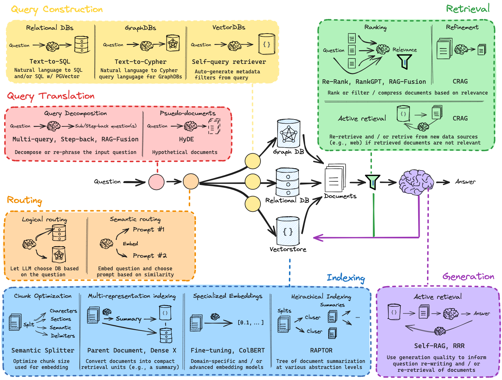
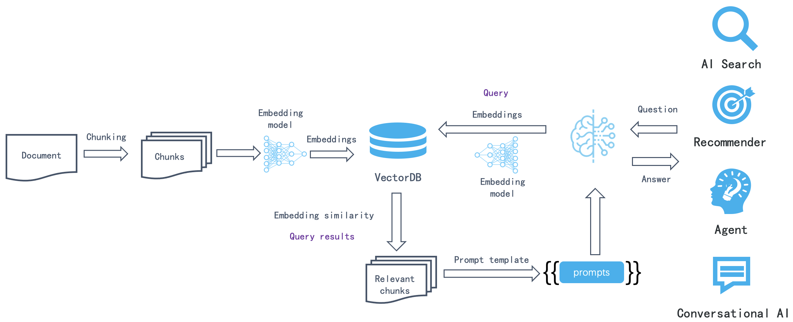
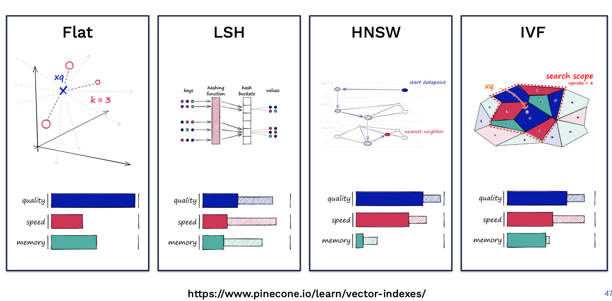
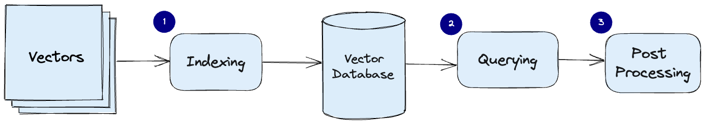

> **注意**: 本文**正在更新中**，内容只是**草稿版本**，并不完善，后续会有变动。请随时关注最新版本。

**检索增强生成（Retrieval-Augmented Generation, RAG）** 是一种结合大型语言模型（LLM）与外部知识库的先进技术框架。RAG 在回答问题时，不再仅依赖模型自身参数，而是通过实时检索外部知识库，显著降低模型的知识盲区，提升答案的准确性与可信度。

## 为什么需要 RAG？

### 1. 长尾知识与私有数据

通用大型语言模型在训练时未覆盖企业或个人特定领域的长尾知识与私密数据，通过 RAG 的外部知识召回机制，能够有效弥补这一短板。

### 2. 降低上下文开销

尽管现代 LLM 的上下文容量不断提升（如 GPT-4o 的 128K、Gemini 的百万级上下文），但一次性输入海量信息既不经济也不高效。RAG 通过精准检索，仅向模型提供最相关的内容，有效减少 Token 的使用量，加快响应速度。

### 3. 提升实时响应能力

RAG 可与实时数据库或搜索引擎对接，快速获取最新信息，特别适用于新闻问答、实时情报分析等对时效性要求较高的场景。

### 4. 提高可解释性

通过明确返回检索内容的索引，RAG 增强了模型输出的透明度，使答案的来源易于追溯和验证，这对于金融、法律、医疗等对可信度要求较高的领域尤为关键。

## RAG 与模型微调的对比分析

在实际项目中，常见的将领域知识注入基座模型的方法主要包括 **微调（Fine-Tuning）** 与 **检索增强生成（RAG）**。RAG 是一种高效的搜索技术范式，适合实时更新知识和对可信性要求较高的场景；而模型微调则更适合对特定领域知识要求极致精度、且更新频率较低的应用场景。两者也可协同使用，实现精度与时效的平衡。

下表详细对比了这两种方法的特点：

| 比较维度         | 检索增强生成（RAG）                                 | 模型微调（Fine-Tuning）                |
| ---------------- | ---------------------------------------------------- | --------------------------------------- |
| **知识更新速度** | 即时，随知识库更新即时生效                           | 慢，需要重新训练模型                    |
| **计算成本**     | 推理阶段需执行检索+LLM生成，训练阶段成本低            | 训练阶段成本高，推理阶段成本固定       |
| **实时响应能力** | 强，能实时检索最新数据                               | 弱，模型参数训练后固定，无法实时更新    |
| **可扩展性**     | 水平扩展容易，知识库扩容简单，性能稳定               | 扩展规模大时成本高，训练复杂度指数增加 |
| **可解释性**     | 高，答案来源明确可追溯                               | 低，答案来源隐藏在模型参数内，难以验证 |
| **深度定制性**   | 弱，依赖外部知识库，模型本身未深入掌握特定领域知识   | 强，模型深度掌握特定领域语义与模式     |
| **灾难性遗忘**   | 无，不改变模型参数，避免遗忘原有知识                 | 有，新知识学习可能导致旧知识被遗忘     |
| **推理效率**     | 中，检索过程增加推理开销，Token 消耗较多             | 高，部署后无需额外检索，推理高效       |
| **知识覆盖范围** | 受限于知识库规模与质量，但扩展灵活                   | 受限于训练数据覆盖面，新增知识成本高   |

## RAG Pipeline：技术流程详解

RAG Pipeline 主要包含以下关键步骤：

### 数据预处理（Data Preprocessing）

数据预处理是 RAG Pipeline 的基石，其核心任务是将来自各种数据源的内容转化为系统可高效处理和检索的格式。数据源类型繁多，包括结构化数据（如数据库表）、非结构化文本（如 PDF 文档、网页）以及富媒体数据（如带图像的报告）。

针对非结构化或富媒体文档，预处理流程通常包含以下关键环节：

- **OCR（光学字符识别）**：对于图像中的文字信息，OCR 技术至关重要，它能将图片中的文字转化为可检索的文本数据。
- **命名实体识别（NER）**：NER 技术能够从文本中提取关键实体（如人名、地名、组织机构名等）和元数据，为后续的索引和检索提供结构化信息。

例如，对于扫描的合同或表格，可以借助 Azure 认知服务等文档智能解析工具，高效提取其中的文本、表格和结构信息。通过精细的数据预处理，原始数据被规范化为适合检索的文本片段和结构化记录，为后续 RAG 流程奠定坚实基础。

### 文本分块（Chunking）

文本分块是 RAG Pipeline 中至关重要的一步，它将大型文档分割成更小、更易管理和检索的文本片段（chunks）。分块的目的是在检索时能够快速定位与用户查询最相关的局部内容，从而提高检索效率和准确性。

分块策略涉及两个关键参数：

- **Chunk Size（分块大小）**：每个文本片段包含的 Token 数量。
- **Overlap（重叠度）**：相邻文本片段之间重叠的 Token 数量。

Chunk Size 与 Overlap 的选择需要根据具体应用场景和数据特点精细调整，需要在检索效率与上下文完整性之间寻求最佳平衡。例如，1024 Token 的 Chunk Size 与 128 Token 的 Overlap 是一种常见设置，适用于许多通用场景。较小的 Chunk Size 可以提高检索精确度，但可能丢失上下文信息；而较大的 Chunk Size 则能保留更多上下文，但可能降低检索效率。设置重叠则有助于确保语义连贯，避免信息割裂。

### 文本嵌入（Embedding）

**文本嵌入模型（Text Embedding Model）** 是 RAG Pipeline 的核心组件之一，其作用是将非结构化文本数据转化为结构化向量，从而将文本语义映射到高维向量空间。目前，基于深度学习的稠密向量嵌入模型是主流选择。

**常用文本嵌入模型：**

- **OpenAI text-embedding-ada-002**：OpenAI 提供的 `text-embedding-ada-002` 模型是业界标杆之一，以其卓越的嵌入效果和强大性能著称。该模型支持处理高达 8191 Token 的文本，足以应对大多数应用场景。
- **Instructor 模型**：Instructor 模型是一类经过指令微调（Instruction Tuning）的文本嵌入模型，其特点在于能根据不同任务（如分类、检索、聚类、文本评估等）和领域（如科学、金融等）生成定制化的文本嵌入向量。这使得 Instructor 模型在特定任务和领域中能实现更精准的语义表示，而无需额外微调，极大提升了模型的灵活性和应用价值。

### 检索（Retrieval）

**相似向量检索** 是 RAG Pipeline 中连接用户查询与知识库的关键环节。其核心问题在于：给定一个查询向量，如何从海量候选向量中快速、准确地检索出与其语义最相似的一个或多个向量。

**相似性度量方法：**

相似性度量定义了向量之间相似程度的计算方式，常见方法包括：

- **余弦相似度（Cosine Similarity）**：衡量向量方向的相似度，取值范围为 [-1, 1]，值越大表示越相似。
- **点积（Dot Product）**：在向量归一化后与余弦相似度等价，计算效率较高。
- **欧氏距离（Euclidean Distance）**：衡量向量在空间中的距离，值越小表示越相似。
- **汉明距离（Hamming Distance）**：用于衡量布尔或离散向量间的差异。

在实际应用中，由于其良好的语义表征能力和计算效率，**余弦相似度** 通常成为向量检索的首选方法。

**相似性检索算法与实现：**

面对海量候选向量以及对检索速度和准确率的不同需求，选择合适的相似性检索算法和实现方法至关重要。需要综合考虑以下因素：

- **候选向量数量级**：向量库的大小直接影响检索算法的选择。
- **检索速度和准确率要求**：不同应用场景对检索性能的要求不同。
- **内存限制**：内存资源限制了可使用的索引结构和算法。

### 向量数据库（Vector Database）

向量数据库专门用于存储、索引和查询向量嵌入，是构建高效 RAG Pipeline 的关键基础设施。它能够对高维向量进行高效相似性搜索，满足 RAG 系统对快速检索相关知识的需求。

**Azure AI Search**：  
Azure AI Search 提供了强大的向量搜索功能，可作为 RAG Pipeline 的向量数据库选择。

**向量数据库数据处理流程：**

下图展示了向量数据库中常见的数据处理流程：

- **索引（Indexing）**：为加速向量检索，向量数据库通常采用高效索引算法，例如：
  - **乘积量化（Product Quantization, PQ）**：一种有损压缩与索引方法，通过向量量化降低存储空间并加速检索。
  - **局部敏感哈希（Locality Sensitive Hashing, LSH）**：一种近似最近邻搜索算法，通过哈希函数将相似向量映射到同一桶中。
  - **分层可导航小世界图（Hierarchical Navigable Small World, HNSW）**：一种基于图的索引算法，以其高效检索性能和良好扩展性受到欢迎。

  索引过程将原始向量映射到特定的数据结构中，从而实现更快速的相似性搜索。

- **查询（Query）**：在查询阶段，向量数据库将输入的查询向量与索引中的向量进行比较，通过预先构建的索引结构快速找到最近邻的相似向量。

- **后处理（Post-processing）**：在某些应用场景下，向量数据库检索出的最近邻向量可能需要经过后处理才能得到最终结果。后处理步骤可能包括结果过滤、排序、去重等操作，以进一步提升检索结果的质量和相关性。

### HyDE（Hypothetical Document Embeddings）

HyDE，即 Hypothetical Document Embeddings（假设文档嵌入），是一种创新的检索增强技术，旨在提升检索的准确性和相关性。其核心思想是：**先生成假设文档，再利用假设文档进行检索**。

传统检索方法直接使用用户初始查询进行向量检索，而 HyDE 则另辟蹊径。对于给定的初始查询，HyDE 首先利用大型语言模型生成一个假设文档或回复，该文档或回复即为对用户查询潜在答案或相关信息的推测。随后，将这个假设文档作为新的查询进行检索，而不是直接使用原始查询。

**HyDE 的优势：**

- **弥合语义鸿沟**：用户的初始查询可能表述不够清晰或含有歧义，导致直接检索效果不佳。HyDE 通过生成的假设文档，能够更全面、更准确地捕捉用户查询的潜在意图和语义信息，从而弥合查询与知识库文档之间的语义鸿沟，提高检索相关性。
- **增强检索鲁棒性**：生成的假设文档可视为对原始查询的一种语义泛化或扩展，能够更好地应对查询的多样性和复杂性，从而提升检索系统的鲁棒性。

---

## 面向大型语言模型的检索增强生成（RAG）

在使用大型语言模型（LLM）时，经常会遇到领域知识缺口、事实准确性问题以及幻觉现象等挑战。检索增强生成（RAG）通过引入外部知识（如数据库）来缓解这些问题，特别适用于知识密集型或需持续更新知识的领域应用。

RAG 的一大优势在于，无需为特定任务对 LLM 重新训练，而能直接利用最新信息生成可靠答案。正因如此，RAG 已在对话代理等应用中得到广泛应用。

在此部分，我们重点总结了 Gao 等人（2023）在《Retrieval-Augmented Generation for Large Language Models: A Survey》中的主要发现和实践见解，涵盖现有方法、最前沿的 RAG 技术、评估方法、应用场景及构成 RAG 系统的各个组件（检索、生成和增强技术）。

### RAG 简介与框架

**RAG 框架** 可以定义为：

- **输入**：用户提出的问题作为输入。如果不使用 RAG，则直接由 LLM 回答。
- **索引**：使用 RAG 时，首先将一系列相关文档通过分块、生成嵌入后，建立向量存储。在推理时，查询同样会生成相似的嵌入。
- **检索**：通过比较查询向量与索引向量，检索出相关文档（即“相关文档”）。
- **生成**：将检索到的相关文档与原始提示拼接为上下文，传入模型生成最终答案，作为系统的输出。

例如，直接使用模型可能由于缺乏对最新事件的了解而无法回答问题，而使用 RAG 时，系统能提取所需信息，从而使模型生成恰当回答。

想了解更多关于 RAG 及高级提示方法的信息，请关注我们的新 AI 课程，现在加入还能享受额外 20% 折扣（使用代码 PROMPTING20）。

### RAG 范式

近年来，RAG 系统经历了从简单 RAG 到高级 RAG 以及模块化 RAG 的演进，以解决性能、成本和效率上的种种局限：

- **简单 RAG（Naive RAG）**  
  简单 RAG 遵循传统的索引、检索和生成流程。简而言之，用户输入用于检索相关文档，然后将这些文档与提示拼接，传入模型生成最终答案。如果涉及多轮对话，历史对话记录也可融入提示中。  
  然而，简单 RAG 存在一些局限，如低精度（检索的片段未能完全匹配）和低召回（未能检索到所有相关片段），甚至可能传递过时信息给模型，从而引发幻觉和错误回答。此外，多段检索时还可能面临冗余、重复以及风格不统一等问题。

- **高级 RAG（Advanced RAG）**  
  高级 RAG 针对简单 RAG 中存在的问题进行改进，如通过优化预检索、检索及后检索过程来提升检索质量。  
  在预检索阶段，通过提升数据粒度、优化索引结构、添加元数据、对齐优化及混合检索等方法，提高被索引数据的质量；  
  在检索阶段，则可以通过优化嵌入模型（例如微调嵌入模型或采用动态嵌入）来改善上下文的语义表达；  
  后检索阶段主要关注解决上下文窗口限制和降低噪声干扰，常见方法包括重排序和提示压缩。

- **模块化 RAG（Modular RAG）**  
  模块化 RAG 强化了各功能模块，例如集成搜索模块进行相似性检索，以及对检索器进行微调。简单 RAG和高级 RAG均可视为模块化 RAG 的特例，具有固定模块，而扩展的 RAG 模块则包括搜索、记忆、融合、路由、预测和任务适配器，可根据任务需求灵活调整模块和流程。

此外，还提出了其他优化技术，例如：

- **混合搜索探索（Hybrid Search Exploration）**：结合关键词搜索与语义搜索以检索更相关、上下文丰富的信息。
- **递归检索与查询引擎（Recursive Retrieval and Query Engine）**：通过从小语义片段开始递归检索，再逐步扩展到更大片段，平衡检索效率与上下文丰富性。
- **StepBack-prompt**：利用提示技术使 LLM 能够进行概念抽象，生成更有依据的回答。
- **子查询（Sub-Queries）**：针对不同场景采用树状查询或顺序查询策略，如 LlamaIndex 提供的子问题查询引擎，可将一个查询拆分为多个子问题，分别从不同数据源检索。

### 检索

检索是 RAG 系统中负责从检索器中提取高度相关上下文的关键组件，主要涉及以下改进方向：

- **提升语义表示**：选择合适的分块策略，根据内容和任务需求调整文本块大小，并结合微调嵌入模型以确保查询与文档在语义空间中的对齐。
- **查询与文档对齐**：通过查询重写（如 Query2Doc、ITER-RETGEN、HyDE）和嵌入转换，优化查询嵌入的表示，使其与文档语义更加匹配。
- **检索器与 LLM 的对齐**：利用 LLM 的反馈信号微调检索器，或引入外部适配器（如 PRCA、RECOMP、PKG）以更好地将检索结果与 LLM 偏好对齐。

### 生成

RAG 系统中的生成器负责将检索到的信息整合并转化为连贯的文本。生成过程可能需要对检索结果进行后处理或对 LLM 进行微调，以确保输出既自然又充分利用检索到的知识。

### 增强

增强过程涉及如何有效将检索到的上下文整合到生成任务中。增强可以在预训练、微调和推理各阶段进行，关键包括：

- **增强阶段**：如 RETRO 系统在大规模预训练中利用外部知识构建额外编码器，或在推理阶段利用迭代检索和重排序来优化上下文。
- **增强数据来源**：可分为非结构化数据、结构化数据以及 LLM 生成的数据。
- **增强过程**：对于多步推理等复杂任务，单次检索可能不足，因此提出了迭代检索、递归检索和自适应检索等方法。

### RAG 评估

与对 LLM 的各项能力进行评估类似，对 RAG 系统的评估也至关重要。传统上，RAG 系统通过下游任务指标（如 F1 分数、准确率等）来评估，同时结合信息检索指标（如 NDCG、命中率）评估检索质量，并关注生成答案的相关性、忠实度以及潜在有害性。评估方法既可采用人工也可自动化，主要从以下维度展开：

- **上下文相关性**：检验检索到的上下文是否精准且具备针对性。
- **答案忠实度**：生成的答案与检索上下文之间的一致性。
- **答案相关性**：答案与用户问题的契合度。

此外，还需评估系统的噪声鲁棒性、负面拒绝能力、信息整合能力及反事实鲁棒性。

### RAG 的挑战与未来

尽管 RAG 系统在提升知识密集型任务表现上展现了巨大潜力，但在未来的发展中仍面临如下挑战：

- **上下文长度问题**：随着 LLM 上下文窗口的不断扩展，如何确保检索到最相关的信息仍然具有挑战性。
- **鲁棒性**：如何应对反事实和对抗性信息，提升系统鲁棒性。
- **混合方法**：如何更好地结合 RAG 与微调模型以取得最佳效果仍需进一步探索。
- **扩展 LLM 的角色**：增强 LLM 在 RAG 系统中的作用和能力。
- **扩展定律**：如何理解 LLM 扩展定律在 RAG 系统中的应用仍未明晰。
- **生产级 RAG 系统**：构建生产级 RAG 系统需要在性能、效率、数据安全与隐私等方面达到工程上的卓越水平。
- **多模态 RAG**：尽管目前大部分 RAG 研究聚焦于文本任务，但扩展到图像、音频、视频、代码等领域已成为发展趋势。
- **评估方法**：随着 RAG 应用的不断复杂化，需要发展更细致和多维的评估指标与工具，以评估上下文相关性、创造性、内容多样性及事实准确性，同时提升系统的可解释性。

### RAG 工具

目前流行的构建 RAG 系统工具包括 LangChain、LlamaIndex 和 DSPy，同时也有诸如 Flowise AI 这样提供低代码解决方案的专用工具。其他相关技术还包括 HayStack、Meltano、Cohere Coral 等。各大软件和云服务供应商也在陆续推出面向 RAG 的服务，例如 Weaviate 的 Verba 和亚马逊的 Kendra。

### 结论

总体来看，RAG 系统正处于快速演进阶段，高级范式的不断涌现使得定制化和性能优化成为可能，进一步拓宽了 RAG 在各领域的应用前景。面对不断增长的知识密集型任务需求，围绕 RAG 各组件的优化方法也在持续探索，从混合方法到自检索，现代 RAG 模型的研究正不断丰富。同时，评估工具和指标的改进也将为 RAG 系统的进一步发展提供有力支持。

